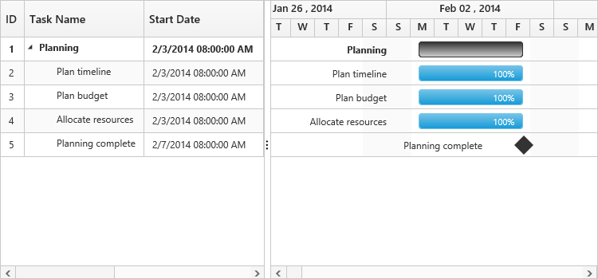

# Time options

Start date and end date in the data source defines the starting point and ending point of a task in the project. The two data types are:

* Date
* Datetime

The datetime data type for start date and end date defines the exact starting point and ending point of a task along with time details of a day. There are two types of time scales available based on working hours:

* `TimeScale8Hours`  for 8 hour working scale
* `TimeScale24Hours` for 24 hour working scale

Use the following code example for setting different time scales of working hours:



<body ng-controller="GanttCtrl">
   <!--Add  Gantt control here-->    
   

   

</body>



Use the following code example to include time options in start date and end date of a task:



<body ng-controller="GanttCtrl">
   <!--Add  Gantt control here-->    
   

   

  
</body>



Execute the above code to render the following output:

