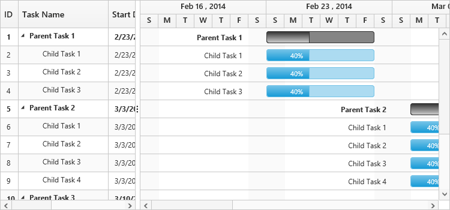
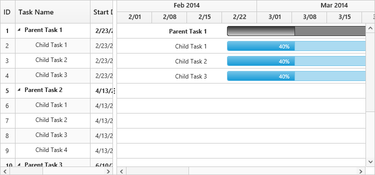
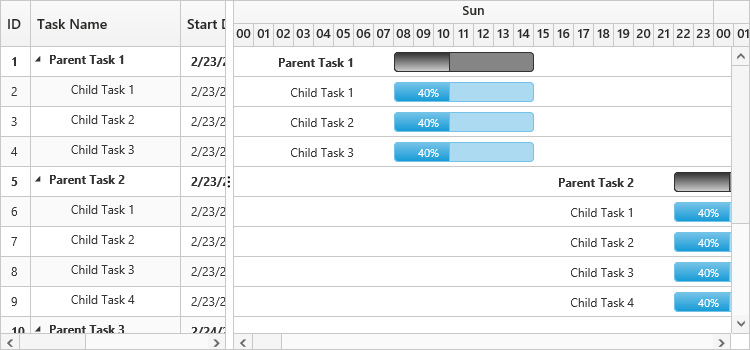

# Timescale customization

The Gantt contains built-in support to switch over various schedule modes. You can achieve this by defining a schedule header type for the Gantt.

## Schedule header types

The Gantt contains the following built-in schedule header types:

* Hour – Minute
* Day – Hour
* Week – Day
* Month – Week
* Year – Month

The following code example illustrates how to change the schedule mode:

### Week schedule mode

In the week schedule mode, the upper part of the schedule header displays the weeks, whereas the bottom half of the header displays the days. Refer to the following code example:



<body ng-controller="GanttCtrl">
   <!--Add  Gantt control here-->    
   

   

  
</body>



The following screenshot illustrates week schedule in the Gantt control:

### Month schedule mode

In the week schedule mode, the upper part of the schedule header displays the months, whereas the bottom header of the schedule displays its corresponding weeks. Refer to the following code example:



<body ng-controller="GanttCtrl">
   <!--Add  Gantt control here-->    
   

   

  
</body>



The following screenshot illustrates month schedule in the Gantt control:

### Year schedule mode

In the week schedule mode, the upper schedule header displays the years, whereas the bottom header displays its corresponding months. Refer to the following code example:



<body ng-controller="GanttCtrl">
   <!--Add  Gantt control here-->    
   

   

  
</body>


The following screenshot shows year schedule in the Gantt control:

### Day schedule mode

In the week schedule mode, the upper part of the header displays the days, whereas the bottom schedule header displays its corresponding hours. Refer to the following code example:



<body ng-controller="GanttCtrl">
   <!--Add  Gantt control here-->    
   

   

  
</body>



The following screenshot illustrates day schedule in the Gantt control:

### Hour schedule mode

An hour-minute schedule mode tracks the tasks in minutes scale. In this mode, the upper schedule header displays hour scale and the lower schedule header displays its corresponding minutes. The minute split-up in the lower schedule header can be defined by using the [minutesPerInterval](/api/js/ejgantt#members:scheduleheadersettings-minutesperinterval) enumeration property. The enumeration values of the [minutesPerInterval](/api/js/ejgantt#members:scheduleheadersettings-minutesperinterval) are:

* Auto 
* oneMinute
* fiveMinutes
* fifteenMinutes
* thirtyMinutes

The value `auto`, automatically calculates the interval depending upon the `e-schedulestartdate` and `e-scheduleenddate`, whereas the other enumeration values splits up accordingly.

The hour schedule mode supports both the `minute` and `hour` duration units.



<body ng-controller="GanttCtrl">
   <!--Add  Gantt control here-->    
   

   

  
</body>


## Week start day customization

In Gantt, you can customize week start day by using the `e-scheduleheadersettings.weekStartDay` property.
By default, the weekStartDay will be assigned with 0 which specifies the start day of the week.

In week schedule mode, week starts with Sunday by default. But, you can customize the week start day by using the following code example:



<body ng-controller="GanttCtrl">
   <!--Add  Gantt control here-->    
   

   

  
</body>


## Rounding off timescale (schedule) start date

You can round off the schedule start date in the project by using the `e-scheduleheadersettings.timescaleStartDateMode` property. You can set the following values to the property:

* auto
* month
* week
* year

The value `auto`, automatically calculates the schedule header depending on the data source values, whereas the other enumeration values rounds off the schedule header accordingly. For instance, in year schedule, if you set "e-timescalestartdatemode" as `month` then the schedule header will start from the immediate month of the schedule instead of starting from beginning of the year.



<body ng-controller="GanttCtrl">
   <!--Add  Gantt control here-->    
   

   

  
</body>



## Customize automatic timescale update action

In Gantt, schedule timeline will be automatically updated when the tasks are edited beyond the schedule start date and end date range. This can be enabled/disabled by using [`scheduleHeaderSettings.updateTimescaleView`](/api/angular/ejgantt#members:scheduleheadersettings-updatetimescaleview "scheduleHeaderSettings.updateTimescaleView") property.
The following code snippets shows how to prevent the automatic timescale update in Gantt.



	<body ng-controller="GanttCtrl">
    <!--Add  Gantt control here-->    
    

    

    
</body>


The following screenshot illustrates the behavior of `updateTimescaleView` property.

At Initial load
{:.caption}

`updateTimescaleView` property as `false`
{:.caption}

`updateTimescaleView` property as `true`
{:.caption}