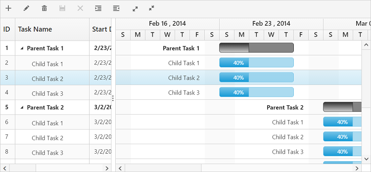
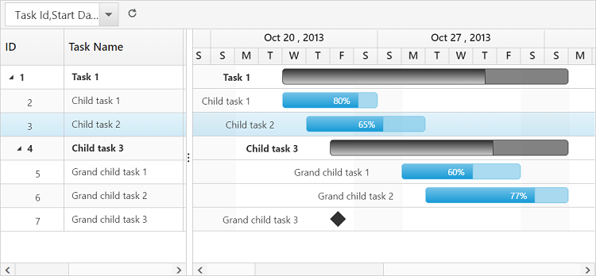

# Toolbar

In Gantt, you can show/hide the toolbar by using the [`toolbarSettings.showToolbar`](https://help.syncfusion.com/api/js/ejgantt#members:toolbarsettings-showtoolbar "showToolbar") property. You can add default toolbar items by [`toolbarSettings.toolbarItems`](https://help.syncfusion.com/api/js/ejgantt#members:toolbarsettings-toolbaritems "toolbarItems"). You can also create a custom toolbar items by using the [`toolbarSettings.customToolbarItems`](https://help.syncfusion.com/api/js/ejgantt#members:toolbarsettings-customToolbarItems "customToolbarItems").

## Default toolbar items
Using Gantt default toolbar items, you can perform the following operations:

* **Add**: Adds a new task.

* **Edit**: Edits a selected task.

* **Delete**: Deletes a selected task.
		   
* **Cancel**: Cancels the edited changes in a task.
		   
* **Update**: Saves the edited changes in a task.
		   
* **ExpandAll**: Expands all the Gantt rows.
		   
* **CollapseAll**: Collapses all the Gantt rows.

* **Indent**: Indents the selected task in the Gantt.
		   
* **Outdent**: Outdent the selected task in the Gantt.
		   
* **CriticalPath**: Supports critical path in the Gantt.

* **PrevTimeSpan**: Navigates the Gantt timeline to previous time span.

* **NextTimeSpan**: Navigates the Gantt timeline to next time span.

* **Search**: Performs search operation in the Gantt.
		   
* **ExcelExport**: Exports Gantt to an Excel format.

* **PdfExport**: Exports Gantt to a PDF format.

You can enable the Gantt toolbar by using the following code example:

    <body ng-controller="GanttCtrl">                
           

            
       
</body>

The following screenshot displays the toolbar option in Gantt control.

N> To perform add, edit, delete, cancel, update, indent, and outdent using toolbar items, you should enable add/edit/delete/indent by using the [`editSettings`](https://help.syncfusion.com/api/js/ejGantt#members:editsettings "editSettings").
  
## Custom toolbar items

CustomToolbarItems allows you to insert custom icons and custom template in the Gantt toolbar. By using below properties, you can customize the Gantt toolbar as per our requirement.

* **text**: Inserts custom icons in the toolbar by using the CSS class name selector.

* **templateID**: Inserts custom icons in the toolbar by using script templates. Using this property, you can bind HTML elements and other EJ controls to the Gantt toolbar.

* **tooltipText**: Displays the tooltip text for custom icons.

To insert EJ Controls in the Gantt toolbar, you should initiate the control in the [`create`](https://help.syncfusion.com/api/js/ejgantt#events:create "create") client side event. In [`toolbarClick`](https://help.syncfusion.com/api/js/ejgantt#events:toolbarclick "toolbarclick") client side event, you can bind actions to custom toolbar items.


   <body ng-controller="GanttCtrl">
                    
           

            
            
    
    
</body>


	

