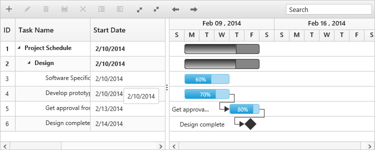

# Tooltip

The Gantt control has support to display the tooltip for both taskbars and for column cells.

## Taskbar tooltip

In Gantt, you can enable or disable the taskbar mouse hover tooltip by using the [e-enabletaskbartooltip](https://help.syncfusion.com/api/js/ejgantt#members:enabletaskbartooltip) property. By default, this property is set to true. The following code example shows how to enable the taskbar tooltip in Gantt:



<body ng-controller="GanttCtrl">
   <!--Add  Gantt control here-->    
   

   

</body>



This tooltip can be customized further by using the [e-taskbartooltiptemplate](https://help.syncfusion.com/api/js/ejgantt#members:taskbartooltiptemplate) property, which is described briefly in the [customization](https://help.syncfusion.com/js/gantt/customizations) section.

## Taskbar drag tooltip

You can enable or disable the tooltip while performing editing actions on the taskbar (left resizing, right resizing, dragging, and progress resizing) by using the [e-enabletaskbardragtooltip](https://help.syncfusion.com/api/js/ejgantt#members:enabletaskbardragtooltip)  property. By default, this property is set to true. The following code example explains this behavior:



<body ng-controller="GanttCtrl">
   <!--Add  Gantt control here-->    
   

   

</body>



## Cell tooltip

You can enable or disable the tree grid cell tooltip in mouse hover by using the [e-showgridcelltooltip](https://help.syncfusion.com/api/js/ejgantt#members:showgridcelltooltip) property. By default, this property is set to true. The following code example explains how to enable and disable this property:



<body ng-controller="GanttCtrl">
   <!--Add  Gantt control here-->    
   

   

</body>


The tooltip can be customized by using the [e-celltooltiptemplate](https://help.syncfusion.com/api/js/ejgantt#members:celltooltiptemplate) property, which is described briefly in the [customization](https://help.syncfusion.com/js/gantt/customizations) section.

## Tree column (expander column) tooltip 

You can display the tooltip only for expander column by setting the [e-showexpandgridcelltooltip](https://help.syncfusion.com/api/js/ejgantt#members:showgridexpandcelltooltip) property. The following code example shows you to enable expander column tooltip in the Gantt:



<body ng-controller="GanttCtrl">
   <!--Add  Gantt control here-->    
   

   

</body>



