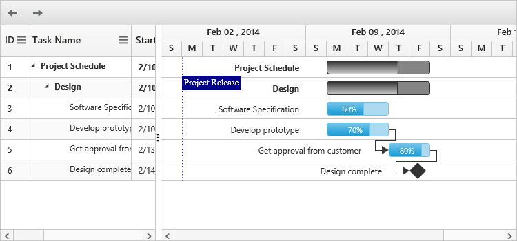

# Validating schedule dates

Validating schedule dates is used to dynamically change the start date and end date of the schedule. By this support, `e-schedulestartdate` and `e-scheduleenddate` can be automatically updated from the data source. When you change the date of any task item to the date that is beyond `e-schedulestartdate` or `e-scheduleenddate` through cell editing, taskbar editing, dialog editing, or toolbar operation, then the `e-schedulestartdate` and `e-scheduleenddate` can be dynamically updated based on the task item’s date.

`PrevTimeSpan` and `NextTimeSpan` toolbar items are used to create a new time span based on the schedule mode.



<body ng-controller="GanttCtrl">
   <!--Add  Gantt control here-->    
   

   

  
</body>



The following screenshot illustrates the output of the above code:

