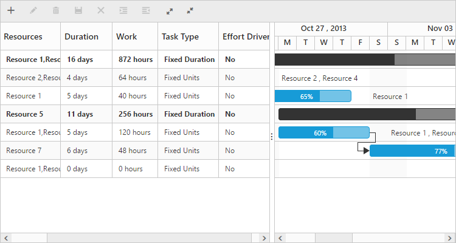

# Work

Work is the total hours taken by a labor to complete a task; this value depends on the number of resources assigned to the task and the duration of the task. Work can be measured in hours, days, and minutes; It is measured in ‘hours’ scale by default. You can change this by using the workUnit property.

The following code snippet explains how to change the workUnit property in Gantt:



<body ng-controller="GanttCtrl">
   <!--Add  Gantt control here-->    
   

   

</body>



Note: 

* Work will be displayed as __0__ __hours__ if there is no resource assigned to the task.
* A resource will work __8__ __hours__ a day on the assigned task.

# Task type 

The work, duration, and resource unit fields of a task depends upon each other values and will change automatically while editing any one of these fields. You can also set these field’s values as constant by using the taskType property. The following values can be set to the type property:

**Fixed duration**: Duration task field will remain constant while updating the resource unit or work field.

**Fixed work**: Work field will remain constant while updating resource unit or duration fields.

**Fixed unit**: Resource units will remain constant while updating duration or work field.

The following code snippet explains how to set the taskType property in Gantt:



<body ng-controller="GanttCtrl">
   <!--Add  Gantt control here-->    
   

   

</body>



Following table explains how the work, duration, and resource unit fields will be updated when changing any of the fields:

<table>
<tr>
<td>
Task Type</td><td>
Changes in Duration</td><td>
Changes in Work</td><td>
Changes in Resource units</td></tr>
<tr>
<td>
Fixed Duration</td><td>
Work field updates</td><td>
Resource unit updates</td><td>
Work field updates</td></tr>
<tr>
<td>
Fixed Work</td><td>
Resource unit updatesNote: For manually scheduled task work will update</td><td>
Duration field updatesNote: For manually scheduled task resource unit updates</td><td>
Duration will updateNote: For manually scheduled task work field updates</td></tr>
<tr>
<td>
Fixed Unit</td><td>
Work field updates</td><td>
Duration field updatesNote: For manually scheduled task resource unit updates</td><td>
Duration will updateNote: For manually scheduled task work field updates</td></tr>
</table>
Note: 

* __Fixed__ __Unit__ is the default taskType in Gantt.
* The above calculations are not applicable for Milestones.

# Effort driven tasks

The effortDriven field is used to define whether the total labor hours or the work need to split or to be extended among the resources when adding or removing a resource to a task.

Note:

* The effort driven field is effective only when adding or removing a resource in the task.

The following table illustrates the effects of effort driven field with taskType property:

<table>
<tr>
<td>
Task Type</td><td>
Effort driven tasks</td><td>
Task without effort driven</td></tr>
<tr>
<td>
Fixed Duration</td><td>
Resource unit updates</td><td>
Work field updates</td></tr>
<tr>
<td>
Fixed Work</td><td>
Duration field updatesNote: For Fixed Work effort driven is always true.In this task type the effort driven field is non-editable</td><td>
Not applicable</td></tr>
<tr>
<td>
Fixed Unit</td><td>
Duration field updates</td><td>
Work field updates</td></tr>
</table>
Notes:

* The above calculations will not be considered for milestones.
* For manually scheduled task, the effort driven will not be considered while adding or removing resources.
* For manually scheduled task, the taskType and effortDriven fields are non-editable.
* When assigning a first resource for the task, the effortDriven and taskType fields are not considered and the work field alone will be calculated.

The following screenshot depicts the work, task type, and effort driven fields in the Gantt:

