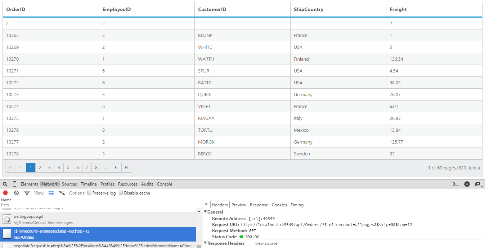
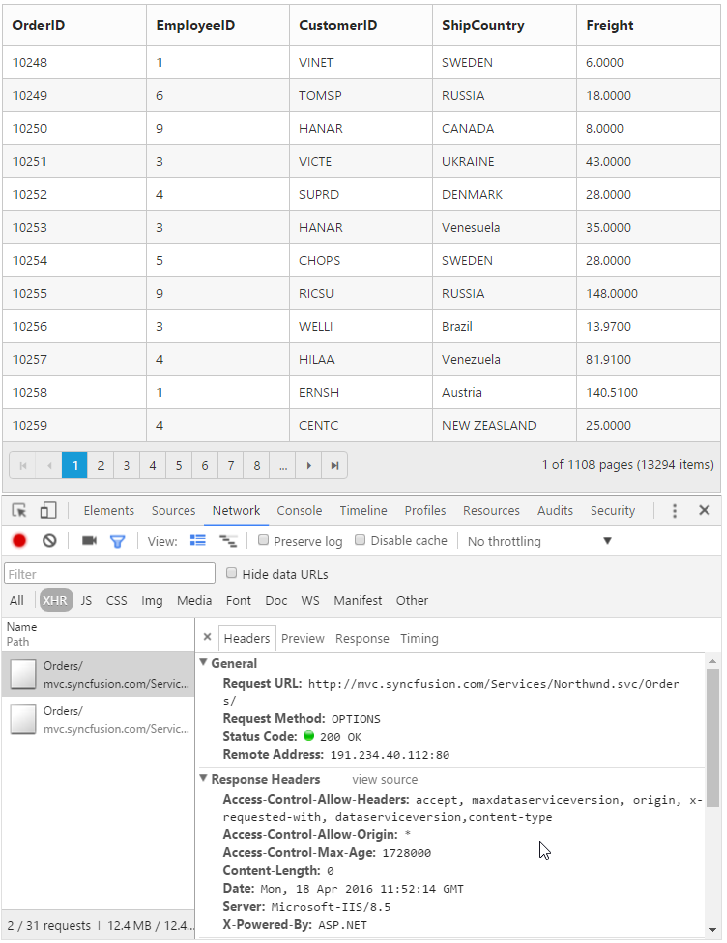
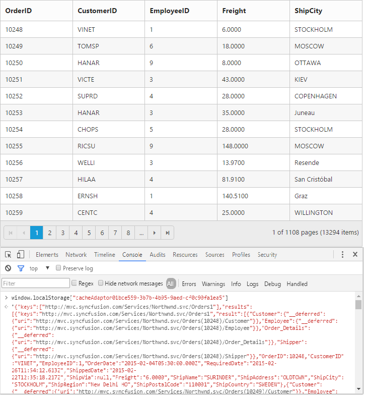

---
Layout: Post
Title: DataBinding with Grid widget for the Syncfusion Essential AngularJS
Description: How to bind in-memory JSON and remote web services in Grid
Platform: AngularJS
Control: Grid
Documentation: UG
--- 
# Data binding

The Grid control uses [`ej.DataManager`](http://helpjs.syncfusion.com/js/datamanager/overview# "ej.DataManager"), which supports both RESTful JSON data service binding and local JSON array binding.  The [`e-datasource`](http://help.syncfusion.com/api/js/ejgrid#members:datasource "dataSource") property can be assigned either with the instance of the [`ej.DataManger`](http://help.syncfusion.com/api/js/ejdatamanager# "ej.DataManager") or JSON data array collection. It supports different kinds of data binding methods such as:

1. Local data
2. Remote data

## Local Data

To bind local data to the Grid, you can assign a JSON array to the [`e-datasource`](http://help.syncfusion.com/api/js/ejgrid#members:datasource "dataSource") property.

The following code example describes the previous behavior.



     

          

             

             

             

             

             

          

     

 




	syncApp.controller('dataBindCtrl', function ($scope,$rootScope) {
       //The datasource "window.gridData" is referred from 'http://js.syncfusion.com/demos/web/scripts/jsondata.min.js'
        $scope.data = window.gridData;
     });



The following output is displayed as the result of previous code example:

N> 1. There is no in-built support to bind XML data to the grid. But you can achieve this requirement with the help of [custom adaptor] concept. 
N> 2. Refer to this [Knowledge Base link](http://www.syncfusion.com/kb/3377/how-to-process-xml-data-from-server-using-datamanager-and-bound-to-grid#) for bounding XML data to grid using custom adaptor. 

## Remote Data

To bind remote data to Grid Control, you can assign a service data as an instance of the [`ej.DataManager`](http://help.syncfusion.com/api/js/ejdatamanager# "DataManager") to the [`e-datasource`](http://help.syncfusion.com/api/js/ejgrid#members:datasource "dataSource") property.

### OData

OData is a standardized protocol to create and consume data. You can provide the the [OData service](http://www.odata.org/#) URL directly to the [`ej.DataManager`](http://help.syncfusion.com/api/js/ejdatamanager# "DataManager") class and then you can assign it to Grid [`e-datasource`](http://help.syncfusion.com/api/js/ejgrid#members:datasource "datasource").

The following code example describes the previous behavior.



     

          

             

             

             

             

             

          

     

 




	
        var dataManger = ej.DataManager({
          url: "http://mvc.syncfusion.com/Services/Northwnd.svc/Orders";
	  });

      syncApp.controller('dataBindCtrl', function ($scope,$rootScope) {
          $scope.data = dataManger;
      }); 



The following output is displayed as the result of previous code example.

N> By default , if no adaptor is specified for the ej.DataMananger and only the URL link is mentioned, it will be considered as ODataService.

#### OData Version 4

For OData Version 4 support, ej.ODataV4Adaptor should be used. By using `url` property of `ej.DataManager` you can bind OData Version 4 Service link and specify  `adaptor` as `ej.ODataV4Adaptor`.

I> You can provide adaptor value either as `string` value ("ODataAdaptor") or by creating a new instance (new `ej.ODataV4Adaptor`).

The following code example describes the above behavior.



    

        

            

                

                

                

                

                

             
            

        

    





	


For further details about OData service please refer to [this link](http://www.odata.org/#). 

### WebAPI

Using `ej.WebApiAdaptor`, you can bind WebApi service data to Grid. The data from WebApi service must be returned as object that has property `Items` with its value as datasource and another property `Count` with its value as dataSource's total records count.

The following code example describes the above behavior.



    

        

           

                

                

                

                

                

             
            

        

    








using System;
using System.Linq;
using System.Web;
using System.Linq.Dynamic;
using System.Web.Http;
using Syncfusion.Linq;
using ServerOperations.Models;

namespace ServerOperations.Controllers
{
    public class OrdersController : ApiController
    {
        NorthwindDataContext db = new NorthwindDataContext();

        // GET api/<controller>       
        public object Get()
        {

            var dataSource = db.OrdersViews.ToList();
            var queryString = HttpContext.Current.Request.QueryString;
            int skip = Convert.ToInt32(queryString["$skip"]);
            int take = Convert.ToInt32(queryString["$top"]);
            string sort = queryString["$orderby"];//sorting    
            string filter = queryString["$filter"]; //Filtering 

            return new { Items = dataSource.Skip(skip).Take(take), Count = dataSource.Count() };

        }

    }

}


The following output is displayed as a result of the above code example.

### Load At Once

On remote data binding, by default all the Grid actions will be processed on server-side such as paging, sorting, editing, grouping and filtering etc. To avoid post back to server on every action, you can set the grid to load all the data on initialization time and make the actions client-side. To enable this, you can use `offline` property of the `ej.DataManager`.

The following code example describes the above behavior.



    

        

            

                

                

                

                

                

             
            

        

    







Please refer to this for further reference on `offline` property

The following output is displayed as a result of the above code example.

### Data Caching

Date caching will help you prevent the request to server for already visited pages in Grid using the `enableCaching` property of `ej.DataManager`. Also using `cachingPageSize` and `timeTillExpiration` properties of `ej.DataManager`, you can control the number of pages to be cached and duration it should be cached respectively.

N> The cached data will be stored in browser's HTML5 `localStorage`. 

The following code example describes the above behavior.



    

        

            

                

                

                

                

                

             
            

        

    





	


The following output is displayed as a result of the above code example.

### Custom request parameters and HTTP Header

#### Adding request parameters

You can use the `addParams` method of `ej.Query` class, to add custom parameter to the data request. The Grid has [`query`](https://help.syncfusion.com/api/js/ejgrid#members:query "query") property, which accepts instance of `ej.Query`.

The following code example describes the above behavior.



    

        

            

                

                

                

                

                

             
            

        

    





	


The custom parameter will be passed along with the data request of the grid as follows.

#### Handling HTTP Errors

During server interaction from the Grid, there may occur some server-side exceptions and you can acquire those error messages or exception details in client-side using the [`actionFailure`](https://help.syncfusion.com/api/angular/ejgrid#events:actionfailure "actionFailure") event of Grid Control.

The argument passed to the [`actionFailure`](https://help.syncfusion.com/api/js/ejgrid#events:actionfailure "actionFailure") Grid event contains the Error details returned from server. Please refer to the following table for some error details that would be acquired in client-side event arguments.

 <table>
        <tr>
            <th>
                Parameter
            </th>
            <th>
                Description
            </th>
        </tr>
        <tr>
            <td>
                argument.error.status
            </td>
            <td>
                It returns the response error code.
            </td>
        </tr>
        <tr>
            <td>
                argument.error.statusText
            </td>
            <td>
                It returns the error message.
            </td>
        </tr>
    </table>

The following code example describes the above behavior.



    

        

            

                

                

                

                

                

             
            

        

    





	


The following output is displayed as a result of the above code example.

