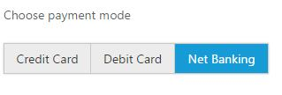
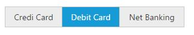

# Behavior Settings

EJ AngularJS GroupButton has some default behavior settings which helps you to customize the component based on application needs.

## Different modes of button

EJ AngularJS GroupButton provides the two different types of modes called check box mode, radio button mode. We can achieve this using this **e-groupButtonMode** API which can be set through scope variable. Setting a checkbox mode, we can perform the multiple actions in a single group. In this case, you can toggle the all the buttons state and perform the actions, since it all will behave as individual button in a group of button. 

**Radio Button Mode** - we can perform the only single action with all related actions in a group of button.

**Checkbox Mode** - Here, multiple button can be selected, please check with the below use case for this mode.

**HtML View Section:**



     

        <ul>
            <li>
                Daily
            </li>
            <li>
                Weekly
            </li>
            <li>
                Monthly
            </li>
        </ul>
     



**Controller section:**



    angular.module("myApp", ['ejangular']).controller("groupbutton", function ($scope) {

    })



** Radio Button Mode:** Here, single button only can be selected, Please check with the below code example 

**HTML View Section:**



     

        <ul>
            <li>
                Credit Card
            </li>
            <li>
                Debit Card
            </li>
            <li>
                Net Banking
            </li>
        </ul>
     



**Controller Section:**



         



## SelectedItemIndex

The state of the button can be changed by user interacting with the button. Also the selection state of the button can be achieved by using **e-selectedItemIndex** API which is used to select the button items in GroupButton based on index. 

This property will accept the array values and its value will be differ based on current mode of Button. If the Button mode is “Radio”, then the selected items can have single value within the array, since we can select a single button only in this mode. Whereas for the “checkbox” mode, the selectedItemIndex can have the multiple values within an array, since multiple button can be in active state in this mode.

** Setting a selectedItemIndex for checkbox mode **

**HTML View Section:**



     

        <ul>
           <li>
                Credit Card
            </li>
            <li>
                Debit Card
            </li>
            <li>
                Net Banking
            </li>
        </ul>
     



** Setting a selectedItemIndex for radio button mode**

**Controller Section:**



     



