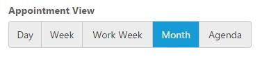

# DataSource

GroupButton can populate the button items based on data source and by specifying the associated fields. 

Refer the below table to know about the available fields.

<table>
<tr>
<td>
text  </td><td>
Text to be displayed in button.  </td></tr>
<tr>
<td>
prefixIcon  </td><td>
Icon class name – prefixIcon will be displayed from the left margin of the button.  </td></tr>
<tr>
<td>
suffixIcon  </td><td>
Icon class name – suffixIcon will be displayed from the left margin of the button.  </td></tr>
<tr>
<td>
contentType  </td><td>
Specifies content type of button item.  </td></tr>
<tr>
<td>
imagePosition  </td><td>
Specifies position of the image in a button item.  </td></tr>
<tr>
<td>
Selected  </td><td>
Specifies the selection state of button item.  </td></tr>
<tr>
<td>
URL  </td><td>
Used to include the URL tag to the button item.  </td></tr>
<tr>
<td>
htmlAttribute  </td><td>
It defines the HTML attributes such as class and styles for an button item.  </td></tr>
<tr>
<td>
linkAttribute  </td><td>
It defines the image attributes such as height, width, styles, etc.  </td></tr>
</table>

## Local Data

To set the local JSON data, define a JSON array and initialize the GroupButton with **dataSource** property. Specify the column names in the fields’ property.

N> the columns are bounded automatically when the field's are specified with the default names like id, text, etc...

Below is the sample to code to render the GroupButton JSON dataSource.







    



## Remote Data

To bind remote data to the GroupButton, you can assign a service data as an instance of `ejDataManager` to the `dataSource` property along with the fields mapping.







    

