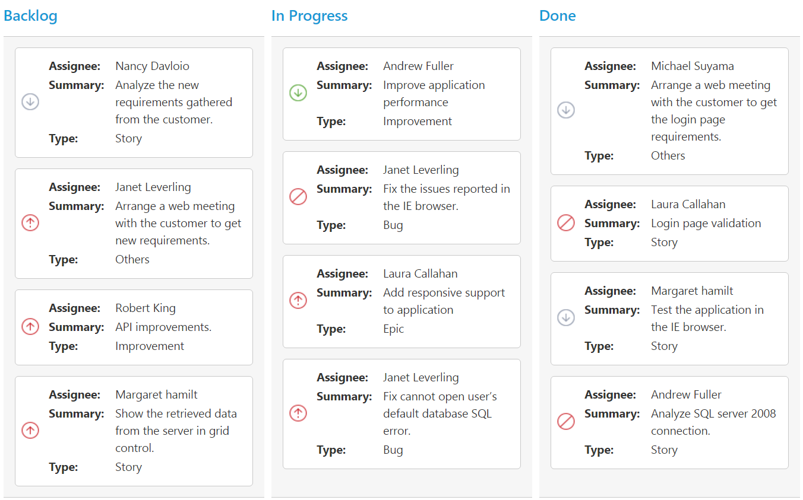

# Cards

## Customization

Cards can be customized with appropriate mapping fields from the database. The customizable mapping properties are listed as follows 

<table>
<tr>
<th>
Mapping Fields</th><th>
Description</th></tr>
<tr>
<td>
{{ 'content' | markdownify }} </td><td> Map the column name to use as content to cards.</td></tr>
<tr>
<td>
{{ 'tag' | markdownify }} </td><td>
Map the column name to use as tag. Multiple tags can be given with comma separated.  E.g. "API","SQL, Database".</td></tr>
<tr>
<td>
{{ 'color' | markdownify }} </td><td>
 Map the column name to use as colors to highlight cards left border.</td></tr>
<tr>
<td>
{{ 'colorMapping' | markdownify }} </td><td>
Map the colors to use with column values which is mapped with `fields.color`.</td></tr>
<tr>
<td>
{{ 'imageUrl' | markdownify }} </td><td>
Map the column name to use as image to cards.</td></tr>
<tr>
<td>
{{ 'primaryKey' | markdownify }} </td><td>
Map the column name to use as primary key to cards.</td></tr>
<tr>
<td>
{{ 'priority' | markdownify }} </td><td>
Map the column name to use as priority to cards.</td></tr>
<tr>
<td>
{{ 'title' | markdownify }} </td><td>
Map the column name to use as title to cards. Default title is  `primaryKey`.</td></tr>
<tr>
<td>
{{ 'allowTitle' | markdownify }} </td><td>
Set as true to enable title for card.</td></tr>
</table>

The following code example describes the above behavior.



    <!DOCTYPE html>
    <html xmlns="http://www.w3.org/1999/xhtml" lang="en" ng-app="KanbanApp">
    <head>
        <title>Essential Studio for AngularJS: Kanban</title>        
    </head>
    <body ng-controller="KanbanCtrl">
        

            

                

                

                

                

            

        

        
    </body>
    </html>



The following output is displayed as a result of the above code example.

## Template

Templates are used to create custom card layout as per the user convenient. HTML templates can be specified in the `template` property of the `cardSettings` as an ID of the template’s HTML element.

You can use JsRender syntax in the template. For more information about JsRender syntax, please refer this [`link`](https://www.jsviews.com/).

The following code example describes the above behavior.



    
            




    <!DOCTYPE html>
    <html xmlns="http://www.w3.org/1999/xhtml" lang="en" ng-app="KanbanApp">
    <head>
        <title>Essential Studio for AngularJS: Kanban</title>        
    </head>
    <body ng-controller="KanbanCtrl">
        

            

                

                

                

                

            

        

        
        
    </body>
    </html>





    <!--CSS for card template-->
        



The following output is displayed as a result of the above code example.

## Tooltip

You can enable HTML tooltip for Kanban card elements by setting `enable` property as true in `tooltipSettings`.

The following code example describes the above behavior.



    <!DOCTYPE html>
    <html xmlns="http://www.w3.org/1999/xhtml" lang="en" ng-app="KanbanApp">
    <head>
        <title>Essential Studio for AngularJS: Kanban</title>
    </head>
    <body ng-controller="KanbanCtrl">
        

            

                

                

                

                

            

        

           
    </body>
    </html>


 
The following output is displayed as a result of the above code example.

### Tooltip Template

By making use of template feature with tooltip, all the field names that are mapped from the `dataSource` can be accessed to define the `template` tooltip for card. The `tooltipSettings.enable` must be enabled first.

The following code example describes the tooltip template.



    





    <!DOCTYPE html>
    <html xmlns="http://www.w3.org/1999/xhtml" lang="en" ng-app="KanbanApp">
    <head>
        <title>Essential Studio for AngularJS: Kanban</title>  
    </head>
    <body ng-controller="KanbanCtrl">
        

            

                

                

                

                

            

        

           
    </body>
    </html>





    <!--toolTip template releated css -->
    



 
The following output is displayed as a result of the above code example.

