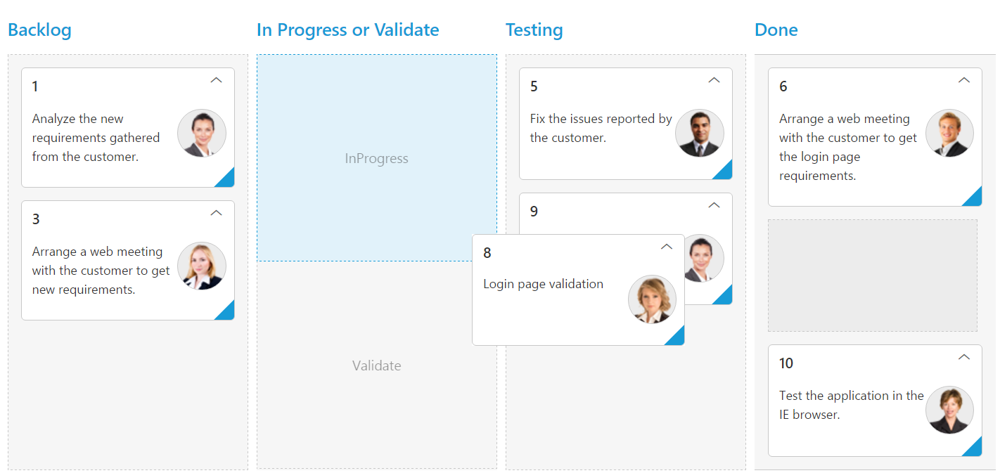

# Columns 

Column fields are present in the `dataSource` schema and it is rendering cards based its mapping column values.

## Key Mapping

To render Kanban with simple cards, you need to map the `dataSource` fields to Kanban cards and `columns`. The required mapping field are listed as follows

<table>
<tr>
<th>
Mapping Fields</th><th>
Description</th></tr>
<tr>
<td>
{{ 'keyField' | markdownify }} </td><td>
Map the column name to use as {{ 'key' | markdownify }} values to columns.</td></tr>
<tr>
<td>
{{ 'columns-key' | markdownify }} </td><td>
Map the corresponding `key` values of `keyField` column to each columns.</td></tr>
<tr>
<td>
{{ 'columns-headerText' | markdownify }} </td><td>
 It represents the title for particular column</td></tr>
<tr>
<td>
{{ 'fields-content' | markdownify }} </td><td>
Map the column name to use as content to cards.</td></tr>
</table>

N> 1. If the column with `keyField` is not in the dataSource and `key` values specified will not available in column values, then the cards will not be rendered.
N> 2. If the `fields-content` is not in the dataSource, then empty cards will be rendered.

The following code example describes the above behavior.



    <html xmlns="http://www.w3.org/1999/xhtml" lang="en" ng-app="KanbanApp">
    <head>
        <title>Essential Studio for AngularJS: Kanban</title>        
    </head>
    <body ng-controller="KanbanCtrl">
        

            

                

                

                

            

        

        
    </body>
    </html>



The following output is displayed as a result of the above code example.

## Multiple Key Mapping

You can map more than one datasource fields as `key` values to show different key cards into single column. For e.g , you can map "Validate,In progress" keys under "In progress" column. 

The following code example and screenshot which describes the above behavior.



    <!DOCTYPE html>
    <html xmlns="http://www.w3.org/1999/xhtml" lang="en" ng-app="KanbanApp">
    <head>
        <title>Essential Studio for AngularJS: Kanban</title>
    </head>
    <body ng-controller="KanbanCtrl">
        

            

                

                

                

            

        

        
    </body>
    </html>



The following output is displayed as a result of the above code example.

## Headers

### Header Template

The template design that applies on for the column header. To render template, set [`headerTemplate`](https://help.syncfusion.com/api/js/ejkanban#members:columns-headertemplate) property of the [`columns`](https://help.syncfusion.com/api/js/ejkanban#members:columns).

You can use JsRender syntax in the template. For more information about JsRender syntax, please refer the [`link`](https://www.jsviews.com/).

The following code example describes the above behavior.



        <!—Column Template -->
        
        

             Done
        





    <!DOCTYPE html>
    <html xmlns="http://www.w3.org/1999/xhtml" lang="en" ng-app="KanbanApp">
    <head>
        <title>Essential Studio for AngularJS: Kanban</title>   
    </head>
    <body ng-controller="KanbanCtrl">
        

            

                

                

                

                

            

        

         
    </body>
    </html>





    



The following output is displayed as a result of the above code example.

## Width

You can specify the width for particular column by setting [`width`](https://help.syncfusion.com/api/js/ejkanban#members:columns-width) property of [`columns`](https://help.syncfusion.com/api/js/ejkanban#members:columns) as in pixel (ex: 100) or in percentage (ex: 40%).

The following code example describes the above behavior.



    <!DOCTYPE html>
    <html xmlns="http://www.w3.org/1999/xhtml" lang="en" ng-app="KanbanApp">
    <head>
        <title>Essential Studio for AngularJS: Kanban</title>        
    </head>
    <body ng-controller="KanbanCtrl">
        

            

                

                

                

                

            

        

            
    </body>
    </html>



The following output is displayed as a result of the above code example.

## Visibility 

You can hide particular column in Kanban by setting [`visible`](https://help.syncfusion.com/api/js/ejkanban#members:columns-visible) property of it as false.

The following code example describes the above behavior.



    <!DOCTYPE html>
    <html xmlns="http://www.w3.org/1999/xhtml" lang="en" ng-app="KanbanApp">
    <head>
        <title>Essential Studio for AngularJS: Kanban</title>        
    </head>
    <body ng-controller="KanbanCtrl">
        

            

                

                

                

                

            

        

        
    </body>
    </html>



The following output is displayed as a result of the above code example.

## Toggle 

You can set particular column collapsed state in Kanban by setting [`isCollapsed`](https://help.syncfusion.com/api/js/ejkanban#members:columns-iscollapsed) property of it as true. You need to set [`allowToggleColumn`](https://help.syncfusion.com/api/js/ejkanban#members:allowtogglecolumn) as true to use “Expand/Collapse” Column.

The following code example describes the above behavior.



    <!DOCTYPE html>
    <html xmlns="http://www.w3.org/1999/xhtml" lang="en" ng-app="KanbanApp">
    <head>
        <title>Essential Studio for AngularJS: Kanban</title>        
    </head>
    <body ng-controller="KanbanCtrl">
        

            

                

                

                

                

            

        

        
    </body>
    </html>



The following output is displayed as a result of the above code example.

## Allow Dragging

You can enable and disable drag behavior to the cards in the Kanban columns using the `allowDrag` property and the default value is `true`.

The following code example describes the above behavior.



    <!DOCTYPE html>
    <html xmlns="http://www.w3.org/1999/xhtml" lang="en" ng-app="KanbanApp">
    <head>
        <title>Essential Studio for AngularJS: Kanban</title>    
    </head>
    <body ng-controller="KanbanCtrl">
        

            

                

                

                

            

        

        
    </body>
    </html>



The following output is displayed as a result of the above code example.

## Allow Dropping

You can enable and disable drop behavior to the cards in the Kanban columns using the `allowDrop` property and the default value is `true`.

The following code example describes the above behavior.



    





    <!DOCTYPE html>
    <html xmlns="http://www.w3.org/1999/xhtml" lang="en" ng-app="KanbanApp">
    <head>
        <title>Essential Studio for AngularJS: Kanban</title>       
    </head>
    <body ng-controller="KanbanCtrl">
        

            

                

                

                

            

        

        
    </body>
    </html>



The following output is displayed as a result of the above code example.

## Items Count

You can show total cards count in each column's header using the property `enableTotalCount` and the default value is `false`.

The following code example describes the above behavior.



    





    <!DOCTYPE html>
    <html xmlns="http://www.w3.org/1999/xhtml" lang="en" ng-app="KanbanApp">
    <head>
        <title>Essential Studio for AngularJS: Kanban</title>       
    </head>
    <body ng-controller="KanbanCtrl">
        

            

                

                

                

            

        

        
    </body>
    </html>



The following output is displayed as a result of the above code example.

## Customize Items Count Text

You can customize the Items count text using the property `totalCount-text`.

The following code example describes the above behavior.



    





    <!DOCTYPE html>
    <html xmlns="http://www.w3.org/1999/xhtml" lang="en" ng-app="KanbanApp">
    <head>
        <title>Essential Studio for AngularJS: Kanban</title>        
    </head>
    <body ng-controller="KanbanCtrl">
        

            

                

                

                

            

        

        
    </body>
    </html>



The following output is displayed as a result of the above code example.

