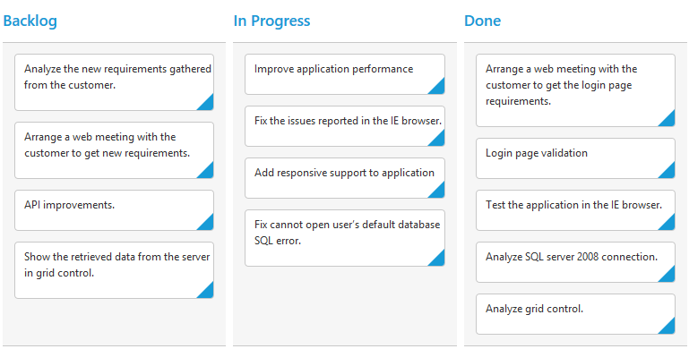

# Getting Started

Before we start with the Kanban, please refer [this page](http://help.syncfusion.com/js/angularjs) page for general information regarding integrating Syncfusion widget’s.

## Adding JavaScript and CSS references

To render the Kanban control, the following list of external dependencies are needed, 

* [jQuery](http://jquery.com) - 1.7.1 and later versions
* [jsRender](https://github.com/borismoore/jsrender) - to render the templates
* [Angular](https://angularjs.org/) - angular latest versions

The required angular script as `angular.min.js` and `ej.widget.angular.min.js` which can be available in below [CDN](/js/cdn) links:

* `angular.min.js` - [http://cdn.syncfusion.com/js/assets/external/angular.min.js](http://cdn.syncfusion.com/js/assets/external/angular.min.js)
* `ej.widget.angular.min.js` - [http://cdn.syncfusion.com/{{ site.releaseversion }}/js/common/ej.widget.angular.min.js](http://cdn.syncfusion.com/14.3.0.49/js/common/ej.widget.angular.min.js)

The other required internal dependencies are tabulated below,

<table>
   <tr>
      <th>
         <b>Files</b>
      </th>
      <th>
         <b>Description/Usage </b>
      </th>
   </tr>
   <tr>
      <td>
         ej.core.min.js
      </td>
      <td>
        It is referred always before using all the JS controls.
      </td>
   </tr>
   <tr>
      <td>
         ej.data.min.js
      </td>
      <td>
         Used to handle data operation and is used while binding data to the JS controls.
      </td>
   </tr>
   <tr>
      <td>
        ej.touch.min.js 
      </td>
      <td>
          It is referred when using touch functionalities in Kanban.
      </td>
   </tr>
    <tr>
      <td>
        ej.draggable.min.js 
      </td>
      <td>
          It is referred when using drag and drop in Kanban.
      </td>
   </tr>
   <tr>
      <td>
        ej.kanban.min.js
      </td>
      <td>
        Kanban core script file which includes kanban related scripts files such as <i>ej.kanban.base.js</i>,
         <i>ej.kanban.common.js</i>,<i>ej.kanban.dragAndDrop.js</i>,<i>ej.kanban.edit.js</i>,
         <i>ej.kanban.adaptive.js</i>,<i>ej.kanban.filter.js</i>,<i>ej.kanban.scroller.js</i>,
         <i>ej.kanban.selection.js</i>,<i>ej.kanban.swimlane.js</i> and <i>ej.kanban.context.js</i>  
      </td>
   </tr>
   <tr>
      <td>
        ej.globalize.min.js
      </td>
      <td>
       It is referred when using localization in Kanban.
      </td>
   </tr>
   <tr>
      <td>
         ej.scroller.min.js
      </td>
      <td>
         It is referred when scrolling is used in the Kanban. 
      </td>
   </tr>
   <tr>
      <td>
         ej.waitingpopup.min.js
      </td>
      <td>
        It is referred when waiting popup used.
      </td>
   </tr>
   <tr>
      <td>
        ej.dropdownlist.min.js
      </td>
      <td rowspan = "5">
         These files are used while enable the Editing feature in the Kanban.
      </td>
   </tr>
   <tr>
      <td>
         ej.dialog.min.js
      </td>
   </tr>
   <tr>
      <td>
        ej.button.min.js
      </td>
   </tr>
   <tr>
      <td>
         ej.datepicker.min.js
      </td>
   </tr>
   <tr>
      <td>
         ej.datetimepicker.min.js
      </td>
   </tr>
   <tr>
      <td>
         ej.editor.min.js
      </td>
   </tr>
   <tr>
      <td>
        ej.toolbar.min.js
      </td>
      <td>
        These files are used while enable the Filtering feature in the Kanban.
      </td>
   </tr>
    <tr>
      <td>
        ej.menu.min.js
      </td>
      <td rowspan = "2">
         These files are used while enable the context menu feature in the Kanban.
      </td>
   </tr>
   <tr>
      <td>
         ej.checkbox.min.js
      </td>
   </tr>
   <tr>
      <td>
        ej.rte.min.js
      </td>
      <td>
        These files are used while using the cell edit type as RTE in the Kanban.
      </td>
   </tr>
</table>

N> Kanban uses one or more sub-controls, therefore refer the `ej.web.all.min.js` (which encapsulates all the `ej` controls and frameworks in a single file) in the application instead of referring all the above specified internal dependencies. 

To get the real appearance of the Kanban, the dependent CSS file `ej.web.all.min.css` (which includes styles of all the widgets) should also needs to be referred.

So the complete boilerplate code is



    <!DOCTYPE html>
    <html xmlns="http://www.w3.org/1999/xhtml" lang="en" ng-app="KanbanApp">
    <head>
    <meta name="viewport" content="width=device-width, initial-scale=1.0">
    <meta name="description" content="Essential Studio for JavaScript">
    <meta name="author" content="Syncfusion">
    <title>Essential Studio for AngularJS: Kanban</title>
    <!-- Essential Studio for JavaScript  theme reference -->
    <link href="http://cdn.syncfusion.com/{{ site.releaseversion }}/js/web/flat-azure/ej.web.all.min.css" rel="stylesheet" />
    <!-- Essential Studio for JavaScript  script references -->
    
    
        
    
    
    <!-- Add your custom scripts here -->
    </head>
    <body>
    </body>
    </html>



N> 1. In production, we highly recommend you to use our [`custom script generator`](http://help.syncfusion.com/js/custom-script-generator) to create custom script file with required controls and its dependencies only. Also to reduce the file size further please use [`GZip compression`](https://developers.google.com/web/fundamentals/performance/optimizing-content-efficiency/optimize-encoding-and-transfer?hl=en) in your server.
N> 2. For themes, you can use the `ej.web.all.min.css` CDN link from the code snippet given. To add the themes in your application, please refer to [`this link`](http://help.syncfusion.com/js/theming-in-essential-javascript-components).

## Create a Kanban

All the Essential JavaScript directives have been encapsulated into a single module called `ejangular` so the first step would be to declare dependency for this module within your AngularJS application.

The kanban can be created using `ej-kanban` AngularJS directive and its properties can be defined using `e-` prefix followed by the property name.(For example, e-headertext)

The code example for defining controls in AngularJS is as follows,



    <html xmlns="http://www.w3.org/1999/xhtml" lang="en" ng-app="KanbanApp">
    <head>
        <title>Essential Studio for AngularJS: Kanban</title>
    </head>
    <body ng-controller="KanbanCtrl">
                    

                        

                            

                            

                            
                            

                        
										
                    

        
    </body>
    </html>



## Data Binding

`Data binding` in the Kanban is achieved by using the [ej.DataManager](http://help.syncfusion.com/js/datamanager/overview) that supports both RESTful JSON data services binding and local JSON array binding. To set the data source to Kanban, the `dataSource` property is assigned with the instance of the `ej.DataManger`. 

For demonstration purpose, [Northwind OData service](http://mvc.syncfusion.com/Services/Northwnd.svc/) is used in this tutorial. Refer to the following code example.



    <html xmlns="http://www.w3.org/1999/xhtml" lang="en" ng-app="KanbanApp">
    <head>
        <title>Essential Studio for AngularJS: Kanban</title>
    </head>
    <body ng-controller="KanbanCtrl">
                    

                            

                                

                                

                                
                                

                            
										
                    

        
    </body>
    </html>



N>  ODataAdaptor is the default adaptor used within DataManager. While binding to other web services, proper [`data adaptor`](http://help.syncfusion.com/js/datamanager/data-adaptors) needs to be set for `adaptor` option of DataManager.

## Mapping Values

In order to display cards in Kanban control, you need to map the database fields to Kanban cards and columns. The required mapping field are listed as follows

* `e-keyField` - Map the column name to use as `key` values to columns.
* `e-columns` -  Map the corresponding `key` values of `e-keyField` column to each columns
* `e-fields.content` - Map the column name to use as content to cards.
* `e-fields.primaryKey` - Map the column name to use as primary Key.



    <html xmlns="http://www.w3.org/1999/xhtml" lang="en" ng-app="KanbanApp">
    <head>
        <title>Essential Studio for AngularJS: Kanban</title>
    </head>
    <body ng-controller="KanbanCtrl">
                    

                            

                                

                                

                                
                                

                            
										
                    

        
    </body>
    </html>

 

N>  `e-fields.primaryKey` field is mandatory for “Drag and Drop” ,”Selection” and “Editing” Features.

## Enable Swimlane

`Swimlane` can be enabled by mapping the `e-fields.swimlaneKey` to appropriate column name in `dataSource`. This enables the grouping of the cards based on the mapped column values.



    <html xmlns="http://www.w3.org/1999/xhtml" lang="en" ng-app="KanbanApp">
        <head>
            <title>Essential Studio for AngularJS: Kanban</title>
        </head>
        <body ng-controller="KanbanCtrl">
                        

                            

                                

                                

                                
                                

                            
										
                        

            
        </body>
    </html>

 

## Adding Filters

Filters allows to filter the collection of cards from `dataSource` which meets the predefined `e-query` in the filters collection. To enable filtering, define `e-filterSettings` collection with display `e-text` and [ej.Query](http://help.syncfusion.com/js/datamanager/query).
 


    <html xmlns="http://www.w3.org/1999/xhtml" lang="en" ng-app="KanbanApp">
        <head>
            <title>Essential Studio for AngularJS: Kanban</title>
        </head>
        <body ng-controller="KanbanCtrl">
                 

                     

                         

                         

                         
                         

                     
		
                     

                         

                         

						 
                     
						
                 
                
            
        </body>
    </html>

 

N> The control can be render using `ej.web.all.min.js` and angular related references are referred from `ej.widget.angular.min.js` to render the control.
