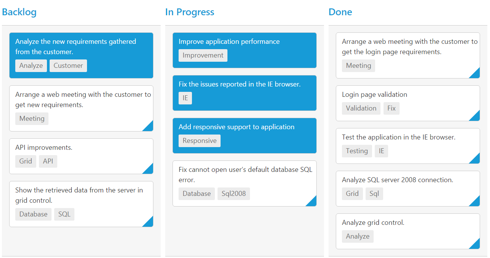

# Selection and Hovering

Selection provides an interactive support to highlight the card that you select. Selection can be done through simple Mouse down or Keyboard interaction. To enable selection, set `allowSelection` as true.

You can see the mouse hovering effect on the corresponding cards using `allowHover` property. By default selection and hovering is `true`.

## Types of Selection

Two types of selections available in Kanban are,

1.	Single
2.	Multiple

### Single Selection

To enable single selection by setting `selectionType` property as single.

### Multiple Selection

Multiple selections is an interactive support to select a group of cards in Kanban by mouse or keyboard interactions. To enable multiple selections by set `selectionType` property as `multiple`.

You can select multiple random cards below key press.

<table>
<tr>
<th>
Keys</th><th>
Description</th></tr>
<tr>
<td>
Ctrl + mouse left</td><td>
To select multiple random cards.</td></tr>
<tr>
<td>
Shift + mouse left </td><td>
To continuous cards select.</td></tr>
</table>

To unselect selected cards, by press “Shift + mouse left” click on selected row.

The following code example describes the above behavior.



<!DOCTYPE html>
<html xmlns="http://www.w3.org/1999/xhtml" lang="en" ng-app="KanbanApp">
<head>
    <title>Essential Studio for AngularJS: Kanban</title>
</head>
<body ng-controller="KanbanCtrl">
    

        

            

            

            

        

    

    
</body>
</html>



The following output is displayed as a result of the above code example.

