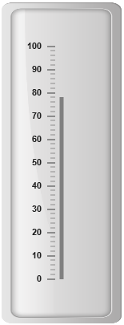
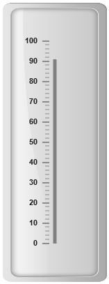
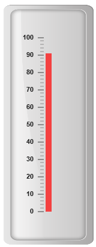
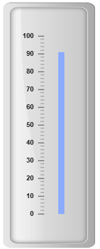
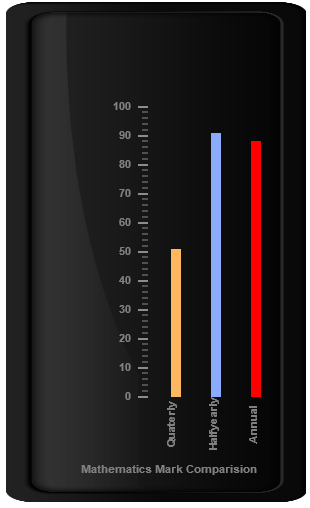

# Bar Pointers

**Bar Pointer** value points out the actual value set in the **Linear Gauge** as marker pointer. You can set the values of the various bar pointer attributes such as value, width, border and color in bar pointer collection.  You can also customize the pointers to improve the appearance of gauge.

## Adding bar pointer collection

You can add Bar Pointer collection directly to the scale object. Refer the following code example.



<html xmlns="http://www.w3.org/1999/xhtml" lang="en" ng-app="LinearGaugeApp">
    <head>
        <title>Essential Studio for AngularJS: LinearGauge</title>
        <!--CSS and Script file References -->
    </head>
    <body ng-controller="LinearGaugeCtrl">
        

                 <ej-lineargauge e-value="78" e-frame-innerwidth="8" e-frame-outerwidth="10"
                 e-frame-backgroundImageUrl="../images/gauge/Gauge_linear_light.png" >
                 <e-scales>
                 <e-scale   e-backgroundcolor="transparent" 
                 e-border-color="transparent" e-border-width="0" e-showBarPointers="true" 
                 e-showMarkerPointers="false" >
                 <e-barpointers>
                 <e-barpointer  e-width="5" e-backgroundColor="grey">
                 </e-barpointer>
                 </e-barpointers>
                 <e-ticks>
                 <e-tick e-type="majorinterval" e-width="2" e-color="#8c8c8c" 
                 e-distancefromscale-x="7" e-distancefromscale-y="0"></e-tick>
                 <e-tick e-type="minorinterval" e-width="1" e-height="6" e-color="#8c8c8c"
                 e-distancefromscale-x="7" e-distancefromscale-y="0"></e-tick>
                 </e-ticks>
                 </e-scale>
                 </e-scales>
                 </ej-lineargauge>
        

        
    </body>
</html>



Execute the above code to render the following output.

## Adding bar pointer value

Bar pointer value is also important element in the **Linear Gauge** as it indicates the gauge value. Real purpose of the **Linear Gauge** is based on the pointer value. You can set the bar pointer value either directly during rendering the control or it can be achieved by public method.



<html xmlns="http://www.w3.org/1999/xhtml" lang="en" ng-app="LinearGaugeApp">
    <head>
        <title>Essential Studio for AngularJS: LinearGauge</title>
        <!--CSS and Script file References -->
    </head>
    <body ng-controller="LinearGaugeCtrl">
        

                 <ej-lineargauge  e-frame-innerwidth="8" e-frame-outerwidth="10"
                 e-frame-backgroundImageUrl="../images/gauge/Gauge_linear_light.png" >
                 <e-scales>
                 <e-scale   e-backgroundcolor="transparent" 
                 e-border-color="transparent" e-border-width="0" e-showBarPointers="true" 
                 e-showMarkerPointers="false" >
                 <e-barpointers>
                 <e-barpointer  e-width="5" e-backgroundColor="grey" e-value="91">
                 </e-barpointer>
                 </e-barpointers>
                 <e-ticks>
                 <e-tick e-type="majorinterval" e-width="2" e-color="#8c8c8c" 
                 e-distancefromscale-x="7" e-distancefromscale-y="0"></e-tick>
                 <e-tick e-type="minorinterval" e-width="1" e-height="6" e-color="#8c8c8c" 
                 e-distancefromscale-x="7" e-distancefromscale-y="0"></e-tick>
                 </e-ticks>
                 </e-scale>
                 </e-scales>
                 </ej-lineargauge>
        

        
    </body>
</html>



Execute the above code to render the following output.

## Pointer Styles

**Appearance**

* Based on the value, the bar pointer points out the label value. You can set the bar pointer width using **width** property and you can also adjust the opacity of the pointer using **opacity** property that holds the value between 0 and 1. You can add the gradient effects to the pointer using **gradient** object. 

* The marker pointer border is modified with the object **border**. It has two border property, **color** and **width** which are used to customize the border color of the scale and border width of the marker pointer. The background color can be customized with attribute **backgroundColor**.



<html xmlns="http://www.w3.org/1999/xhtml" lang="en" ng-app="LinearGaugeApp">
    <head>
        <title>Essential Studio for AngularJS: LinearGauge</title>
        <!--CSS and Script file References -->
    </head>
    <body ng-controller="LinearGaugeCtrl">
        

                 <ej-lineargauge   e-enableanimation="false" e-frame-innerwidth="8" 
                 e-frame-outerWidth="10" 
                 e-frame-backgroundImageUrl="../images/gauge/Gauge_linear_light.png" >
                 <e-scales>
                 <e-scale   e-backgroundcolor="transparent" 
                 e-border-color="transparent" e-border-width="0" e-showBarPointers="true" 
                 e-showMarkerPointers="false" >
                 <e-barpointers>
                 <e-barpointer  e-width="10"  e-backgroundColor="red" e-opacity="0.7" 
                 e-border-color="#860201" e-border-width="2" e-value="91">
                 </e-barpointer>
                 </e-barpointers>
                 <e-ticks>
                 <e-tick e-type="majorinterval" e-width="2" e-color="#8c8c8c" 
                 e-distancefromscale-x="7" e-distancefromscale-y="0"></e-tick>
                 <e-tick e-type="minorinterval" e-width="1" e-height="6" e-color="#8c8c8c" 
                 e-distancefromscale-x="7" e-distancefromscale-y="0"></e-tick>
                 </e-ticks>
                 </e-scale>
                 </e-scales>
                 </ej-lineargauge>
        

        
    </body>
</html>



Execute the above code to render the following output.

## Positioning the pointer	

* Bar pointer can be positioned with two properties such as **distanceFromScale** and **placement**. The **distanceFromScale** property defines the distance between the scale and pointer element. 

* The **placement** property is used to locate the pointer with respect to scale either inside or outside the scale or along the scale. It is an enumerable data type.



<html xmlns="http://www.w3.org/1999/xhtml" lang="en" ng-app="LinearGaugeApp">
    <head>
        <title>Essential Studio for AngularJS: LinearGauge</title>
        <!--CSS and Script file References -->
    </head>
    <body ng-controller="LinearGaugeCtrl">
        

                 <ej-lineargauge   e-enableanimation="false" e-frame-innerwidth="8" 
                 e-frame-outerWidth="10"
                 e-frame-backgroundImageUrl="../images/gauge/Gauge_linear_light.png" >
                 <e-scales>
                 <e-scale   e-backgroundcolor="transparent" e-border-color="transparent" 
                 e-border-width="0" e-showBarPointers="true" e-showMarkerPointers="false">
                 <e-barpointers>
                 <e-barpointer  e-width="10"  e-backgroundColor="#8BABFF" e-placement="near" 
                 e-distancefromscale="20" e-value="91">
                 </e-barpointer>
                 </e-barpointers>
                 <e-ticks>
                 <e-tick e-type="majorinterval" e-width="2" e-color="#8c8c8c" 
                 e-distancefromscale-x="7" e-distancefromscale-y="0"></e-tick>
                 <e-tick e-type="minorinterval" e-width="1" e-height="6" e-color="#8c8c8c" 
                 e-distancefromscale-x="7" e-distancefromscale-y="0"></e-tick>
                 </e-ticks>
                 </e-scale>
                 </e-scales>
                 </ej-lineargauge>
        

        
    </body>
</html>



Execute the above code to render the following output.

## Multiple Bar Pointers

**Linear Gauge** can contain multiple bar pointers on it. You can use any combination and any number of pointers in a gauge. That is, a Gauge can contain any number of marker pointer and any number of bar pointers. Refer the following code example containing multiple bar pointers.



<html xmlns="http://www.w3.org/1999/xhtml" lang="en" ng-app="LinearGaugeApp">
    <head>
        <title>Essential Studio for AngularJS: LinearGauge</title>
        <!--CSS and Script file References -->
    </head>
    <body ng-controller="LinearGaugeCtrl">
        

                 <ej-lineargauge   e-enableanimation="false" e-height="500" e-width="300" 
                 e-labelcolor="Grey" e-frame-innerWidth="8" e-frame-outerWidth="10"
                 e-frame-backgroundImageUrl="../images/gauge/Gauge_linear_light.png" >
                 <e-scales>
                 <e-scale   e-backgroundcolor="transparent" e-border-color="transparent" 
                 e-border-width="0" e-showBarPointers="true" e-showMarkerPointers="false" 
                 e-showCustomLabels="true" ><e-barpointers>
                 //adding first bar pointer 
                 <e-barpointer  e-width="10"  e-backgroundColor="#8BABFF" e-placement="near" 
                 e-distancefromscale="60" e-value="91"></e-barpointer>
                 //adding second bar pointer
                 <e-barpointer  e-width="10"  e-backgroundColor="#FDB761" e-placement="near" 
                 e-distancefromscale="20" e-value="51">
                 </e-barpointer>
                  //adding third bar pointer
                 <e-barpointer  e-width="10"  e-backgroundColor="Red" e-placement="near" 
                 e-distancefromscale="100" e-value="88">
                 </e-barpointer>
                 </e-barpointers>
                 <e-ticks>
                 <e-tick e-type="majorinterval" e-width="2" e-color="#8c8c8c" e-distancefromscale-x="7" 
                 e-distancefromscale-y="0"></e-tick>
                 <e-tick e-type="minorinterval" e-width="1" e-height="6" e-color="#8c8c8c" 
                 e-distancefromscale-x="7" e-distancefromscale-y="0"></e-tick>
                 </e-ticks>
                 <e-customlabels>
                 <e-customlabel e-value="Mathematics Mark Comparision" e-position-x="55" 
                 e-position-y="97"></e-customlabel>
                 <e-customlabel e-value="HalfYearly" e-position-x="72" e-position-y="87" 
                 e-textangle="90"></e-customlabel>
                 <e-customlabel e-value="Quarterly" e-position-x="56" e-position-y="87" 
                 e-textangle="90"></e-customlabel>
                 <e-customlabel e-value="Annual" e-position-x="87" e-position-y="87" 
                 e-textangle="90"></e-customlabel>
                 </e-customlabels>
                 </e-scale>
                 </e-scales>
                 </ej-lineargauge>
        

        
    </body>
</html>



Execute the above code to render the following output.

