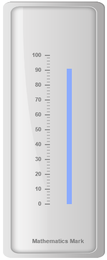
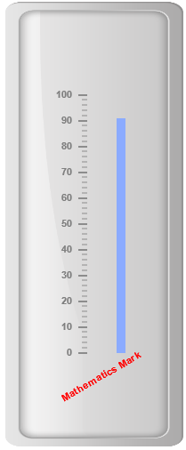
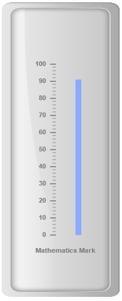
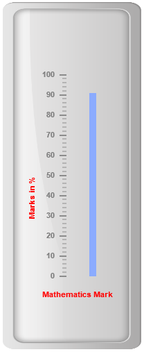

# Custom labels

Custom labels are the text that can paste in any location of the **Linear Gauge**. It is used to define the purpose of the gauge.

## Adding Custom label collection

Custom labels collection can be directly added to the scale object. Refer the following code to add custom labels collection in a **Linear Gauge** control.



<html xmlns="http://www.w3.org/1999/xhtml" lang="en" ng-app="LinearGaugeApp">
    <head>
        <title>Essential Studio for AngularJS: LinearGauge</title>
        <!--CSS and Script file References -->
    </head>
    <body ng-controller="LinearGaugeCtrl">
        

                 <ej-lineargauge   e-enableanimation="false" e-height="500" e-width="200" 
                 e-labelcolor="Grey" e-frame-innerWidth="8" e-frame-outerWidth="10"
                 e-frame-backgroundImageUrl="../images/gauge/Gauge_linear_light.png" >
                 <e-scales>
                 <e-scale   e-backgroundcolor="transparent" e-border-color="transparent"
                 e-border-width="0" e-showBarPointers="true" e-showMarkerPointers="false" 
                 e-showCustomLabels="true" >
                 <e-barpointers>
                 <e-barpointer  e-width="10"  e-backgroundColor="#8BABFF" e-placement="near" 
                 e-distancefromscale="30" e-value="91">
                 </e-barpointer>
                 </e-barpointers>
                 <e-ticks>
                 <e-tick e-type="majorinterval" e-width="2" e-color="#8c8c8c" e-distancefromscale-x="7" 
                 e-distancefromscale-y="0"></e-tick>
                 <e-tick e-type="minorinterval" e-width="1" e-height="6" e-color="#8c8c8c" 
                 e-distancefromscale-x="7" e-distancefromscale-y="0"></e-tick>
                 </e-ticks>
                 <e-customlabels>
                 <e-customlabel e-value="Mathematics Mark" e-position-x="55" e-position-y="97">
                 </e-customlabel>
                 </e-customlabels>
                 </e-scale>
                 </e-scales>
                 </ej-lineargauge>
        

        
    </body>
</html>



Execute the above code to render the following output.

## Basic Customization

**Appearance**

* You can customize custom labels using the properties like **textAngle**, **color** and **font**. The API **textAngle** is used to display the custom labels in the specified angles and **color** attribute is used to display the custom labels in specified color. You can use **value** attribute to set the text value in the custom labels. 

* To display the custom labels, set **showCustomLabels** as ‘true’. Font option is also available on the custom labels. The basic three properties of fonts such as size, family and style can be achieved by **size**, **fontStyle** and **fontFamily**. You can adjust the opacity of the label with the property **opacity** and the value of opacity lies between 0 and 1.



<html xmlns="http://www.w3.org/1999/xhtml" lang="en" ng-app="LinearGaugeApp">
    <head>
        <title>Essential Studio for AngularJS: LinearGauge</title>
        <!--CSS and Script file References -->
    </head>
    <body ng-controller="LinearGaugeCtrl">
        

                 <ej-lineargauge   e-enableanimation="false" e-height="500" e-width="200" 
                 e-labelcolor="Grey" e-frame-innerWidth="8" e-frame-outerWidth="10"
                 e-frame-backgroundImageUrl="../images/gauge/Gauge_linear_light.png" >
                 <e-scales>
                 <e-scale  e-backgroundcolor="transparent" e-border-color="transparent" 
                 e-border-width="0" e-showBarPointers="true" e-showMarkerPointers="false" 
                 e-showCustomLabels="true" >
                 <e-barpointers>
                 <e-barpointer  e-width="10"  e-backgroundColor="#8BABFF" e-placement="near" 
                 e-distancefromscale="30" e-value="91">
                 </e-barpointer>
                 </e-barpointers>
                 <e-ticks>
                 <e-tick e-type="majorinterval" e-width="2" e-color="#8c8c8c" e-distancefromscale-x="7" 
                 e-distancefromscale-y="0"></e-tick>
                 <e-tick e-type="minorinterval" e-width="1" e-height="6" e-color="#8c8c8c" 
                 e-distancefromscale-x="7" e-distancefromscale-y="0"></e-tick>
                 </e-ticks>
                 <e-customlabels>
                 <e-customlabel e-value="Mathematics Mark" e-position-x="55" e-position-y="87" 
                 e-textAngle="30" e-opacity="0.5" e-color="red"></e-customlabel>
                 </e-customlabels>
                 </e-scale>
                 </e-scales>
                 </ej-lineargauge>
        

        
    </body>
</html>



Execute the above code to render the following output.

## Locating the CustomLabels

To set the location of the custom label in **Linear Gauge**, **position** property is used. You can position the custom labels in horizontal and vertical axis using **X** and **Y** axis respectively.



<html xmlns="http://www.w3.org/1999/xhtml" lang="en" ng-app="LinearGaugeApp">
    <head>
        <title>Essential Studio for AngularJS: LinearGauge</title>
        <!--CSS and Script file References -->
    </head>
    <body ng-controller="LinearGaugeCtrl">
        

                 <ej-lineargauge   e-enableanimation="false" e-height="500" e-width="200" 
                 e-labelcolor="Grey" e-frame-innerWidth="8" e-frame-outerWidth="10"
                 e-frame-backgroundImageUrl="../images/gauge/Gauge_linear_light.png" >
                 <e-scales>
                 <e-scale   e-backgroundcolor="transparent" e-border-color="transparent" 
                 e-border-width="0" e-showBarPointers="true" e-showMarkerPointers="false" 
                 e-showCustomLabels="true" >
                 <e-barpointers>
                 <e-barpointer  e-width="10"  e-backgroundColor="#8BABFF" e-placement="near" 
                 e-distancefromscale="30" e-value="91">
                 </e-barpointer>
                 </e-barpointers>
                 <e-ticks>
                 <e-tick e-type="majorinterval" e-width="2" e-color="#8c8c8c" e-distancefromscale-x="7" 
                 e-distancefromscale-y="0"></e-tick>
                 <e-tick e-type="minorinterval" e-width="1" e-height="6" e-color="#8c8c8c" 
                 e-distancefromscale-x="7" e-distancefromscale-y="0"></e-tick>
                 </e-ticks>
                 <e-customlabels>
                 <e-customlabel e-value="Mathematics Mark" e-position-x="55" e-position-y="87" >
                 </e-customlabel>
                 </e-customlabels>
                 </e-scale>
                 </e-scales>
                 </ej-lineargauge>
        

        
    </body>
</html>



Execute the above code to render the following output.

## Multiple Custom Labels

You can set multiple custom labels in a single **Linear Gauge** by adding an array of custom label objects. Refer the following code example for multiple custom label functionality.



<html xmlns="http://www.w3.org/1999/xhtml" lang="en" ng-app="LinearGaugeApp">
    <head>
        <title>Essential Studio for AngularJS: LinearGauge</title>
        <!--CSS and Script file References -->
    </head>
    <body ng-controller="LinearGaugeCtrl">
        

                 <ej-lineargauge   e-enableanimation="false" e-height="500" e-width="200" 
                 e-labelcolor="Grey" e-frame-innerWidth="8" e-frame-outerWidth="10"
                 e-frame-backgroundImageUrl="../images/gauge/Gauge_linear_light.png" >
                 <e-scales>
                 <e-scale   e-backgroundcolor="transparent" e-border-color="transparent" 
                 e-border-width="0" e-showBarPointers="true" e-showMarkerPointers="false" 
                 e-showCustomLabels="true" >
                 <e-barpointers>
                 <e-barpointer  e-width="10"  e-backgroundColor="#8BABFF" e-placement="near" 
                 e-distancefromscale="30" e-value="91">
                 </e-barpointer>
                 </e-barpointers>
                 <e-ticks>
                 <e-tick e-type="majorinterval" e-width="2" e-color="#8c8c8c" e-distancefromscale-x="7" 
                 e-distancefromscale-y="0"></e-tick>
                 <e-tick e-type="minorinterval" e-width="1" e-height="6" e-color="#8c8c8c" 
                 e-distancefromscale-x="7" e-distancefromscale-y="0"></e-tick>
                 </e-ticks>
                 <e-customlabels>
                 <e-customlabel e-value="Mathematics Mark" e-position-x="55" e-position-y="87" 
                 e-color="red"></e-customlabel>
                 <e-customlabel e-value="Marks in %" e-position-x="15" e-position-y="87" 
                 e-color="red" e-textAngle="90"></e-customlabel>
                 </e-customlabels>
                 </e-scale>
                 </e-scales>
                 </ej-lineargauge>
        

        
    </body>
</html>



Execute the above code to render the following output.

