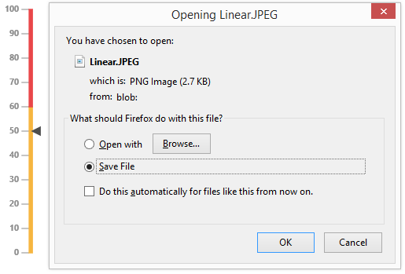

# Exporting

**Linear Gauge** has an exporting feature that converts **Gauge** control into image format and then export in client side. The method API **exportImage** is used to export the **LinearGauge**. It has two arguments such as **file name** and **file format** to specify the file name and file formats. For exporting refer the following code example.



 <ej-lineargauge  e-labelcolor="#8c8c8c" e-width="450" >
                 <e-scales>
                 <e-scale e-width="4" e-backgroundColor="transparent" e-showranges="true" e-showbarpointers="false" e-length="310" 
                 e-border-color="transparent" e-border-width="0" e-position-x=52 e-position-y="50" >
                 <e-markerpointers>
                 <e-markerpointer  e-width="10" e-length="10" e-backgroundColor="#4D4D4D"  e-border-color="#4D4D4D" e-value="50">
                 </e-markerpointer>
                 </e-markerpointers>
                 <e-ticks>
                 <e-tick e-type="majorinterval" e-width="1" e-color="#8c8c8c" ></e-tick>
                 </e-ticks>
                 <e-labels>
                 <e-label e-distancefromscale-x="-13" e-font-size="11px" e-font-fontfamily="segeo ui" e-font-fontstyle="bold" >
                 </e-label>
                 </e-labels>
                 <e-ranges>
                 <e-range e-endvalue="60" e-startvalue="0" e-startwidth="4"  e-endwidth="4" e-backgroundcolor="#F6B53F" 
                 e-border-color="#F6B53F"></e-range>
                 <e-range e-endvalue="100" e-startvalue="60" e-startwidth="4"  e-endwidth="4" e-backgroundcolor="#E94649" 
                 e-border-color="#E94649"></e-range>
                 </e-ranges>
                 </e-scale>
                 </e-scales>
                 </ej-lineargauge>

<button id="buttonSubmit">Export</button>

FileName 

<input type="text" id="fileName">

FileFormat 

<select id="fileFormat">
<option value="JPEG">JPEG</option>
<option value="PNG">PNG</option>
</select>

$(function () {
        // declaration
        $("#buttonSubmit").ejButton({ width: "50px", click: "buttonClickEvent", });
        $("#fileFormat").ejDropDownList({ selectedItemIndex: 0, width: "115" });
       });
    function buttonClickEvent() {
        var FileName = $("#fileName").val();
        var FileFormat = $("#fileFormat").ejDropDownList("option", "value");
        $("#LinearGauge1").ejLinearGauge("exportImage", FileName, FileFormat);
    }
 



Execute the above code to render the following output.

