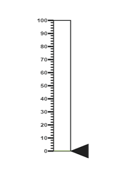
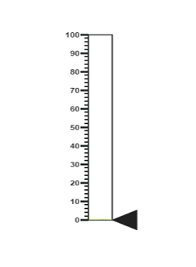
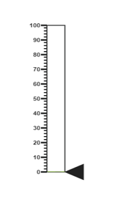
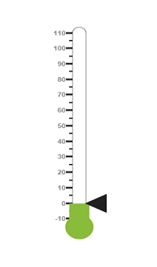
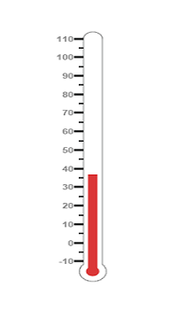
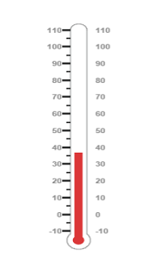
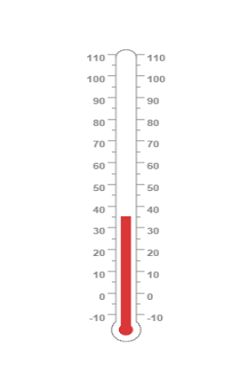
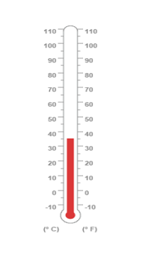
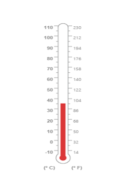

# Getting Started

Before we start with the linear gauge, please refer [this page](http://help.syncfusion.com/js/angularjs) page for general information regarding integrating Syncfusion widget’s.

## Adding JavaScript and CSS references

To render the linear gauge control, the following list of external dependencies are needed, 

* [jQuery](http://jquery.com) - 1.7.1 and later versions
* [Angular](https://angularjs.org/) - Angular latest versions

The required angular script as `angular.min.js` and `ej.widget.angular.min.js` which can be available in below [CDN](/js/cdn) links:

* `angular.min.js` - [http://cdn.syncfusion.com/js/assets/external/angular.min.js](http://cdn.syncfusion.com/js/assets/external/angular.min.js)
* `ej.widget.angular.min.js` - [http://cdn.syncfusion.com/{{ site.releaseversion }}/js/common/ej.widget.angular.min.js](http://cdn.syncfusion.com/14.3.0.49/js/common/ej.widget.angular.min.js)

The other required internal dependencies are tabulated below,

<table>
   <tr>
      <th>
         <b>Files</b>
      </th>
      <th>
         <b>Description/Usage </b>
      </th>
   </tr>
   <tr>
      <td>
         ej.core.min.js
      </td>
      <td>
        It is referred always before using all the JS controls.
      </td>
   </tr>
   <tr>
      <td>
         ej.data.min.js
      </td>
      <td>
         Used to handle data operation and is used while binding data to the JS controls.
      </td>
   </tr>
   <tr>
      <td>
        ej.lineargauge.min.js 
      </td>
      <td>
         LinearGauge core script file which includes linear gauge related scripts files.
      </td>
   </tr>
    <tr>
      <td>
        ej.excanvas.min.js 
      </td>
      <td>
          
      </td>
   </tr>
</table>

N> Refer the `ej.web.all.min.js` (which encapsulates all the `ej` controls and frameworks in a single file) in the application instead of referring all the above specified internal dependencies. 

To get the real appearance of the linear gauge, the dependent CSS file `ej.web.all.min.css` (which includes styles of all the widgets) should also needs to be referred.

So the complete boilerplate code is



    <!DOCTYPE html>
    <html xmlns="http://www.w3.org/1999/xhtml" lang="en" ng-app="LinearGaugeApp">
    <head>
    <title>Essential Studio for AngularJS: LinearGauge</title>
    <!-- Essential Studio for JavaScript  theme reference -->
    <link href="http://cdn.syncfusion.com/{{ site.releaseversion }}/js/web/flat-azure/ej.web.all.min.css" rel="stylesheet" />
    <!-- Essential Studio for JavaScript  script references -->
    
        
    
    
    <!-- Add your custom scripts here -->
    </head>
    <body>
    </body>
    </html>



N> 1. In production, we highly recommend you to use our [`custom script generator`](http://help.syncfusion.com/js/custom-script-generator) to create custom script file with required controls and its dependencies only. Also to reduce the file size further please use [`GZip compression`](https://developers.google.com/web/fundamentals/performance/optimizing-content-efficiency/optimize-encoding-and-transfer?hl=en) in your server.
N> 2. For themes, you can use the `ej.web.all.min.css` CDN link from the code snippet given. To add the themes in your application, please refer to [`this link`](http://help.syncfusion.com/js/theming-in-essential-javascript-components).

## Create a linear gauge

All the Essential JavaScript directives have been encapsulated into a single module called `ejangular` so the first step would be to declare dependency for this module within your AngularJS application.

The linear gauge can be created using `ej-lineargauge` AngularJS directive and its properties can be defined using `e-` prefix followed by the property name.(For example, e-height)

The code example for defining controls in AngularJS is as follows,



<html xmlns="http://www.w3.org/1999/xhtml" lang="en" ng-app="LinearGaugeApp">
    <head>
        <title>Essential Studio for AngularJS: LinearGauge</title>
        <!--CSS and Script file References -->
    </head>
    <body ng-controller="LinearGaugeCtrl">
        

                 <ej-lineargauge></ej-lineargauge>
        

    </body>
</html>



On executing the above code, sample renders a default **Linear Gauge** with default values as follows.

## Set Height and Width values

* Basic attributes of each canvas elements are height and width properties. 

* You can set the height and width of the gauge as shown in the following code example.



 <ej-lineargauge e-height="550" e-width="500">
 </ej-lineargauge>



On executing the above code sample renders a default **Linear Gauge** with height and width.

## Set animate option and Label Color

* You can draw the Thermometer with Label color and set animate property to _true_.  

* Initially set the animate property to _false_ to avoid unwanted script loads.



  <ej-lineargauge e-height="550" e-width="500" e-labelcolor="#8c8c8c" e-enableanimation="false">
  </ej-lineargauge>



On executing the above code sample renders a customized **Linear Gauge** as follows.

## Provide scale values

* You can change the Scale Style of Thermometer using **type** property.

* You can set the Minimum temperature up to -10 and maximum body temperature up to 110. 

* You can set the Minimum scale value as -10 and maximum value as 110.

* You can set the Location values such as vertical and horizontal position in the thermometer.

* You can set the thermometer height using **length** property.

* You can set the Minor Interval value as 5 to get the exact temperature of the patient.



<ej-lineargauge e-height="550" e-width="500" e-labelcolor="#8c8c8c" e-enableanimation="false">
    <e-scales>
       <e-scale e-type="thermometer" e-backgroundcolor="transparent" e-minimum="-10" e-maximum="110" 
       e-minorintervalvalue="5" e-width="20" e-position-x="50" e-position-y="18" e-length="355" 
       e-border-width="0.5">
       //Add the pointers customization code here
       //Add the labels customization code here
       //Add the ticks customization code here
       //Add the Custom labels customization code here
       </e-scale>
    </e-scales>
</ej-lineargauge>
    


On executing the above code sample renders a customized gauge with ranges as follows.

## Add pointers data

In **Linear gauge** there are two types of pointers available such as marker pointer and bar pointer.

* **Marker pointer** displays as a pointer device which shows the actual values. In this example, there is no need to show a marker pointer in a thermometer, therefore, you can hide it by setting the **Opacity** property to ‘0’.

* **Bar pointer** displays as a mercury metal that shows the exact temperature of the person. You can set the basic properties of the bar pointer such as **width**, **distanceFromScale**, **Value** and **backgroundColor**.



<ej-lineargauge e-height="550" e-width="500" e-labelcolor="#8c8c8c" e-enableanimation="false">
    <e-scales>
       <e-scale e-type="thermometer" e-backgroundcolor="transparent" e-minimum="-10" e-maximum="110"
       e-minorintervalvalue="5" e-width="20" e-position-x="50" e-position-y="18" e-length="355" 
       e-border-width="0.5">
       <e-markerpointers>
               <e-markerpointer e-opacity="0"></e-markerpointer>
       </e-markerpointers>
       <e-barpointers>
              <e-barpointer  e-width="10" e-distancefromscale="-0.5" e-value="37" 
              e-backgroundcolor="#DB3738"></e-barpointer>
        </e-barpointers>
        //Add the labels customization code here
        //Add the ticks customization code here
        //Add the Custom labels customization code here
        </e-scale>
    </e-scales>
</ej-lineargauge>



On executing the above code sample renders a **Linear Gauge** with bar marker as follows.

## Add Label Customization

* You can display the label value on both sides to get temperature in different scales. For that you can add two label values in an array.

* You can use the scale labels to display the value in the gauge. You can customize the label placement, font (including its style and family) and  its distance from scale.



 <ej-lineargauge e-height="550" e-width="500" e-labelcolor="#8c8c8c" e-enableanimation="false">
    <e-scales>
       <e-scale>
        //Add the labels customization code here
        //Add the ticks customization code here
        //Add the Custom labels customization code here
          <e-labels>
             <e-label e-placement="near">
                <e-font e-size="10px" e-fontfamily="Segoe UI" e-fontstyle="Normal"></e-font>
             </e-label>
             <e-label e-placement="far" e-distanceFromScale-x="10"></e-label>
          </e-labels>
        //Add the ticks customization code here
        //Add the Custom labels customization code here
        </e-scale>
    </e-scales>
</ej-lineargauge>



On executing the above code sample renders a customized **Linear Gauge** as follows.

## Add Ticks Details

* You can set the width and height of the major ticks greater than the Minor ticks. You can set dark background for tick Color to have a better visibility.

* You can also use four ticks for both the sides, each having two minor ticks and major ticks.



 <ej-lineargauge e-height="550" e-width="500" e-labelcolor="#8c8c8c" e-enableanimation="false">
    <e-scales>
       <e-scale>
            //Add the pointers customization code here
            //Add the labels customization code here
            //Add the ticks customization code here
            <e-ticks>
              <e-tick e-type="majorinterval" e-height="8" e-width="1" e-color="#8c8c8c" 
              e-distancefromscale-y="-4"></e-tick>
              <e-tick e-type="minorinterval" e-height="4" e-width="1" e-color="#8c8c8c" 
              e-distancefromscale-y="-4"></e-tick>
              <e-tick e-type="majorinterval" e-placement="far" e-height="8" e-width="1" 
              e-color="#8c8c8c" e-distancefromscale-y="-4">
              </e-tick>
              <e-tick e-type="minorinterval" e-placement="far" e-height="4" e-width="1" 
              e-color="#8c8c8c" e-distancefromscale-y="-4">
              </e-tick>
            </e-ticks>
            //Add the Custom labels customization code here   
        </e-scale>
    </e-scales>
</ej-lineargauge>



On executing the above code sample renders a **Linear Gauge** with custom labels as follows.

## Add Custom Label Details

* You can specify the texts using **Custom labels** which displays in the gauge and customize them using various properties.

* You can change the **showIndicators** property as **true** to show the custom labels.

The following code example illustrates how to use custom texts.



<ej-lineargauge e-height="550" e-width="500" e-labelcolor="#8c8c8c" e-enableanimation="false">
    <e-scales>
       <e-scale>
             //Add the pointers customization code here
             //Add the labels customization code here
             //Add the ticks customization code here
             //Add the Custom labels customization code here
            <e-customlabels>
               <e-customlabel e-value="(° C)" e-position-x="44" e-position-y="78">
                  <e-font e-size="12px" e-fontfamily="Segoe UI" e-fontstyle="Bold"></e-font>
               </e-customlabel>
               <e-customlabel e-value="(° F)" e-position-x="56" e-position-y="78">
                  <e-font e-size="12px" e-fontfamily="Segoe UI" e-fontstyle="Bold"></e-font>
               </e-customlabel>
               <e-customlabel e-position-x="51" e-position-y="90">
                  <e-font e-size="13px" e-fontfamily="Segoe UI" e-fontstyle="Bold"></e-font>
               </e-customlabel>
            </e-customlabels>
        </e-scale>
    </e-scales>
</ej-lineargauge>



On executing the above code sample renders a customized **Linear Gauge** as follows. 

## Change scale Degree to Fahrenheit

You can add a function to convert the temperature from Degrees to Fahrenheit values in the label by having index value as 1.



<ej-lineargauge e-height="550" e-width="500" e-labelcolor="#8c8c8c" e-enableanimation="false" 
e-drawlabels="DrawLabel">
</ej-lineargauge>



On executing the above code sample renders a **Linear Gauge** with values in Degrees and Fahrenheit as follows.

## Add Custom label for Current Value

You can add the function that displays the current temperature value in the custom label.



<ej-lineargauge e-height="550" e-width="500" e-labelcolor="#8c8c8c" e-enableanimation="false" 
e-drawlabels="DrawLabel">
</ej-lineargauge>



The following screen shot displays a linear gauge with all the customizations discussed earlier.

