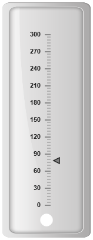
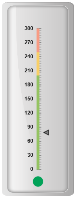
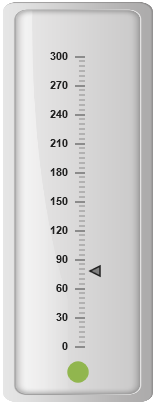
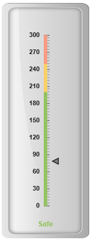
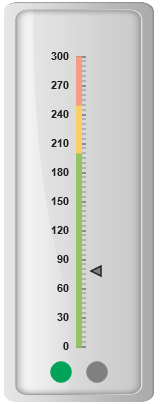

# Indicators

Indicators simply indicates the current status of the pointer. Indicators are in several formats such as in shape format, textual format and image format.

## Setting Dimension

* You can enable indicators by setting **showIndicators** to ‘true’ in scale collection. The **height** and **width** property for the indicators are used to specify the area allocated to the indicator for the width and height respectively. 

* You can use the position collection to position the indicators along **X** and **Y** axis. **X** specifies horizontal position in indicators whereas **Y** specifies vertical position in indicators. Indicators are of several types such as, dimensions like circle, rectangle, rounded rectangle, text and image. By using the **type** property it can be applied. For image type **imageUrl** property is used.



<html xmlns="http://www.w3.org/1999/xhtml" lang="en" ng-app="LinearGaugeApp">
    <head>
        <title>Essential Studio for AngularJS: LinearGauge</title>
        <!--CSS and Script file References -->
    </head>
    <body ng-controller="LinearGaugeCtrl">
        

                 <ej-lineargauge e-enableanimation="false" e-value="78" 
                 e-frame-backgroundImageUrl="../images/gauge/Gauge_linear_light.png" >
                 <e-scales>
                 <e-scale e-width="0"  e-backgroundColor="transparent" e-showIndicators="true" 
                 e-showbarpointers="false" e-border-color="transparent" e-border-width="0" 
                 e-minimum="0" e-maximum="300" e-minorintervalvalue="5" 
                 e-majorintervalvalue="30" >
                 <e-markerpointers>
                 <e-markerpointer  e-width="10" e-length="10" e-backgroundColor="grey" 
                 e-distancefromscale="12">
                 </e-markerpointer>
                 </e-markerpointers>
                 <e-ticks>
                 <e-tick e-type="majorinterval" e-width="2" e-color="#8c8c8c" e-distancefromscale-x="7"
                 e-distancefromscale-y="0"></e-tick>
                 <e-tick e-type="minorinterval" e-width="1" e-height="6" e-color="#8c8c8c" 
                 e-distancefromscale-x="7" e-distancefromscale-y="0"></e-tick>
                 </e-ticks>
                 <e-indicators>
                 <e-indicator e-type="circle" e-width="10" e-height="10"  e-position-x="50" 
                 e-position-y="100"></e-indicator>
                 </e-indicators>
                 </e-scale>
                 </e-scales>
                 </ej-lineargauge>
        

        
    </body>
</html>



Execute the above code to render the following output.

## State Ranges

State ranges are used to specify the indicator behavior in the certain region. **startValue** and **endValue** are used to set the range bound for the pointer. Whenever the pointer crosses the specified region, the indicator attributes are applied for the ranges.



<html xmlns="http://www.w3.org/1999/xhtml" lang="en" ng-app="LinearGaugeApp">
    <head>
        <title>Essential Studio for AngularJS: LinearGauge</title>
        <!--CSS and Script file References -->
    </head>
    <body ng-controller="LinearGaugeCtrl">
        

                 <ej-lineargauge e-enableanimation="false" e-value="78" 
                 e-frame-backgroundImageUrl="../images/gauge/Gauge_linear_light.png" >
                 <e-scales>
                 <e-scale e-width="0"  e-backgroundColor="transparent" e-showIndicators="true" 
                 e-showbarpointers="false" e-showranges="true" e-border-color="transparent" 
                 e-border-width="0" e-minimum="0" e-maximum="300" e-minorintervalvalue="5" 
                 e-majorintervalvalue="30" >
                 <e-markerpointers>
                 <e-markerpointer  e-width="10" e-length="10" e-backgroundColor="grey" 
                 e-distancefromscale="12">
                 </e-markerpointer>
                 </e-markerpointers>
                 <e-ticks>
                 <e-tick e-type="majorinterval" e-width="2" e-color="#8c8c8c" e-distancefromscale-x="7" 
                 e-distancefromscale-y="0"></e-tick>
                 <e-tick e-type="minorinterval" e-width="1" e-height="6" e-color="#8c8c8c" 
                 e-distancefromscale-x="7" e-distancefromscale-y="0"></e-tick>
                 </e-ticks>
                 <e-ranges>
                 <e-range e-startvalue="0" e-endValue="200" e-startwidth="5" e-endwidth="5"  
                 e-backgroundcolor="#94C361" e-border-color="#94C361" e-border-width="1"> </e-range>
                 <e-range e-startvalue="200" e-endValue="250" e-startwidth="5" e-endwidth="5" 
                 e-backgroundcolor="#F9CF67" e-border-color="#F9CF67" e-border-width="1"></e-range>
                 <e-range e-startvalue="250" e-endValue="300" e-startwidth="5" e-endwidth="5" 
                 e-backgroundcolor="#F89B83" e-border-color="#F89B83" e-border-width="1"></e-range>
                 </e-ranges>
                 <e-indicators>
                 <e-indicator e-type="circle" e-width="10" e-height="10"  e-position-x="50" 
                 e-position-y="100">
                 <e-stateranges>
                 <e-staterange e-startValue="0" e-endValue="200" e-backgroundColor="#02A258" 
                 e-borderColor="#02A258"></e-staterange>
                 <e-staterange e-startValue="200" e-endValue="300" e-backgroundColor="Grey" 
                 e-borderColor="Grey"></e-staterange>
                 </e-stateranges>
                 </e-indicator>
                 </e-indicators>
                 </e-scale>
                 </e-scales>
                 </ej-lineargauge>
        

        
    </body>
</html>



Execute the above code to render the following output.

Linear Gauge with indicator state ranges
{:.caption}

## Color and Appearance

The **backgroundColor** and **borderColor** sets the appearance behavior for the indicators. You can apply this only if it lies within the state ranges. Otherwise default behavior will be applied.



<html xmlns="http://www.w3.org/1999/xhtml" lang="en" ng-app="LinearGaugeApp">
    <head>
        <title>Essential Studio for AngularJS: LinearGauge</title>
        <!--CSS and Script file References -->
    </head>
    <body ng-controller="LinearGaugeCtrl">
        

                 <ej-lineargauge e-enableanimation="false" e-value="78" 
                 e-frame-backgroundImageUrl="../images/gauge/Gauge_linear_light.png" >
                 <e-scales>
                 <e-scale e-width="0"  e-backgroundColor="transparent" e-showIndicators="true" 
                 e-showbarpointers="false" e-border-color="transparent" e-border-width="0" 
                 e-minimum="0" e-maximum="300" e-minorintervalvalue="5" e-majorintervalvalue="30" >
                 <e-markerpointers>
                 <e-markerpointer  e-width="10" e-length="10" e-backgroundColor="grey" 
                 e-distancefromscale="12">
                 </e-markerpointer>
                 </e-markerpointers>
                 <e-ticks>
                 <e-tick e-type="majorinterval" e-width="2" e-color="#8c8c8c" e-distancefromscale-x="7" 
                 e-distancefromscale-y="0"></e-tick>
                 <e-tick e-type="minorinterval" e-width="1" e-height="6" e-color="#8c8c8c" 
                 e-distancefromscale-x="7" e-distancefromscale-y="0"></e-tick>
                 </e-ticks>
                 <e-indicators>
                 <e-indicator e-type="circle" e-width="10" e-height="10"  e-position-x="50" 
                 e-position-y="100">
                 <e-stateranges>
                 <e-staterange e-startValue="0" e-endValue="300" e-backgroundColor="#91B64E" 
                 e-borderColor="#91B64E"></e-staterange>
                 </e-stateranges>
                 </e-indicator>
                 </e-indicators>
                 </e-scale>
                 </e-scales>
                 </ej-lineargauge>
        

        
    </body>
</html>



Execute the above code to render the following output.

## Font options

The basic font options available for the textual type indicators in the **Linear Gauge** such as Size, font style and font family are achieved by the properties **size**, **fontStyle** and **fontFamily.**



<html xmlns="http://www.w3.org/1999/xhtml" lang="en" ng-app="LinearGaugeApp">
    <head>
        <title>Essential Studio for AngularJS: LinearGauge</title>
        <!--CSS and Script file References -->
    </head>
    <body ng-controller="LinearGaugeCtrl">
        

                 <ej-lineargauge e-enableanimation="false" e-value="78" 
                 e-frame-backgroundImageUrl="../images/gauge/Gauge_linear_light.png" >
                 <e-scales>
                 <e-scale e-width="0"  e-backgroundColor="transparent" e-showIndicators="true" 
                 e-showbarpointers="false" e-showranges="true" e-border-color="transparent" 
                 e-border-width="0" e-minimum="0" e-maximum="300" e-minorintervalvalue="5" 
                 e-majorintervalvalue="30" >
                 <e-markerpointers>
                 <e-markerpointer  e-width="10" e-length="10" e-backgroundColor="grey" 
                 e-distancefromscale="12">
                 </e-markerpointer>
                 </e-markerpointers>
                 <e-ticks>
                 <e-tick e-type="majorinterval" e-width="2" e-color="#8c8c8c" e-distancefromscale-x="7" 
                 e-distancefromscale-y="0"></e-tick>
                 <e-tick e-type="minorinterval" e-width="1" e-height="6" e-color="#8c8c8c" 
                 e-distancefromscale-x="7" e-distancefromscale-y="0"></e-tick>
                 </e-ticks>
                 <e-ranges>
                 <e-range e-startvalue="0" e-endValue="200" e-startwidth="5" e-endwidth="5"  
                 e-backgroundcolor="#94C361" e-border-color="#94C361" e-border-width="1"> </e-range>
                 <e-range e-startvalue="200" e-endValue="250" e-startwidth="5" e-endwidth="5" 
                 e-backgroundcolor="#F9CF67" e-border-color="#F9CF67" e-border-width="1"></e-range>
                 <e-range e-startvalue="250" e-endValue="300" e-startwidth="5" e-endwidth="5" 
                 e-backgroundcolor="#F89B83" e-border-color="#F89B83" e-border-width="1"></e-range>
                 </e-ranges>
                 <e-indicators>
                 <e-indicator e-type="text" e-height="10"  e-textlocation-x="50" e-textlocation-y="100" 
                 e-font-size="12px" e-font-fontFamily="arial" e-font-fontStyle="bold">
                 <e-stateranges>
                 <e-staterange e-startValue="0" e-endValue="200" e-text="Safe" e-textColor="#94C361">
                 </e-staterange>
                 <e-staterange e-startValue="200" e-endValue="250" e-text="Caution" 
                 e-textColor="#F9CF67"></e-staterange>
                 <e-staterange e-startValue="250" e-endValue="300" e-text="Danger" 
                 e-textColor="#F89B83"></e-staterange>
                 </e-stateranges>
                 </e-indicator>
                 </e-indicators>
                 </e-scale>
                 </e-scales>
                 </ej-lineargauge>
        

        
    </body>
</html>



Execute the above code to render the following output.

## Multiple Indicator

You can set multiple indicators in a single **Linear Gauge** by adding an array of indicator objects. Refer the following code example for multiple indicator functionality.



<html xmlns="http://www.w3.org/1999/xhtml" lang="en" ng-app="LinearGaugeApp">
    <head>
        <title>Essential Studio for AngularJS: LinearGauge</title>
        <!--CSS and Script file References -->
    </head>
    <body ng-controller="LinearGaugeCtrl">
        

                 <ej-lineargauge e-enableanimation="false" e-readonly="false"  e-value="78" 
                 e-frame-backgroundImageUrl="../images/gauge/Gauge_linear_light.png" >
                 <e-scales>
                 <e-scale e-width="0"  e-backgroundColor="transparent" e-showIndicators="true" 
                 e-showbarpointers="false" e-showranges="true" e-border-color="transparent" 
                 e-border-width="0" e-minimum="0" e-maximum="300" e-minorintervalvalue="5" 
                 e-majorintervalvalue="30" >
                 <e-markerpointers>
                 <e-markerpointer  e-width="10" e-length="10" e-backgroundColor="grey" 
                 e-distancefromscale="12">
                 </e-markerpointer>
                 </e-markerpointers>
                 <e-ticks>
                 <e-tick e-type="majorinterval" e-width="2" e-color="#8c8c8c" e-distancefromscale-x="7" 
                 e-distancefromscale-y="0"></e-tick>
                 <e-tick e-type="minorinterval" e-width="1" e-height="6" e-color="#8c8c8c" 
                 e-distancefromscale-x="7" e-distancefromscale-y="0"></e-tick>
                 </e-ticks>
                 <e-ranges>
                 <e-range e-startvalue="0" e-endValue="200" e-startwidth="5" e-endwidth="5"  
                 e-backgroundcolor="#94C361" e-border-color="#94C361" e-border-width="1"> </e-range>
                 <e-range e-startvalue="200" e-endValue="250" e-startwidth="5" e-endwidth="5" 
                 e-backgroundcolor="#F9CF67" e-border-color="#F9CF67" e-border-width="1"></e-range>
                 <e-range e-startvalue="250" e-endValue="300" e-startwidth="5" e-endwidth="5" 
                 e-backgroundcolor="#F89B83" e-border-color="#F89B83" e-border-width="1"></e-range>
                 </e-ranges>
                 <e-indicators>
                  //Adding first indicator
                 <e-indicator e-type="circle" e-height="10"  e-width="10" e-position-x="30" 
                 e-position-y="100"><e-stateranges>
                 <e-staterange e-startValue="0" e-endValue="200" e-backgroundcolor="#02A258" 
                 e-bordercolor="#02A258"></e-staterange>
                 <e-staterange e-startValue="200" e-endValue="300" e-backgroundcolor="Grey" 
                 e-bordercolor="Grey"></e-staterange>
                 </e-stateranges>
                 </e-indicator>
                 //Adding second indicator
                  <e-indicator e-type="circle" e-height="10"  e-width="10" e-position-x="70"
                   e-position-y="100"><e-stateranges>
                 <e-staterange e-startValue="0" e-endValue="200" e-backgroundcolor="Grey" 
                 e-bordercolor="Grey"></e-staterange>
                 <e-staterange e-startValue="200" e-endValue="300" e-backgroundcolor="red" 
                 e-bordercolor="red"></e-staterange>
                 </e-stateranges>
                 </e-indicator>
                 </e-indicators>
                 </e-scale>
                 </e-scales>
                 </ej-lineargauge>
        

        
    </body>
</html>



Execute the above code to render the following output.

