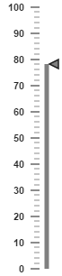

# Interaction and Animation

* **Linear Gauge** control contains **Interaction** feature. You can use this interaction feature to change the pointer values manually either by clicking or dragging the pointer over the **Gauge.** It dynamically changes the value of pointer when dragged. To Enable/Disable the user interaction you can use the **readOnly** Boolean property. The user interaction option is enabled when you set **readOnly** property as false. By default it holds the true value.

* **Linear Gauge** contains another attractive concept called **Animation**. The animation option enables the movement of the pointer from the minimum value to the current value. You can use animation option to change the pointer value dynamically. You can enable/ disable it using **enableAnimation** property. To enable animation set **enableAnimation** to "true". 

* By default it holds the true value. You can control the speed of the pointer during animating using **animationSpeed**. It is a numerical value that holds the time in milliseconds. That is when setting value is 1000, it is considered as 1 second.



<html xmlns="http://www.w3.org/1999/xhtml" lang="en" ng-app="LinearGaugeApp">
    <head>
        <title>Essential Studio for AngularJS: LinearGauge</title>
        <!--CSS and Script file References -->
    </head>
    <body ng-controller="LinearGaugeCtrl">
        

                 <ej-lineargauge e-enableanimation="true" e-animationspeed="1000" e-readonly="false" e-value="78" >
                 <e-scales>
                 <e-scale e-border-color="transparent" e-border-width="0" e-showBarPointers="true" e-showmarkerpointers="true" >
                 <e-barpointers>
                 <e-barpointer e-width="5" e-backgroundColor="grey">
                 </e-barpointer>
                 </e-barpointers>
                 <e-markerpointers>
                 <e-markerpointer e-width="10" e-length="10" e-backgroundColor="grey" e-distancefromscale="-12">
                 </e-markerpointer>
                 </e-markerpointers>
                 <e-ticks>
                 <e-tick e-type="majorinterval" e-width="2" e-color="#8c8c8c" e-distancefromscale-x="7" 
                 e-distancefromscale-y="0"></e-tick>
                 <e-tick e-type="minorinterval" e-width="1" e-height="6" e-color="#8c8c8c" 
                 e-distancefromscale-x="7" e-distancefromscale-y="0"></e-tick>
                 </e-ticks>
                 </e-scale>
                 </e-scales>
                 </ej-lineargauge>
        

        
    </body>
</html>



Execute the above code to render the following output.

### Enable Marker Pointer Animation

Specifies the animate state for marker pointer, you can set `enableMarkerPointer`property as **true**



<html xmlns="http://www.w3.org/1999/xhtml" lang="en" ng-app="LinearGaugeApp">
    <head>
        <title>Essential Studio for AngularJS: LinearGauge</title>
        <!--CSS and Script file References -->
    </head>
    <body ng-controller="LinearGaugeCtrl">
        

                 <ej-lineargauge  e-enableanimation="false" e-enablemarkerpointer="true">                 
                 </ej-lineargauge>
        

        
    </body>
</html>



