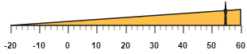
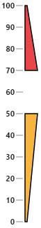
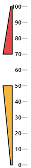
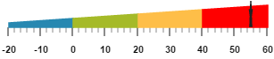

# Ranges 

Ranges are used to specify or group the scale values. You can describe the values in the pointers using ranges. 

## Adding range collection

Range collection can be directly added to the scale object. Refer the following code example to add range collection in a **Linear Gauge** control. 



<html xmlns="http://www.w3.org/1999/xhtml" lang="en" ng-app="LinearGaugeApp">
    <head>
        <title>Essential Studio for AngularJS: LinearGauge</title>
        <!--CSS and Script file References -->
    </head>
    <body ng-controller="LinearGaugeCtrl">
        

                 <ej-lineargauge   e-enableanimation="false" e-width="600" e-height="150" 
                 e-orientation="Horizontal" e-labelColor="black">
                 <e-scales>
                 <e-scale e-width="0"  e-backgroundcolor="#AEC75F"  e-direction="clockwise" 
                 e-minimum="-20" e-maximum="60" e-border-color="transparent" e-border-width="0" 
                 e-showBarPointers="false" e-showRanges="true" >
                 <e-markerpointers>
                 <e-markerpointer  e-width="3" e-length="30" e-backgroundcolor="#FEBE48" e-type="star" 
                 e-distancefromscale="20" e-placement="near" e-value="55">
                 </e-markerpointer>
                 </e-markerpointers>
                 <e-labels>
                 <e-label e-angle="90" e-distancefromscale-x="0" e-distancefromscale-y="50"></e-label>
                 </e-labels>
                 <e-ticks>
                 <e-tick e-type="majorinterval" e-width="2" e-color="#8c8c8c" e-distancefromscale-x="25" 
                 e-distancefromscale-y="-1"></e-tick>
                 <e-tick e-type="minorinterval" e-width="1" e-height="6" e-color="#8c8c8c" 
                 e-distancefromscale-x="25" e-distancefromscale-y="-1"></e-tick>
                 </e-ticks>
                 <e-ranges>
                 <e-range e-startvalue="-20" e-endValue="60" e-startwidth="0" e-endwidth="20" 
                 e-placement="near" e-distancefromscale="20" e-backgroundcolor="#FEBE48"></e-range>
                 </e-ranges>
                 </e-scale>
                 </e-scales>
                 </ej-lineargauge>
        

        
    </body>
</html>



Execute the above code to render the following output.

## Range Customization

**Appearance**

The major attributes for ranges are **startValue** and **endValue**. The **startValue** defines the start position of the range and **endValue** defines the end position of the range. The **startWidth** and **endWidth** are used to specify the range width at the starting and ending position of the ranges.



<html xmlns="http://www.w3.org/1999/xhtml" lang="en" ng-app="LinearGaugeApp">
    <head>
        <title>Essential Studio for AngularJS: LinearGauge</title>
        <!--CSS and Script file References -->
    </head>
    <body ng-controller="LinearGaugeCtrl">
        

                 <ej-lineargauge  e-width="500" e-labelColor="#8c8c8c">
                 <e-scales>
                 <e-scale e-width="4" e-backgroundcolor="#10ADF5" e-position-x="50" e-position-y="50" 
                 e-length="310" e-border-color="transparent" e-border-width="0" 
                 e-showMarkerPointers="false" e-showRanges="true"e-showScaleBar="true">
                 <e-labels>
                 <e-label e-font-fontStyle="bold" e-font-fontFamily="Segoe UI" e-font-size="11px" 
                 e-distancefromscale-x="-12" ></e-label>
                 </e-labels>
                 <e-ticks>
                 <e-tick e-type="majorinterval" e-width="1" e-color="#8c8c8c"></e-tick>
                 </e-ticks>
                 <e-ranges>
                 <e-range e-startvalue="0" e-endValue="50" e-startwidth="8" e-endwidth="8" 
                 e-distancefromscale="5" e-backgroundcolor="#F6B53F"></e-range>
                 <e-range e-startvalue="70" e-endValue="100" e-startwidth="8" e-endwidth="8" 
                 e-distancefromscale="5" e-backgroundcolor="#E94649"></e-range>
                 </e-ranges>
                 </e-scale>
                 </e-scales>
                 </ej-lineargauge>
        

        
    </body>
</html>



Execute the above code to render the following output.

## Colors and Border

* You can customize the ranges to improve the appearance of the **Gauge**. The range border is modified with the object called **border**. It has two border property such as **color** and **width** which are used to customize the border color of the ranges and border width of the ranges. 

* You can set the background color to improve the look and feel of the **Linear Gauge**. For customizing the background color of the ranges, **backgroundColor** is used.You can add the gradient effects to the ranges by using **gradient** object.



<html xmlns="http://www.w3.org/1999/xhtml" lang="en" ng-app="LinearGaugeApp">
    <head>
        <title>Essential Studio for AngularJS: LinearGauge</title>
        <!--CSS and Script file References -->
    </head>
    <body ng-controller="LinearGaugeCtrl">
        

                 <ej-lineargauge  e-width="500" e-labelColor="#8c8c8c">
                 <e-scales>
                 <e-scale e-width="4" e-backgroundcolor="transparent" e-position-x="50" e-position-y="50" 
                 e-length="310" e-border-color="transparent" e-border-width="0" e-showMarkerPointers="false" 
                 e-showRanges="true"e-showScaleBar="true">
                 <e-labels>
                 <e-label e-font-fontStyle="bold" e-font-fontFamily="Segoe UI" e-font-size="11px" 
                 e-distancefromscale-x="-12" ></e-label>
                 </e-labels>
                 <e-ticks>
                 <e-tick e-type="majorinterval" e-width="1" e-color="#8c8c8c"></e-tick>
                 </e-ticks>
                 <e-ranges>
                 <e-range e-startvalue="0" e-endValue="50" e-startwidth="3" e-endwidth="18" 
                 e-distancefromscale="10" e-border-color="black" e-backgroundcolor="#F6B53F"></e-range>
                 <e-range e-startvalue="70" e-endValue="100" e-startwidth="18" e-endwidth="3" 
                 e-distancefromscale="10" e-backgroundcolor="#E94649" e-border-color="black"></e-range>
                 </e-ranges>
                 </e-scale>
                 </e-scales>
                 </ej-lineargauge>
        

        
    </body>
</html>



Execute the above code to render the following output.

## Positioning the ranges

* You can position ranges using two properties such as **distanceFromScale** and **placement**. The **distanceFromScale** property defines the distance between the scale and range. 

* **Placement** property is used to locate the pointer with respect to scale either inside the scale or outside the scale or along the scale. It is an enumerable data type. 



<html xmlns="http://www.w3.org/1999/xhtml" lang="en" ng-app="LinearGaugeApp">
    <head>
        <title>Essential Studio for AngularJS: LinearGauge</title>
        <!--CSS and Script file References -->
    </head>
    <body ng-controller="LinearGaugeCtrl">
        

                 <ej-lineargauge  e-width="500" e-labelColor="#8c8c8c">
                 <e-scales>
                 <e-scale e-width="4"  e-backgroundcolor="transparent" e-position-x="50" 
                 e-position-y="50" e-length="310" e-border-color="transparent" e-border-width="0" 
                 e-showMarkerPointers="false" e-showRanges="true"e-showScaleBar="true">
                 <e-labels>
                 <e-label e-font-fontStyle="bold" e-font-fontFamily="Segoe UI" e-font-size="11px" 
                 e-distancefromscale-x="-12" ></e-label>
                 </e-labels>
                 <e-ticks>
                 <e-tick e-type="majorinterval" e-width="1" e-color="#8c8c8c"></e-tick>
                 </e-ticks>
                 <e-ranges>
                 <e-range e-startvalue="0" e-endValue="50" e-startwidth="3" e-endwidth="18" 
                 e-distancefromscale="-30" e-placement="near" e-border-color="black" 
                 e-backgroundcolor="#F6B53F"></e-range>
                 <e-range e-startvalue="70" e-endValue="100" e-startwidth="18" e-endwidth="3" 
                 e-distancefromscale="-30" e-placement="near" e-backgroundcolor="#E94649" 
                 e-border-color="black"></e-range>
                 </e-ranges>
                 </e-scale>
                 </e-scales>
                 </ej-lineargauge>
        

        
    </body>
</html>



Execute the above code to render the following output.

## Multiple Ranges

You can set multiple ranges by adding an array of range objects. Refer the following code example for multiple range functionality.



<html xmlns="http://www.w3.org/1999/xhtml" lang="en" ng-app="LinearGaugeApp">
    <head>
        <title>Essential Studio for AngularJS: LinearGauge</title>
        <!--CSS and Script file References -->
    </head>
    <body ng-controller="LinearGaugeCtrl">
        

                 <ej-lineargauge e-enableanimation="false" e-width="600" e-height="150" 
                 e-labelColor="black" e-orientation="Horizontal" e-enableresize="true" >
                 <e-scales>
                 <e-scale e-width="0"  e-backgroundcolor="#AEC75F" e-direction="clockwise"  
                 e-minimum="-20" e-maximum="60" e-position-x="50" e-position-y="50" e-length="310" 
                 e-border-color="transparent" e-border-width="0" e-showbarPointers="false" 
                 e-showRanges="true">
                 <e-markerpointers>
                 <e-markerpointer  e-width="3" e-length="30" e-backgroundcolor="#FE5C09" e-type="star" 
                 e-distancefromscale="20" e-placement="near" e-value="55">
                 </e-markerpointer>
                 </e-markerpointers>
                 <e-labels>
                 <e-label e-angle="90" e-distancefromscale-x="0" e-distancefromscale-y="50" ></e-label>
                 </e-labels>
                 <e-ticks>
                 <e-tick e-type="majorinterval" e-width="2" e-color="#8c8c8c" e-distancefromscale-x="20" 
                 e-distancefromscale-y="-1"></e-tick>
                 <e-tick e-type="minorinterval" e-width="1" e-height="6" e-color="#8c8c8c" 
                 e-distancefromscale-x="20" e-distancefromscale-y="-1"></e-tick>
                 </e-ticks>
                 <e-ranges>
                 <e-range e-startvalue="-20" e-endValue="0" e-startwidth="5" e-endwidth="10" 
                 e-distancefromscale="20" e-placement="near" e-border-color="#2788B1" 
                 e-backgroundcolor="#2788B1"></e-range>
                 <e-range e-startvalue="0" e-endValue="20" e-startwidth="10" e-endwidth="15" 
                 e-distancefromscale="20" e-placement="near" e-backgroundcolor="#A5BA28" 
                 e-border-color="#A5BA28"></e-range>
                 <e-range e-startvalue="20" e-endValue="40" e-startwidth="15" e-endwidth="20" 
                 e-distancefromscale="20" e-placement="near" e-backgroundcolor="#FEBE48" 
                 e-border-color="#FEBE48"></e-range>
                 <e-range e-startvalue="40" e-endValue="60" e-startwidth="20" e-endwidth="25" 
                 e-distancefromscale="20" e-placement="near" e-backgroundcolor="red" 
                 e-border-color="red"></e-range>
                 </e-ranges>
                 </e-scale>
                 </e-scales>
                 </ej-lineargauge>
        

        
    </body>
</html>

 



Execute the above code to render the following output.

