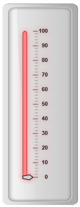
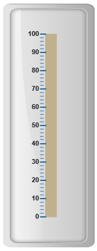
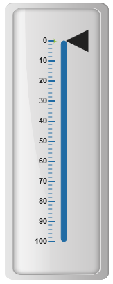
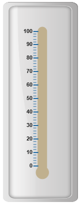
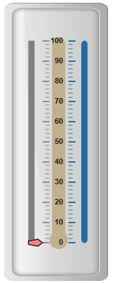

# Scales

**Scales** are the basic functional block of the **Linear Gauge**. You can improve the appearance of scales by customizing it. The functional blocks of **Linear Gauge** are 

* Marker Pointers

* Bar Pointer

* Labels

* Custom Labels

* Indicators

* Ticks

* Ranges

## Adding scale collection

**Scale** is the basic element of **Linear Gauge**. Scale collection is directly added to the gauge object. Refer the following code example to add scale collection in **Gauge** control. 



<html xmlns="http://www.w3.org/1999/xhtml" lang="en" ng-app="LinearGaugeApp">
    <head>
        <title>Essential Studio for AngularJS: LinearGauge</title>
        <!--CSS and Script file References -->
    </head>
    <body ng-controller="LinearGaugeCtrl">
        

                 <ej-lineargauge e-enableanimation="false" 
                 e-frame-backgroundImageUrl="../images/gauge/Gauge_linear_light.png" >
                 <e-scales>
                 <e-scale  e-width="8" e-position-x="20" e-position-y="50" e-backgroundColor="grey"
                 e-border-color="transparent" e-border-width="1" e-showBarPointers="true" 
                 e-showmarkerpointers="true" >
                 <e-labels>
                 <e-label  e-distancefromscale-x="50" e-distancefromscale-y="0"></e-label>
                 </e-labels>
                 <e-markerpointers>
                 <e-markerpointer  e-type="pentagon" e-placement="near" e-width="20" e-length="10" 
                 e-backgroundColor="#FE8282" e-distancefromscale="20">
                 </e-markerpointer>
                 </e-markerpointers>
                 <e-ticks>
                 <e-tick e-type="majorinterval" e-width="2" e-color="#8c8c8c" e-distancefromscale-x="30" 
                 e-distancefromscale-y="0"></e-tick>
                 <e-tick e-type="minorinterval" e-width="1" e-height="6" e-color="#8c8c8c" 
                 e-distancefromscale-x="30" e-distancefromscale-y="0"></e-tick>
                 </e-ticks>
                 </e-scale>
                 </e-scales>
                 </ej-lineargauge>
        

        
    </body>
</html>



Execute the above code to render the following output.

## Scale Customization

**Colors and Border**

* The **Scale** border is modified with **border** object. It has two border property, **color** and **width**  are used to customize the border color of the scale and border width of the scale. Setting the background color improves the look and feel of the **Linear Gauge**. You can customize the background color of the scale using **backgroundColor**. 

* Scales are used to enable or disable various properties such as **showRanges, showIndicators, showCustomLabels, showLabels, showTicks, showBarPointers** and **showMarkerPointers**. Enable/disable is done by setting the property into two states either “**true**” or “**false**”. You can adjust the Opacity of the scale with **opacity** property.



<html xmlns="http://www.w3.org/1999/xhtml" lang="en" ng-app="LinearGaugeApp">
    <head>
        <title>Essential Studio for AngularJS: LinearGauge</title>
        <!--CSS and Script file References -->
    </head>
    <body ng-controller="LinearGaugeCtrl">
        

                 <ej-lineargauge e-enableanimation="false" 
                 e-frame-backgroundImageUrl="../images/gauge/Gauge_linear_light.png" >
                 <e-scales>
                 <e-scale  e-width="8" e-position-x="20" e-position-y="50" e-backgroundColor="#FE8282" 
                 e-opacity="0.5" e-shadowoffset="10" e-type="RoundedRectangle" e-border-color="red" 
                 e-border-width="1" e-showBarPointers="false" e-showmarkerpointers="true" >
                 <e-labels>
                 <e-label  e-distancefromscale-x="50" e-distancefromscale-y="0"></e-label>
                 </e-labels>
                 <e-markerpointers>
                 <e-markerpointer  e-type="pentagon" e-placement="near" e-width="20" e-length="10" 
                 e-backgroundColor="#C9E1E5" e-distancefromscale="20">
                 </e-markerpointer>
                 </e-markerpointers>
                 <e-ticks>
                 <e-tick e-type="majorinterval" e-width="2" e-color="#8c8c8c" e-distancefromscale-x="30" 
                 e-distancefromscale-y="0"></e-tick>
                 <e-tick e-type="minorinterval" e-width="1" e-height="6" e-color="#8c8c8c" 
                 e-distancefromscale-x="30" e-distancefromscale-y="0"></e-tick>
                 </e-ticks>
                 </e-scale>
                 </e-scales>
                 </ej-lineargauge>
        

        
    </body>
</html>



Execute the above code to render the following output.

## Appearance 

* You can improve the appearance of **Linear Gauge** using various properties. You can set the interval values for the scale with **major interval value** and **minor interval value** properties and maximum and minimum value by **minimum and maximum** property. The **width** property is used to set the scale bar width. 

* You can also adjust the Opacity of the scale with **opacity** property. The value for opacity lies between 0 and 1.**Linear Gauge** contains two scale directions, clockwise and counter clockwise. It can be set with **direction** property**.**



<html xmlns="http://www.w3.org/1999/xhtml" lang="en" ng-app="LinearGaugeApp">
    <head>
        <title>Essential Studio for AngularJS: LinearGauge</title>
        <!--CSS and Script file References -->
    </head>
    <body ng-controller="LinearGaugeCtrl">
        

                 <ej-lineargauge e-enableanimation="false" 
                 e-frame-backgroundImageUrl="../images/gauge/Gauge_linear_light.png" >
                 <e-scales>
                 <e-scale  e-width="18"  e-minimum="10" e-maximum="210" e-minorIntervalValue="25" 
                 e-majorIntervalValue="50" e-direction="counterclockwise" e-position-x="20" 
                 e-position-y="50" e-backgroundColor="gray" e-border-color="gray" e-border-width="1" 
                 e-showBarPointers="false" e-showmarkerpointers="true" >
                 <e-labels>
                 <e-label  e-distancefromscale-x="50" e-distancefromscale-y="0"></e-label>
                 </e-labels>
                 <e-markerpointers>
                 <e-markerpointer  e-type="pentagon" e-placement="near" e-width="20" e-length="10" 
                 e-backgroundColor="#FE8282" e-distancefromscale="20">
                 </e-markerpointer>
                 </e-markerpointers>
                 <e-ticks>
                 <e-tick e-type="majorinterval" e-width="2" e-color="#8c8c8c" e-distancefromscale-x="30" 
                 e-distancefromscale-y="0"></e-tick>
                 <e-tick e-type="minorinterval" e-width="1" e-height="6" e-color="#8c8c8c" 
                 e-distancefromscale-x="30" e-distancefromscale-y="0"></e-tick>
                 </e-ticks>
                 </e-scale>
                 </e-scales>
                 </ej-lineargauge>
        

        
    </body>
</html>



Execute the above code to render the following output.

## Scale Types

Scale Type is an element which decides the appearance of the gauge**. Linear Gauge** contains three scale types such as,

* Rectangle

* Rounded Rectangle

* Thermometer

**Rectangle**

For rectangular scale type, the scale renders with rectangular structure. Refer the following code example.



<html xmlns="http://www.w3.org/1999/xhtml" lang="en" ng-app="LinearGaugeApp">
    <head>
        <title>Essential Studio for AngularJS: LinearGauge</title>
        <!--CSS and Script file References -->
    </head>
    <body ng-controller="LinearGaugeCtrl">
        

                 <ej-lineargauge e-enableanimation="false" 
                 e-frame-backgroundImageUrl="../images/gauge/Gauge_linear_light.png" >
                 <e-scales>
                 <e-scale  e-width="18" e-length="300" e-position-x="54" e-position-y="50" 
                 e-type="rectangle" e-backgroundColor="#C0B08E" e-border-color="#C0B08E" 
                 e-border-width="1" e-showBarPointers="false" e-showmarkerpointers="false">
                 <e-ticks>
                 <e-tick e-type="majorinterval" e-width="2" e-color="#206BA4" e-placement="far" 
                 e-distancefromscale-x="-27" e-distancefromscale-y="0"></e-tick>
                 <e-tick e-type="minorinterval" e-width="1" e-height="6" e-color="#206BA4" 
                 e-placement="far" e-distancefromscale-x="-27" e-distancefromscale-y="0">
                 </e-tick>
                 </e-ticks>
                 </e-scale>
                 </e-scales>
                 </ej-lineargauge>
        

        
    </body>
</html>



Execute the above code to render the following output.

**Rounded Rectangle**

For rounded rectangular scale type, the scale renders as rectangular structure but with constant radius rounded corner. Refer the following code example.



<html xmlns="http://www.w3.org/1999/xhtml" lang="en" ng-app="LinearGaugeApp">
    <head>
        <title>Essential Studio for AngularJS: LinearGauge</title>
        <!--CSS and Script file References -->
    </head>
    <body ng-controller="LinearGaugeCtrl">
        

                 <ej-lineargauge e-enableanimation="false" 
                 e-frame-backgroundImageUrl="../images/gauge/Gauge_linear_light.png" >
                 <e-scales>
                 <e-scale  e-width="8"   e-direction="clockwise" e-type="roundedrectangle"
                 e-position-x="60" e-position-y="50" e-backgroundColor="#206BA4" e-border-color="#206BA4" 
                 e-border-width="1">
                 <e-ticks>
                 <e-tick e-type="majorinterval" e-width="2" e-color="#206BA4" e-distancefromscale-x="-27" 
                 e-distancefromscale-y="0" e-placement="far"></e-tick>
                 <e-tick e-type="minorinterval" e-width="1" e-height="6" e-color="#206BA4" 
                 e-distancefromscale-x="-27" e-distancefromscale-y="0" e-placement="far"></e-tick>
                 </e-ticks>
                 </e-scale>
                 </e-scales>
                 </ej-lineargauge>
        

        
    </body>
</html>



Execute the above code to render the following output.

**Thermometer**

For thermometer scale type, the scale renders as thermometer structure with rounded bottom. Refer the following code example.



<html xmlns="http://www.w3.org/1999/xhtml" lang="en" ng-app="LinearGaugeApp">
    <head>
        <title>Essential Studio for AngularJS: LinearGauge</title>
        <!--CSS and Script file References -->
    </head>
    <body ng-controller="LinearGaugeCtrl">
        

                 <ej-lineargauge e-enableanimation="false" 
                 e-frame-backgroundImageUrl="../images/gauge/Gauge_linear_light.png" >
                 <e-scales>
                 <e-scale  e-width="18"  e-length="300" e-type="thermometer"
                 e-position-x="54" e-position-y="50" e-backgroundColor="#C0B08E" 
                 e-border-color="#C0B08E" e-border-width="1" e-showmarkerpointers="false"
                 e-showBarPointers="false">
                 <e-ticks>
                 <e-tick e-type="majorinterval" e-width="2" e-color="#206BA4" e-distancefromscale-x="-27" 
                 e-distancefromscale-y="0" e-placement="far"></e-tick>
                 <e-tick e-type="minorinterval" e-width="1" e-height="6" e-color="#206BA4" 
                 e-distancefromscale-x="-27" e-distancefromscale-y="0" e-placement="far"></e-tick>
                 </e-ticks>
                 </e-scale>
                 </e-scales>
                 </ej-lineargauge>
        

        
    </body>
</html>



Execute the above code to render the following output.

## Adding multiple scales

You can set multiple scales for a single **Linear Gauge** control by using an array of scale objects. Each scale object is independent of each other. Refer the following code example to add multiple scale collection.



<html xmlns="http://www.w3.org/1999/xhtml" lang="en" ng-app="LinearGaugeApp">
    <head>
        <title>Essential Studio for AngularJS: LinearGauge</title>
        <!--CSS and Script file References -->
    </head>
    <body ng-controller="LinearGaugeCtrl">
        

                 <ej-lineargauge e-enableanimation="false" 
                 e-frame-backgroundImageUrl="../images/gauge/Gauge_linear_light.png" >
                 <e-scales>
                 <e-scale  e-width="8" e-position-x="15" e-position-y="50"
                 e-backgroundColor="Grey" e-border-color="Grey" e-border-width="1" 
                 e-showmarkerpointers="true" e-showBarPointers="false">
                 <e-labels>
                 <e-label e-distancefromscale-x="50" e-distancefromscale-y="0"></e-label>
                 </e-labels>
                 <e-markerpointers>
                 <e-markerpointer e-type="pentagon" e-placement="near" e-width="20" e-length="10" 
                 e-backgroundColor="#FE8282" e-distancefromscale="20">
                 </e-markerpointer>
                 </e-markerpointers>
                 <e-ticks>
                 <e-tick e-type="majorinterval" e-width="2" e-color="#8c8c8c" e-distancefromscale-x="30" 
                 e-distancefromscale-y="0" ></e-tick>
                 <e-tick e-type="minorinterval" e-width="1" e-height="6" e-color="#8c8c8c" 
                 e-distancefromscale-x="30" e-distancefromscale-y="0"></e-tick>
                 </e-ticks>
                 </e-scale>
                 //Adding second scale 
                 <e-scale  e-width="8" e-position-x="90" e-position-y="50" e-type="roundedrectangle" 
                 e-direction="clockwise" e-backgroundColor="#206BA4" e-border-color="#206BA4" 
                 e-border-width="1" e-showmarkerpointers="false" e-showBarPointers="false" 
                 e-showLabels="false">
                 <e-ticks>
                 <e-tick e-type="majorinterval" e-width="2" e-color="#206BA4" e-distancefromscale-x="-27" 
                 e-distancefromscale-y="0" e-placement="far"></e-tick>
                 <e-tick e-type="minorinterval" e-width="1" e-height="6" e-color="#206BA4" 
                 e-distancefromscale-x="-27" e-distancefromscale-y="0" e-placement="far"></e-tick>
                 </e-ticks>
                 </e-scale>
                  //Adding third scale 
                 <e-scale  e-width="18" e-length="300" e-position-x="54" e-position-y="50" 
                 e-type="thermometer" e-backgroundColor="#C0B08E" e-border-color="#C0B08E" 
                 e-border-width="1" e-showmarkerpointers="false" e-showBarPointers="false" 
                 e-showLabels="false" e-showTicks="false">
                 </e-scale>
                 </e-scales>
                 </ej-lineargauge>
        

        
    </body>
</html>



Execute the above code to render the following output.

