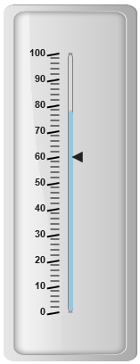

# Ticks

Ticks are used to mark some values on the scale. Based on the tick’s value you can set the labels on the required position.

## Adding tick collection 

Tick collection can be directly added to the scale object. Refer the following code example to add tick collection in a **Linear Gauge** control.



<html xmlns="http://www.w3.org/1999/xhtml" lang="en" ng-app="LinearGaugeApp">
    <head>
        <title>Essential Studio for AngularJS: LinearGauge</title>
        <!--CSS and Script file References -->
    </head>
    <body ng-controller="LinearGaugeCtrl">
        

                 <ej-lineargauge   e-enableanimation="false" e-value="78" e-frame-innerWidth="8" 
                 e-frame-outerWidth="10"
                 e-frame-backgroundImageUrl="../images/gauge/Gauge_linear_light.png" >
                 <e-scales>
                 <e-scale  e-width="5" e-backgroundcolor="transparent" e-type="roundedrectangle"
                 e-border-color="Grey" e-border-width="1" e-showBarPointers="true" >
                 <e-barpointers>
                 <e-barpointer  e-width="5" e-backgroundcolor="#95C7E0" >
                 </e-barpointer>
                 <e-barpointer  e-width="6" e-backgroundcolor="#EDC1D7" e-distancefromscale="-15" 
                 e-value="30" e-opacity="0.7" >
                 </e-barpointer>
                 </e-barpointers>
                 <e-markerpointers>
                 <e-markerpointer  e-width="10" e-length="10" e-value="60" >
                 </e-markerpointer>
                 </e-markerpointers>
                 <e-labels>
                 <e-label e-distancefromscale-x="-25" e-distancefromscale-y="0"></e-label>
                 </e-labels>
                 <e-ticks>
                 <e-tick e-type="majorinterval" e-width="2" e-color="#8c8c8c" e-distancefromscale-x="-10" 
                 e-distancefromscale-y="0" e-position="far"></e-tick>
                 <e-tick e-type="minorinterval" e-width="1" e-height="6" e-color="#8c8c8c" 
                 e-distancefromscale-x="-10" e-distancefromscale-y="0" e-position="far"></e-tick>
                 </e-ticks>
                 </e-scale>
                 </e-scales>
                 </ej-lineargauge>
        

        
    </body>
</html>



Execute the above code to render the following output.

## Tick Customization

**Appearance**

* Height and width of the ticks can be applied by using the properties **height** and **width**. You can customize ticks with the properties like angle, color, etc. **angle** attribute is used to display the labels in the specified angles and **color** attribute is used to display the labels in specified color. 

* Ticks are two types such as major and minor. The opacity of the labels can be adjusted with the property **opacity.** The opacity values lies between 0 and 1.



<html xmlns="http://www.w3.org/1999/xhtml" lang="en" ng-app="LinearGaugeApp">
    <head>
        <title>Essential Studio for AngularJS: LinearGauge</title>
        <!--CSS and Script file References -->
    </head>
    <body ng-controller="LinearGaugeCtrl">
        

                 <ej-lineargauge   e-enableanimation="false" e-value="78" e-frame-innerWidth="8" 
                 e-frame-outerWidth="10" 
                 e-frame-backgroundImageUrl="../images/gauge/Gauge_linear_light.png" >
                 <e-scales>
                 <e-scale  e-width="5" e-backgroundcolor="transparent" e-type="roundedrectangle"
                 e-border-color="Grey" e-border-width="1" e-showBarPointers="true" >
                 <e-barpointers>
                 <e-barpointer  e-width="5" e-backgroundcolor="#95C7E0" >
                 </e-barpointer>
                 </e-barpointers>
                 <e-markerpointers>
                 <e-markerpointer  e-width="10" e-length="10" e-value="60" >
                 </e-markerpointer>
                 </e-markerpointers>
                  <e-labels>
                 <e-label e-distancefromscale-x="-25" e-distancefromscale-y="0"></e-label>
                 </e-labels>
                 <e-ticks>
                 <e-tick e-type="majorinterval" e-width="2"  e-height="14" e-angle="10" e-color="black" 
                 e-distancefromscale-x="-10" e-distancefromscale-y="0" e-position="far"></e-tick>
                 <e-tick e-type="minorinterval" e-width="1" e-height="10" e-color="black" 
                 e-opacity="0.5" e-distancefromscale-x="-10" e-distancefromscale-y="0" e-position="far">
                 </e-tick>
                 </e-ticks>
                 </e-scale>
                 </e-scales>
                 </ej-lineargauge>
        

        
    </body>
</html>



Execute the above code to render the following output.

## Types

Ticks are two types such as **majorInterval** and **minorInterval**. Major type ticks are for major interval values and minor type ticks are for minor interval values.



<html xmlns="http://www.w3.org/1999/xhtml" lang="en" ng-app="LinearGaugeApp">
    <head>
        <title>Essential Studio for AngularJS: LinearGauge</title>
        <!--CSS and Script file References -->
    </head>
    <body ng-controller="LinearGaugeCtrl">
        

                 <ej-lineargauge   e-enableanimation="false" e-value="78" e-frame-innerWidth="8" 
                 e-frame-outerWidth="10"
                 e-frame-backgroundImageUrl="../images/gauge/Gauge_linear_light.png" >
                 <e-scales>
                 <e-scale  e-width="5" e-backgroundcolor="transparent" e-type="roundedrectangle"
                 e-border-color="Grey" e-border-width="1" e-showBarPointers="true" >
                 <e-barpointers>
                 <e-barpointer  e-width="5" e-backgroundcolor="#95C7E0" >
                 </e-barpointer>
                 </e-barpointers>
                 <e-markerpointers>
                 <e-markerpointer  e-width="10" e-length="10" e-value="60" >
                 </e-markerpointer>
                 </e-markerpointers>
                 <e-labels>
                 <e-label e-distancefromscale-x="-25" e-distancefromscale-y="0"></e-label>
                 </e-labels>
                 <e-ticks>
                 <e-tick e-type="majorinterval" e-width="2"  e-height="14"  e-color="Black" 
                 e-position="far"></e-tick>
                 <e-tick e-type="minorinterval" ></e-tick>
                 </e-ticks>
                 </e-scale>
                 </e-scales>
                 </ej-lineargauge>
        

        
    </body>
</html>



Execute the above code to render the following output.

## Positioning the ticks

* You can position ticks with the help of two properties such as **distanceFromScale** and **placement**. The property **distanceFromScale** defines the distance between the scale and ticks. 

* **Placement** property is used to locate the ticks with respect to scale either inside the scale or outside the scale or along the scale. It is an enumerable data type.



<html xmlns="http://www.w3.org/1999/xhtml" lang="en" ng-app="LinearGaugeApp">
    <head>
        <title>Essential Studio for AngularJS: LinearGauge</title>
        <!--CSS and Script file References -->
    </head>
    <body ng-controller="LinearGaugeCtrl">
        

                 <ej-lineargauge   e-enableanimation="false" e-value="78" e-frame-innerWidth="8" 
                 e-frame-outerWidth="10"
                 e-frame-backgroundImageUrl="../images/gauge/Gauge_linear_light.png" >
                 <e-scales>
                 <e-scale  e-width="5" e-backgroundcolor="transparent" e-type="roundedrectangle"
                 e-border-color="Grey" e-border-width="1" e-showBarPointers="true" >
                 <e-barpointers>
                 <e-barpointer  e-width="5" e-backgroundcolor="#95C7E0" >
                 </e-barpointer>
                 </e-barpointers>
                 <e-markerpointers>
                 <e-markerpointer  e-width="10" e-length="10" e-value="60" >
                 </e-markerpointer>
                 </e-markerpointers>
                 <e-labels>
                 <e-label e-distancefromscale-x="-25" e-distancefromscale-y="0"></e-label>
                 </e-labels>
                 <e-ticks>
                 <e-tick e-type="majorinterval" e-width="2"  e-height="14"  e-color="Red" 
                 e-distancefromscale-x="-10" e-distancefromscale-y="0" e-position="far"></e-tick>
                 <e-tick e-type="minorinterval"  e-color="grey" e-distancefromscale-x="-10" 
                 e-distancefromscale-y="0"></e-tick>
                 </e-ticks>
                 </e-scale>
                 </e-scales>
                 </ej-lineargauge>
        

        
    </body>
</html>



Execute the above code to render the following output.

