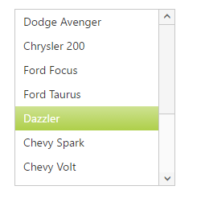
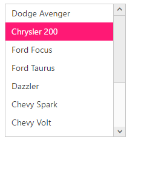

# Appearance and Styling

## Theme

**ListBox** control support rich appearance. This control consist of six flat themes and six gradient themes. To use these twelve themes, refer the themes files in HTML file. 

You need two style sheets to apply styles to **ListBox** control; one **ej.widgets.core.min.css** and one **ej.theme.min.css**. If you use **ej.web.all.min.css** then you don’t need to use **ej.widgets.core.min.css** and **ej.theme.min.css** because **ej.web.all.min.css** is a combination of these two.

The core style sheet applies styles related to positioning and size, but are not related to the color scheme and always require the control to look correct and function properly. The theme styles sheet applies theme-specific styles like colors and backgrounds.

The following list is of themes supported by **ListBox**:

* default-theme
* flat-azure-dark
* flat-lime
* flat-lime-dark
* flat-saffron
* flat-saffron-dark
* gradient-azure
* gradient-azure-dark
* gradient-lime
* gradient-lime-dark
* gradient-saffron
* gradient-saffron-dark
* Material
* office-365
* Bootstrap
* High-Contrast-01
* High-contrast-02

Add the following code in your **HTML** page.



<!DOCTYPE html>
<html lang="en" ng-app="listboxApp">
   <head>
      <link href="http://cdn.syncfusion.com/{{ site.releaseversion }}/js/web/gradient-lime/ej.web.all.min.css" rel="stylesheet" />
      
      
      
        
   </head>
 <body ng-controller="ListboxCtrl">
      

        <ul id="selectcustomer" ej-listbox e-datasource="dataList" e-fields-text="text"></ul>
    

      
   </body>
</html>



## Css Class

**ListBox** control also allows you to customize its appearance using user-defined CSS and custom skin options such as colors and backgrounds. To apply custom themes you have a property called **cssClass**. **cssClass** property sets the root class for **ListBox** theme.

Using this **cssClass** you can override the existing styles under the theme style sheet. The theme style sheet applies theme-specific styles like colors and backgrounds. In the following example, the value of **cssClass** property is set as **customClass**. **customClass** is added as root class to **ListBox** control at the runtime. From this root class you can customize the **ListBox** control theme.

Add the following code in your **HTML** page to render the ListBox.


   
<!DOCTYPE html>
<html lang="en" ng-app="listboxApp">
   <head>
      <link href="http://cdn.syncfusion.com/{{ site.releaseversion }}/js/web/gradient-lime/ej.web.all.min.css" rel="stylesheet" />
      
      
      
        
   </head>
 <body ng-controller="ListboxCtrl">
      

        <ul id="selectcustomer" ej-listbox e-datasource="dataList" e-fields-text="text" e-cssclass="customClass"></ul>
    

      
   </body>
</html>



In the following style sheet the existing theme style sheet file has been over-ridden using root class **customClass**. 

Add the following code in your style section.





