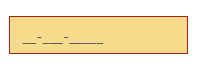
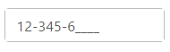
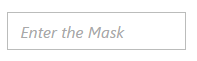
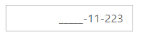

# Appearance

## Theme

The **MaskEdit** control’s style and appearance can be controlled based on CSS classes. In order to apply styles to the MaskEdit control, you need to refer 2 files namely, ej.widgets.core.min.css and ej.theme.min.css. If the file ej.web.all.min.css is referred, then it is not necessary to include the files ej.widgets.core.min.css and ej.theme.min.css in your project, as ej.web.all.min.css is the combination of these two.

By default, there are 17 themes support available for **MaskEdit** control namely:

* bootstrap
* flat-azure
* flat-azure-dark
* flat-lime
* flat-lime-dark
* flat-saffron
* flat-saffron-dark
* gradient-azure
* gradient-azure-dark
* gradient-lime
* gradient-lime-dark
* gradient-saffron
* gradient-saffron-dark
* high-contrast-01
* high-contrast-02
* material
* office-365

## CSS Class

The **CSS** can be customized by using the **cssClass** in the **MaskEdit**. You can customize the **MaskEdit** with **cssClass** property to appear like your desired control.

The following steps explain the implementation of MaskEdit with **cssClass** property.

In the HTML page, add a &lt;input&gt; element to render the MaskEdit widget.  



<input id="maskedit" type="text" ej-maskedit e-inputmode="ej.InputMode.Text" e-maskformat='99-999-99999' e-cssclass="customCss" /> 
    


Customize the CSS properties in custom CSS class.





The output for MaskEdit after applying **cssClass** is as follows.

## Rounded Corner Support

MaskEdit provides you with rounded corner support whose appearance is different from normal textbox controls.

The following steps explain the implementation of MaskEdit with **showRoundedCorner** property.

In the HTML page, add a &lt;input&gt; element to render the MaskEdit widget. 



<input id="maskedit" type="text" ej-maskedit e-inputmode="ej.InputMode.Text" e-maskformat='99-999-99999' e-value="123456" e-showroundedcorner="true"/> 
    


Output of MaskEdit when **showRoundedCorner** is “**true**”.

## WatermarkText Support

The **MaskEdit** control provide water mark text support. You can display the initial value in the control by water mark.

The following steps explain the implementation of MaskEdit with **watermarkText** property.

In the HTML page, add a &lt;input&gt; element to render the MaskEdit widget.



<input id="maskedit" type="text" ej-maskedit e-inputmode="ej.InputMode.Text" e-maskformat='99-999-99999' e-watermarktext="Enter the Mask" /> 
    


Output of MaskEdit when **waterMarkText** is “**Enter the Mask**”.

## Text Alignment Support

The **MaskEdit** provides text alignment support that allows you to set the alignment of text in the control by using the **textAlign** property.

The following steps explain the implementation of MaskEdit with **textAlign** property.

In the HTML page, add a &lt;input&gt; element to render the MaskEdit widget



<input id="maskedit" type="text" ej-maskedit e-inputmode="ej.InputMode.Text" e-maskformat='99-999-99999' e-textalign="ej.TextAlign.Right" /> 
    


The output for Textboxes when **textAlign** is set to **“right”**.

