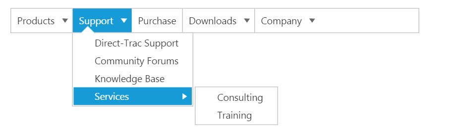
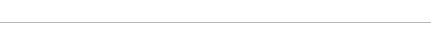
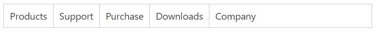
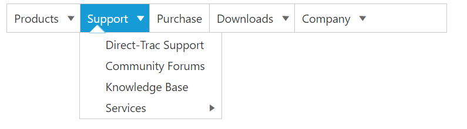

# Getting Started 

This section explains briefly about how to create a **Menu** control in your application with **JavaScript**. The **Essential JavaScript** **Menu** supports displaying a **Menu** of list-out items. This **Menu** is based on ul-li hierarchy, where the sub-list items are rendered as the sub-menu items. The **Menu** control can also be rendered with local and remote data source.  From the following guidelines, you can learn how to customize the **Menu** control for a website. In this case, **Syncfusion's** website **Menu** is discussed. The following screenshot displays the appearance of **Menu**.

 

## Create a Menu in AngularJS

**Essential JavaScript** **Menu** widgets are basically provided with built-in features like keyboard navigation, show and hide **Menu** items with animations, and flexible API's. From the following guidelines, you can learn how to render **Menu** control with Remote data source value.

Create an **HTML** file and add the following template into it for **Menu** creation.



    <!DOCTYPE html>
    <html ng-app="MenuApp">
    <head>
    <meta name="viewport" content="width=device-width, initial-scale=1.0" charset="utf-8" />
    <!-- Style sheet for default theme (flat azure) -->
    <link href="http://cdn.syncfusion.com/{{ site.releaseversion }}/js/web/flat-azure/ej.web.all.min.css" rel="stylesheet" />
    <!--Scripts-->
    
    
	
    
	
    <!--Add custom scripts here -->
    </head>
     <body ng-controller="MenuCtrl">
    <!-- add necessary HTML elements here -->
    </body>
    </html>



The ng-app directive explains the root element (<html> or <body> tags) of the application. You will assign a name to the ng-app directive, then you must create a module with that name. In this module, you  have to define your directives, services, filters and configurations.

A controller is defined using ng-controller directive. Each controller accepts an object $scope which we pass as a parameter.  This object is used to bind the controller with view.   

Properties can be bind to ejMenu control using the prefix e- and particular property name.

Adding **Ul** element for **Menu** rendering.



       <ul id="syncfusionProducts" ej-menu >
       </ul>



To render the ejMenu using angular directive, we need to inject the ej angular directive with modules shown as below,

Initialize Menu in script.



    
        


Output of the above steps.

 

## Configure parent Menu items

Every **Menu** has a list of **Menu** items with list of sub level **Menu** items. From the following guidelines, you can learn how to initialize the root level elements of **Menu** control with Local data source value.  Initialize the **Menu** with data source value as illustrated in the following code example. 



       <ul id="syncfusionProducts" ej-menu e-fields-datasource="dataList" e-width="500px" e-fields-id="id" e-fields-parentid="parentId"
                    e-fields-text="text">
       </ul>





    var data = [
            { id: 1, text: "Products", parentId: null },
            { id: 2, text: "Support", parentId: null },
            { id: 3, text: "Purchase", parentId: null },
            { id: 4, text: "Downloads", parentId: null },
			{ id: 5, text: "Company", parentId: null }];
	   angular.module('MenuApp', ['ejangular']).controller('MenuCtrl', function ($scope) {
	             $scope.dataList = data;
});



The following screenshot displays output.

 

## Initialize sub-level Menu items

Every **Menu** items have a list of sub level **Menu** items. From the following guidelines, you can learn how to initialize the sub level items of **Menu** control. The **parentId** field is used to map root level **Menu** item to its sub level **Menu** item.								

The following code example describes how to initialize first level sub menu items of product **Menu** item.



       var data = [
            { id: 1, text: "Products", parentId: null },
            { id: 2, text: "Support", parentId: null },
            { id: 3, text: "Purchase", parentId: null },
            { id: 4, text: "Downloads", parentId: null },
			{ id: 5, text: "Company", parentId: null },
            //first level child
            { id: 11, parentId: 1, text: "ASP.NET" },
            { id: 12, parentId: 1, text: "ASP.NET MVC" },
            { id: 13, parentId: 1, text: "Mobile MVC" },
            { id: 14, parentId: 1, text: "Silverlight" },
            { id: 15, parentId: 2, text: "Direct-Trac Support" },
            { id: 16, parentId: 2, text: "Community Forums" },
            { id: 17, parentId: 2, text: "Knowledge Base" },
            { id: 18, parentId: 2, text: "Services" },
			{ id: 19, parentId: 4, text: "Evaluation" },
			{ id: 20, parentId: 4, text: "Free E-Books" },
			{ id: 21, parentId: 4, text: "Metro Studio" },
			{ id: 22, parentId: 4, text: "Latest Version" },
			{ id: 23, parentId: 5, text: "Technology Resource Portal " },
			{ id: 24, parentId: 5, text: "Case Studies" },
			{ id: 25, parentId: 5, text: "Boucher & Data sheets" },
			{ id: 26, parentId: 5, text: "FAQ" }                   
        ];
        angular.module('MenuApp', ['ejangular']).controller('MenuCtrl', function ($scope) {
	             $scope.dataList = data;
				 });



Execute the above code example to render the following output.

 

## Define multiple level Menu items

You can define the sub-menu items to multiple levels in **Menu** control. You need to specify the parent Id value to render sub level **Menu** item for the **Menu** items.

To initialize multiple levels sub menu items, use the following code example.



       var data = [
            { id: 1, text: "Products", parentId: null },
            { id: 2, text: "Support", parentId: null },
            { id: 3, text: "Purchase", parentId: null },
            { id: 4, text: "Downloads", parentId: null },
			{ id: 5, text: "Company", parentId: null },
            //first level child
            { id: 11, parentId: 1, text: "ASP.NET" },
            { id: 12, parentId: 1, text: "ASP.NET MVC" },
            { id: 13, parentId: 1, text: "Mobile MVC" },
            { id: 14, parentId: 1, text: "Silverlight" },
            { id: 15, parentId: 2, text: "Direct-Trac Support" },
            { id: 16, parentId: 2, text: "Community Forums" },
            { id: 17, parentId: 2, text: "Knowledge Base" },
            { id: 18, parentId: 2, text: "Services" },
			{ id: 19, parentId: 4, text: "Evaluation" },
			{ id: 20, parentId: 4, text: "Free E-Books" },
			{ id: 21, parentId: 4, text: "Metro Studio" },
			{ id: 22, parentId: 4, text: "Latest Version" },
			{ id: 23, parentId: 5, text: "Technology Resource Portal " },
			{ id: 24, parentId: 5, text: "Case Studies" },
			{ id: 25, parentId: 5, text: "Boucher & Data sheets" },
			{ id: 26, parentId: 5, text: "FAQ" },
            //second level child
            {id: 111, parentId: 18, text: "Consulting" },
            { id: 112, parentId: 18, text: "Training" }            
        ];
        angular.module('MenuApp', ['ejangular']).controller('MenuCtrl', function ($scope) {
	        $scope.dataList = data;
         });



The following screenshot is the output.

 

By following the above mentioned steps, you can render the **Menu** control with multiple level sub items through online data source. You can simply customize the **Menu** widget in an efficient manner.

In summary of this getting started, you have now simulated the **Syncfusion�s** website **Menu** with **Essential JavaScript Menu**. You have utilized and learn the appearance customization etc.  

By following the above mentioned steps, you can render the **Menu** control with multiple level sub items. You can simply customize the **Menu** in an efficient manner.