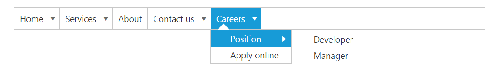
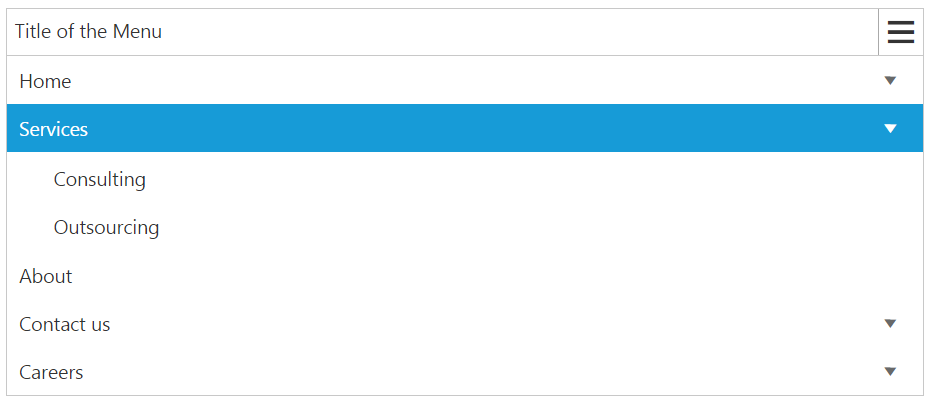
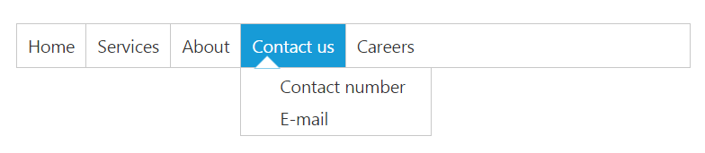
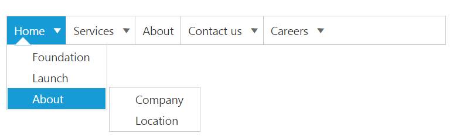

# Miscellaneous

## Height

Specifies the height of the root menu. You can customize the height of the **Menu** control by using [height](https://help.syncfusion.com/api/js/ejmenu#members:height) property. 

You can specify the height of the **Menu** control as shown below.



    <ul id="menu" ej-menu e-height="50"></ul>



## Width

Specifies the width of the main menu. You can customize the width of the **Menu** control by using [width](https://help.syncfusion.com/api/js/ejmenu#members:width) property.

You can specify the width of the **Menu** control as shown below.



    <ul id="menu" ej-menu e-width="700"></ul>



## Open on click

Specifies the sub menu items to be show or open only on click. It accepts the Boolean value. Its default value is false. If we set [openOnClick](https://help.syncfusion.com/api/js/ejmenu#members:openonclick) property to true then the submenu items will open only on click. By default the submenu will open when we hover on menu items.

Add the following code in order to show the menu items only on click. 



    <ul id="menu" ej-menu e-width="612" e-openonclick="true"></ul>



Output screenshot for the above code example is as follows.

## Animation

[**AnimationType**](https://help.syncfusion.com/api/js/ejmenu#members:animationtype) is used to enable or disable the Animation when hover or click on menu items. Its value type is string. It accepts two values such as "none" and "default". Support to disable the **AnimationType** when hover or click on menu items is none. Support to enable the Animation Type when hover or click on menu items is default. 

Add the following code to render menu using animation type. 



    <ul id="menu" ej-menu e-width="612" e-animationtype="animationType">
        <li id="home">
            <a href="#">Home</a>
            <ul>
                <li><a>Foundation</a></li>
                <li><a>Launch</a></li>
                <li>
                    <a>About</a>
                    <ul>
                        <li><a>Company</a></li>
                        <li><a>Location</a></li>
                    </ul>
                </li>
            </ul>
        </li>
        <li id="Services">
            <a>Services</a>
            <ul>
                <li><a>Consulting</a></li>
                <li><a>Outsourcing</a></li>
            </ul>
        </li>
        <li id="About"><a>About</a></li>
        <li id="Contact">
            <a>Contact us</a>
            <ul>
                <li><a>Contact number</a></li>
                <li><a>E-mail</a></li>
            </ul>
        </li>
        <li id="Careers">
            <a>Careers</a>
            <ul>
                <li>
                    <a>Position</a>
                    <ul>
                        <li><a>Developer</a></li>
                        <li><a>Manager</a></li>
                    </ul>
                </li>
                <li><a>Apply online</a></li>
            </ul>
        </li>
    </ul>

    



Output screenshot for the above code sample is as follows.

## Title text

Specifies the title to the responsive menu. You can provide title to the **Menu** control by using [titleText](https://help.syncfusion.com/api/js/ejmenu#members:titletext) property. 

You can specify the title of the **Menu** control as follows.



    <ul id="menu" ej-menu e-width="612" e-titletext="Title of the Menu">
    </ul>



The following screenshot displays the output of the above code.

## Show root level arrows

Specifies the main menu item arrows to display only when it contains child menu items. You can use “**showRootLevelArrows**” property to display the arrows of main menu items only when it contains child menu items. This property accepts Boolean value. Its default value is true. 

Refer to the below code example.



    <ul id="menu" ej-menu e-width="500" e-showrootlevelarrows="false">
    </ul>



The following screenshot displays the output of the above code.

## Show sub level arrows

Specifies the sub menu items arrows to display only when it contains child menu items. You can use [showSubLevelArrows](https://help.syncfusion.com/api/js/ejmenu#members:showsublevelarrows) property to show the arrows of sub menu items only when it contains child menu items. This property accepts Boolean value. Its default value is true. 

Refer to the below code example.



    <ul id="menu" ej-menu e-width="500" e-showsublevelarrows="false">
    </ul>



The following screenshot displays the output of the above code.

