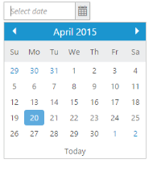

---
title: Welcome to Syncfusion Essential AngularJS
description: This section describes the overview of Syncfusion Essential AngularJS and How to render a Syncfusion AngularJS component.
platform: AngularJS
control: Introduction
documentation: ug
--- 

# Overview of Syncfusion Essential AngularJS

Essential JS includes AngularJS directives for all controls in the `ej.widget.angular.min.js` script file. All the Essential JS directives have been encapsulated into a single module called `ejangular`. To render our ej controls in angular, you need to refer the `angular.min.js` and `ej.widget.angular.min.js` in your application.

Create a new HTML file and include the below code:



<!DOCTYPE html>
<html xmlns="http://www.w3.org/1999/xhtml" ng-app="DateCtrl">
<head>
    <meta name="viewport" content="width=device-width, initial-scale=1.0" charset="utf-8" />
    <!-- Style sheet for default theme (flat azure) -->
    <link href="http://cdn.syncfusion.com/{{ site.releaseversion }}/js/web/flat-azure/ej.web.all.min.css" rel="stylesheet" />
    <!--Scripts-->
    
    
	
    
    
    <!--Add custom scripts here -->
</head>
<body ng-controller="DatePickerCtrl">
    <!-- add necessary HTML elements here -->
</body>
</html>



The ng-app directive explains the root element (<html> or <body> tags) of the application. You will assign a name to the ng-app directive, then you must create a module with that name. In this module, you will have to define your directives, services, filters and configurations.

A controller is defined using ng-controller directive. Each controller accepts an object $scope which we pass as a parameter.  This object is used to bind the controller with view.   

All the Syncfusion widget’s control directives are prefixed with `ej-` to avoid conflict with other library directives and its properties are defined using `e-` prefix followed by the property name. The code example for defining controls in AngularJS is as follows,

Create INPUT element and add in the body tag as below.



<html xmlns="http://www.w3.org/1999/xhtml" ng-app="DateCtrl">
  <head>
    <title>Essential Studio for JavaScript : DatePicker - AngularJS</title>
  </head>
  <body ng-controller="DatePickerCtrl">
    <input id="datepick" ej-datepicker e-value="dateValue" />
  </body>
</html>



In the above code snippet, `ej-datepicker` denotes the control directive for the Syncfusion’s datepicker widget and all its properties are prefixed with the letter `e-` (For example, `e-value`).

To render the ejDatePicker using angular directive, we need to inject the ejangular module with modules.



angular.module('DateCtrl', ['ejangular'])
     .controller('DatePickerCtrl', function ($scope) {
         $scope.dateValue = "2/3/2013";
});



## Data binding

When a widget's model (`ng-model`) attribute is bound to a scope variable, it can reflect the changes both ways. In general, we could have more than one property bound to the same variable. 

The below table depicts the properties of all the Syncfusion widgets that supports model binding - 

<table>
<tr>
<th>
Control</th><th>
Supported properties</th></tr>
<tr>
<td>
ejAccordion</td><td>
-</td></tr>
<tr>
<td>
ejAutoComplete</td><td>
value</td></tr>
<tr>
<td>
ejBarcode</td><td>
-</td></tr>
<tr>
<td>
ejBulletGraph</td><td>
value comparativeMeasureValue</td></tr>
<tr>
<td>
ejButton</td><td>
-</td></tr>
<tr>
<td>
ejChart</td><td>
xZoomFactor yZoomFactor xZoomPosition yZoomPosition </td></tr>
<tr>
<td>
ejCheckBox</td><td>
-</td></tr>
<tr>
<td>
ejCircularGauge</td><td>
value minimum maximum</td></tr>
<tr>
<td>
ejDatePicker</td><td>
value</td></tr>
<tr>
<td>
ejDateTimePicker</td><td>
value</td></tr>
<tr>
<td>
ejDiagram</td><td>
-</td></tr>
<tr>
<td>
ejDialog</td><td>
-</td></tr>
<tr>
<td>
ejDigitalGauge</td><td>
value</td></tr>
<tr>
<td>
ejDropDownList</td><td>
value</td></tr>
<tr>
<td>
ejGantt</td><td>
selectedItem</td></tr>
<tr>
<td>
ejGrid</td><td>
dataSource selectedRow pageSettings.currentPage selectedRowIndices</td></tr>
<tr>
<td>
ejLinearGauge</td><td>
value minimum maximum</td></tr>
<tr>
<td>
ejMaps</td><td>
zoomLevel minZoom zoomFactor maxZoom baseMapIndex</td></tr>
<tr>
<td>
ejMaskEdit</td><td>
value</td></tr>
<tr>
<td>
ejMenu</td><td>
-</td></tr>
<tr>
<td>
ejOlapChart</td><td>
title.text commonSeriesOptions.type locale</td></tr>
<tr>
<td>
ejOlapClient</td><td>
Title gridLayout displaySettings.mode displaySettings.defaultView displaySettings.controlPlacement displaySettings.enableTogglePanel locale </td></tr>
<tr>
<td>
ejOlapGauge</td><td>
rowsCount columnsCount showHeaderLabel locale radius frameType </td></tr>
<tr>
<td>
ejPivotGrid</td><td>
Layout enableCellContext hyperlinkSettings.enableValueCellHyperlink hyperlinkSettings.enableRowHeaderHyperlink hyperlinkSettings.enableColumnHeaderHyperlink hyperlinkSettings.enableSummaryCellHyperlink </td></tr>
<tr>
<td>
ejRadioButton</td><td>
-</td></tr>
<tr>
<td>
ejRangeNavigator</td><td>
-</td></tr>
<tr>
<td>
ejRating</td><td>
currentValue</td></tr>
<tr>
<td>
ejRTE</td><td>
value</td></tr>
<tr>
<td>
ejRotator</td><td>
-</td></tr>
<tr>
<td>
ejSchedule</td><td>
fields.dataSource currentView currentDate</td></tr>
<tr>
<td>
ejScroller</td><td>
scrollTop   scrollLeft</td></tr>
<tr>
<td>
ejSlider</td><td>
value   values</td></tr>
<tr>
<td>
ejSplitButton</td><td>
-</td></tr>
<tr>
<td>
ejSplitter</td><td>
-</td></tr>
<tr>
<td>
ejTab</td><td>
-</td></tr>
<tr>
<td>
ejTagCloud</td><td>
-</td></tr>
<tr>
<td>
ejNumericTextbox</td><td>
value</td></tr>
<tr>
<td>
ejPercentageTextbox</td><td>
value</td></tr>
<tr>
<td>
ejCurrencyTextbox</td><td>
value</td></tr>
<tr>
<td>
ejTimePicker</td><td>
value</td></tr>
<tr>
<td>
ejToggleButton</td><td>
-</td></tr>
<tr>
<td>
ejToolbar</td><td>
-</td></tr>
<tr>
<td>
ejTreemap</td><td>
dataSource colorValuePath weightValuePath</td></tr>
<tr>
<td>
ejTreeView</td><td>
-</td></tr>
<tr>
<td>
ejUploadbox</td><td>
-</td></tr>
<tr>
<td>
ejWaitingPopup</td><td>
-</td></tr>
</table>

Model binding has been demonstrated in the below code,



<html xmlns="http://www.w3.org/1999/xhtml" ng-app="DateCtrl">
  <head>
    <title>Essential Studio for JavaScript : DatePicker - Angular</title>
    <!-- SCRIPT & CSS REFERENCE SECTION -->
  </head>
  <body ng-controller="DatePickerCtrl">
    <input id="datepicker1" ej-datepicker  e-value="dateValue" e-enableStrictMode="true" />
    <input id="datepicker2" ej-datepicker  e-value="dateValue" e-enableStrictMode="true" />
    
  </body>
</html>



##Event binding

Events can be bind to controls using the prefix `e-` and particular event name. For example, to bind change event on ejDatePicker, we need to define attribute as `e-change="dateChanged"`. Refer the following snippet for complete example.


<html xmlns="http://www.w3.org/1999/xhtml" ng-app="DateCtrl">
  <head>
    <title>Essential Studio for JavaScript : DatePicker - Angular</title>
    <!-- SCRIPT & CSS REFERENCE SECTION -->
  </head>
  <body ng-controller="DatePickerCtrl">
    <input id="datepicker1" ej-datepicker e-value="dateValue" e-enableStrictMode="true" e-change="dateChanged" />
    
  </body>
</html>



## Getting Widget Reference in Controller

In controller, you can get the reference to the `ej` widgets using the `ID` of particular widget in AngularJS scope. Refer the following code example.
 

  <body ng-controller="DatePickerCtrl">
    <input id="datepicker" ej-datepicker e-value="dateValue" e-enableStrictMode="true" e-change="dateChanged" />

    
  </body>



N> Since the widgets rendered after the controller, we can’t access the widget object  and their members like properties/methods inside controller. So we need to use callback functions or  '$postLink' (in case of custom directives).  For more information about component Life-cycle refer the [link](https://docs.angularjs.org/api/ng/service/$compile)

## Widget Configuration in Controller

You can set whole `ej` widgets configuration using particular component attribute. Please find the code snippet for the same:


  <body ng-controller="DatePickerCtrl">
    <input id="datepicker" ej-datepicker="dateSettings" />

    
    
  </body>


