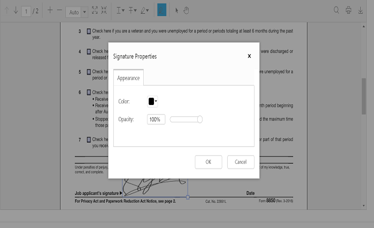

## Handwritten Signature

We have provided the support for adding handwritten signature into the PDF document. The handwritten signature support reduces the paper work of reviewing the content and verify it digitally. 

The ejPdfViewer has an option in the toolbar settings to enable/disable the signature button in the default toolbar. 

The below code snippet describes how to show only the signature tool in the component.




<html ng-app="syncApp">
<head>
    <title>Handwritten Signature - PDF viewer</title>
    <!-- Add Scripts and CSS for rendering Essential JS components -->
    <link href="http://cdn.syncfusion.com/{{ site.releaseversion }}/js/web/flat-azure/ej.web.all.min.css" rel="stylesheet" />
    
    
    
    
</head>
<body>
    

        

    

</body>
</html>



angular.module('syncApp', ['ejangular']).controller('PDFViewerController', function($scope) {
    $scope.serviceurl = 'http://js.syncfusion.com/ejservices/api/PdfViewer';
    $scope.toolbarsettings = {
        toolbarItem: ej.PdfViewer.ToolbarItems.SignatureTool
    }
});



**Drawing and adding signature in the PDF document**

The handwritten signature can be added by drawing the signature content in the signature panel and on clicking the button labeled ADD, the signature will be added in the PDF documents. The following screenshots are pictorial representation of this.

**Move, Resize and Delete the Handwritten Signature**

The handwritten signature content can be moved to the specified location within the page bounds by using touch gestures, arrow keys and mouse. We can also resize the handwritten signature content with maintaining aspect ratio. 

The selected handwritten signature content can be deleted using the "Delete" option in the context menu or delete key. The following screenshots are pictorial representation of this.

            

**Changing Handwritten Signature properties**

The properties (i.e. opacity and color) of a handwritten signature can be modified by color palate and opacity slider which is available in the “Properties" option in context menu. The following screenshots are pictorial representation of this. 

      

Select the desired color from the color palette and then click on OK button.

  

The selected color will be updated on the signature.

  

You can also change the opacity of the added signature in the "properties" option.

  

**Saving the Signature**

The added signature can be saved to the PDF document and can be downloaded by clicking the download button in the toolbar. This action will not affect the original document

 

