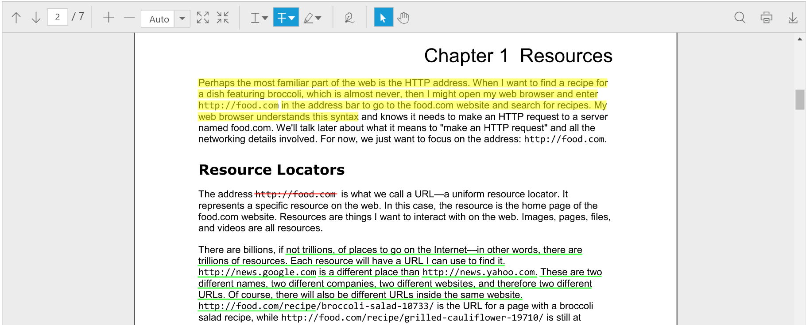
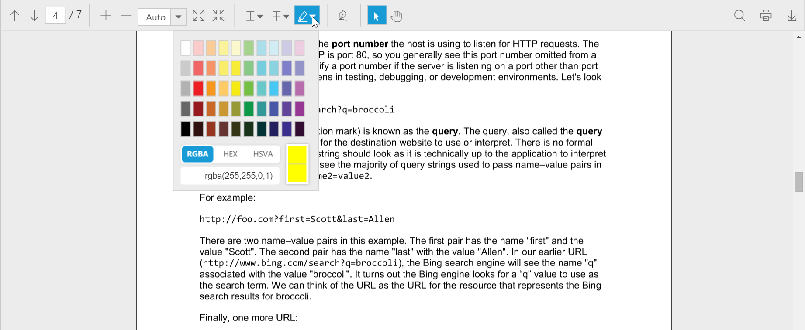
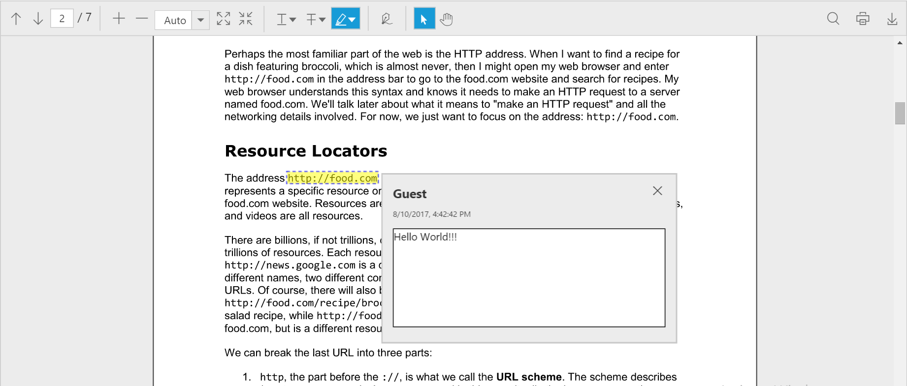
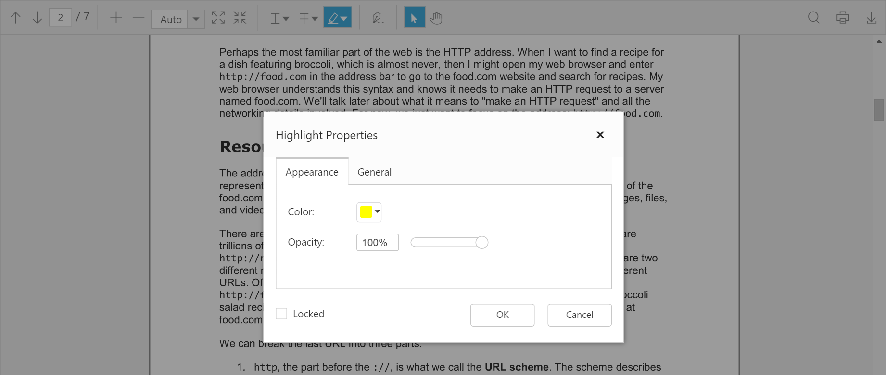

## Text Markup Annotation

PDF viewer control supports adding text markup annotations in the PDF documents. The component also renders the existing text markup annotations from the PDF document when the document is loaded in it.

The following screenshot shows PDF viewer with the PDF document containing text markup annotations.

**Adding text markup annotations**

The text markup annotations are added to the PDF document using the text markup annotation tools provided in the toolbar of the PDF viewer component.

The text markup annotation tools can be enabled or disabled using the toolbar settings property.

The below code snippet describes how to show only the text markup annotation tools in the component.




<html ng-app="syncApp">
<head>
    <title>Text Markup Annotation - PDF viewer</title>
    <!-- Add Scripts and CSS for rendering Essential JS components -->
    <link href="http://cdn.syncfusion.com/{{ site.releaseversion }}/js/web/flat-azure/ej.web.all.min.css" rel="stylesheet" />
    
    
    
    
</head>
<body>
    

        

    

</body>
</html>



angular.module('syncApp', ['ejangular']).controller('PDFViewerController', function($scope) {
    $scope.serviceurl = 'http://js.syncfusion.com/ejservices/api/PdfViewer';
    $scope.toolbarsettings = {
        toolbarItem: ej.PdfViewer.ToolbarItems.TextMarkupAnnotationTools
    }
});



The colorpicker control is provided in the text markup annotation tools to select the desired color for the text markup annotation to be added in the document.

**Adding notes to the text markup annotation**

The notes can be added to the text markup annotations using the context menu provided in the PDF viewer component.

The below screenshot shows that the notes have been added to a text markup annotation in the PDF document.

**Editing the text markup annotation**

The properties of the text markup annotations in the PDF document can be edited using the properties window provided in the PDF viewer component. The color, opacity, author and subject of the text markup annotation can be modified. The properties of the text markup annotation can also be locked using the locked checkbox in the properties window.

The below screenshot shows the properties window used for editing the properties of a text markup annotation.

The text markup annotation in the PDF document can also be deleted from the PDF document.

**Saving the text markup annotation**

When the download tool is selected in the toolbar, the text markup annotations will be saved in the PDF document. This action will not affect the original document.
