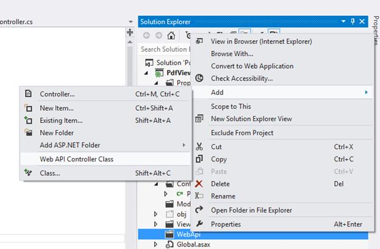
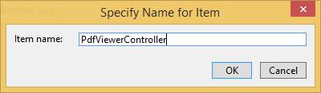
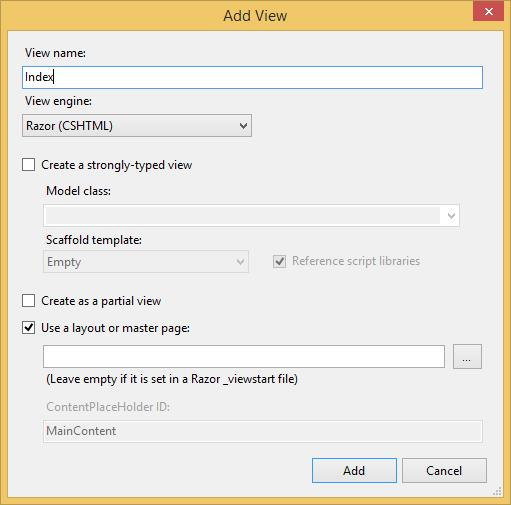
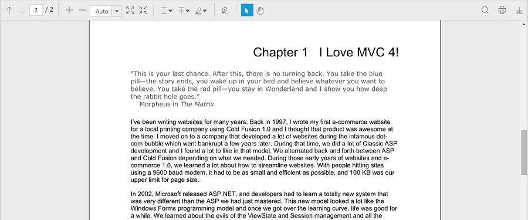

# Getting Started

The AngularJS directives are usually included within the `ej.widget.angular.min.js` file and all these directives are packed together in a common module known as `ejangular`. For basic details on how to configure Syncfusion widgets in AngularJS framework, refer [here](https://help.syncfusion.com/js/angularjs).

To get started with the PdfViewerControl in AngularJS framework, the following list of external dependencies are mandatory, which are available in the following link. 

* [jQuery](http://jquery.com) - 1.7.1 and later versions
* [jsRender](https://github.com/borismoore/jsrender) - to render the templates
* [AngularJS](https://angularjs.org/)

The external AngularJS script file `angular.min.js` can also be accessed from the following installed location.

* **(installed location)**\Syncfusion\Essential Studio\{{ site.releaseversion }}\JavaScript\assets\external

An another mandatory script is `ej.widget.angular.min.js`, which can be accessed from the following specified location.

* **(installed location)**\Syncfusion\Essential Studio\{{ site.releaseversion }}\JavaScript\assets\scripts\common

### Add References, Scripts, Styles

**Add References**

Add reference to the following assemblies from [NuGet package](https://help.syncfusion.com/extension/syncfusion-nuget-packages/web-nuget-packages-details "Web NuGet Package Details").

* System.Web.Http
* System. Web.Http.WebHost
* System.Net.Http.WebRequest
* System.Net.Http.Formatting

N> The System.Web.Routing and System.Net.Http assemblies are also required, which are referred by default when creating the project.

Add the following references to the project that are necessary for using the ejPdfViewer control.

* Syncfusion.Compression.Base
* Syncfusion.EJ.PdfViewer
* Syncfusion.Pdf.Base

N> Starting with v16.2.0.x, if you reference Syncfusion assemblies from trial setup or from the NuGet feed, include a license key in your projects. Refer to this [link](https://help.syncfusion.com/common/essential-studio/licensing/license-key "Syncfusion Licensing Overview") to learn about registering Syncfusion license key in your JavaScript application to use the components.

## Add Scripts and Styles

The PDF Viewer has the [JQuery](http://jquery.com/# "JQuery") external dependency.

The following table shows the list of ej widgets required for using the ejPdfViewer.

<table>
<tr>
<td>
{{'**File**'| markdownify }}
</td>
<td>
{{'**Description/Usage**'| markdownify }}
</td>
</tr>
<tr>
<td>
ej.core.min.js
</td>
<td>
Must be referred always before using all the JS widgets.
</td>
</tr>
<tr>
<td>
ej.data.min.js
</td>
<td>
To handle data operation and should be used while binding data to JS widgets.
</td>
</tr>
<tr>
<td>
ej.globalize.min.js
</td>
<td>
To support the globalization.
</td>
</tr>
<tr>
<td>
ej.draggable.js
</td>
<td>
Used for dragging and dropping an element in JS controls.
</td>
</tr>
<tr>
<td>
ej.pdfviewer.min.js
</td>
<td>
Main PDF viewer file
</td>
</tr>
<tr>
<td>
ej.toolbar.min.js
</td>
<td>
To add toolbar in the widget.
</td>
</tr>
<tr>
<td>
ej.button.min.js
</td>
<td>
To add buttons in the toolbar.
</td>
</tr>
<tr>
<td>
ej.dropdownlist.min.js
</td>
<td>
To add dropdownlist in the toolbar.
</td>
</tr>
<tr>
<td>
ej.scroller.min.js
</td>
<td>
To handle scrolling operation in the widget.
</td>
</tr>
<tr>
<td>
ej.waitingpopup.min.js
</td>
<td>
To show waiting popups on loading and rendering.
</td>
</tr>
<tr>
<td>
ej.checkbox.min.js
</td>
<td>
To add checkboxes in the text search toolbar and annotation properties window.
</td>
</tr>
<tr>
<td>
ej.tooltip.min.js
</td>
<td>
To add tooltip in the widget.
</td>
</tr>
<tr>
<td>
ej.colorpicker.min.js
</td>
<td rowspan="2">
To add colorpicker in the text markup annotation tools and the annotation properties window.
</td>
</tr>
<tr>
<td>
ej.splitbutton.min.js
</td>
</tr>
<tr>
<td>
ej.maskedit.min.js
</td>
<td rowspan="5">
To add properties window for annotations in the widget.
</td>
</tr>
<tr>
<td>
ej.dialog.min.js
</td>
</tr>
<tr>
<td>
ej.tab.min.js
</td>
</tr>
<tr>
<td>
ej.menu.min.js
</td>
</tr>
<tr>
<td>
ej.slider.min.js
</td>
</tr>
</table>

Find the scripts and style sheets in any of the following locations:
Local Disk: [Click here](https://help.syncfusion.com/js/installation-and-deployment# "Installation and deployment") to learn more about script and style sheets installed in local machine.
CDN Link: [Click here](https://help.syncfusion.com/js/cdn# "CDN scripts and styles links") to learn more about script and style sheets available online.
NuGet Package: [Click here](https://help.syncfusion.com/js/installation-and-deployment#configuring-syncfusion-nuget-packages "Configuring Syncfusion NuGet Packages") to learn more about script and style sheets available in NuGet package.

Create a new HTML file and include the following initial code.



<!DOCTYPE html>
<html lang="en" xmlns="http://www.w3.org/1999/xhtml">
    <head>
        <meta charset="utf-8" />
        <title> </title>
    </head>
    <body>
    </body>
</html>



Refer to the CSS file from the specific theme folder to your HTML file within the head section as shown below. Refer to the Syncfusion built-in theme [here](https://help.syncfusion.com/js/theming-in-essential-javascript-components).



<head>
    <meta charset="utf-8" />
    <title>Getting Started - PDF viewer</title>
    <link href="http://cdn.syncfusion.com/{{ site.releaseversion }}/js/web/flat-azure/ej.web.all.min.css" rel="stylesheet" />
</head>



Refer to the [CDN](https://help.syncfusion.com/js/cdn) script files with other required external dependencies.



<head>
    <meta charset="utf-8" />
    <title>Getting Started - PDF viewer</title>
    <link href="http://cdn.syncfusion.com/{{ site.releaseversion }}/js/web/flat-azure/ej.web.all.min.css" rel="stylesheet" />
    
    
    
    
    
</head>



N> For getting started, you can use the ej.web.all.min.js file, which encapsulates all the ej widgets and frameworks in a single file. In production, it is highly recommended to use [custom script generator](http://csg.syncfusion.com "Custom Script Generator") to create custom script file with required widgets and its dependencies to reduce the size of the script files.

## Initialize and configure the control

The ng-app directive explains the root element (<html> or <body> tags) of the application. Assign a name to the ng-app directive and you should create a module with that name. In this module, define your directives, services, and configurations.

The PDF Viewer must be initialized using the following steps:

To initialize the PDF viewer control, use the [serviceUrl](https://help.syncfusion.com/api/js/ejpdfviewer#serviceurl-string "serviceUrl property") property that is necessary to access the service from which the PDF document is loaded and processed for the control. 



 




angular.module('PDFViewer', ['ejangular']).controller('PDFViewerController', function ($scope) {
    $scope.serviceurl = "http://js.syncfusion.com/ejservices/api/PdfViewer",
});



N> Default PDF document will be rendered, which is used in the online service.

**Provide Web API action methods**

The Web API action methods must be available in the server (Web API controller) to load and process the PDF documents. The available API methods in the controller are Load, FileUpload, Download, and Unload. You can modify the name of the server action methods as used in the controller using the [serverActionSettings](https://help.syncfusion.com/api/js/ejpdfviewer#serveractionsettings-object "serverActionSettings property") property in the PdfViewerControl.




<html ng-app="syncApp">
<head>
    <title>PDF viewer</title>
    <!-- Add Scripts and CSS for rendering Essential JS components -->
    <link href="http://cdn.syncfusion.com/{{ site.releaseversion }}/js/web/flat-azure/ej.web.all.min.css" rel="stylesheet" />
    
    
    
    
</head>
<body>
    

        

    

</body>
</html>



angular.module('PDFViewer', ['ejangular']).controller('PDFViewerController', function($scope) {
    $scope.serviceurl = 'http://js.syncfusion.com/ejservices/api/PdfViewer';
    $scope.serverActionSettings = {
                load: 'LoadAction', fileUpload: 'FileUploadAction',
                download: 'DownloadAction'
            };
});



**Load PDF documents from client-side**

The PDF documents can be loaded in the PdfViewerControl using [load()](https://help.syncfusion.com/api/js/ejpdfviewer#loadfilename "load method") method in the client-side. The path of the PDF document and the base64 string of the document can be used to load the PDF document.

N> If the name of the PDF document is only passed as parameter in the load() method, the PDF document must be available in the folder that is specified in the Load action method in the controller.


var pdfviewer=$("#viewer").data("ejPdfViewer");
pdfviewer.load("HTTP Succinctly");


When the PDF document is loaded in the PdfViewerControl, the documentLoad event will be triggered. You can define the event method using the [documentLoad](https://help.syncfusion.com/api/js/ejpdfviewer#documentload "documentLoad Event") property of the control.




<html ng-app="syncApp">
<head>
    <title>PDF viewer</title>
    <!-- Add Scripts and CSS for rendering Essential JS components -->
    <link href="http://cdn.syncfusion.com/{{ site.releaseversion }}/js/web/flat-azure/ej.web.all.min.css" rel="stylesheet" />
    
    
    
    
</head>
<body>
    

        

    

</body>
</html>



angular.module('PDFViewer', ['ejangular']).controller('PDFViewerController', function($scope) {
    $scope.serviceurl = 'http://js.syncfusion.com/ejservices/api/PdfViewer';
    $scope.documentLoad = function (args) {
                alert("The document" + args.fileName + "is ready to view");
            }
});



**Load the documents during control initialization**

The PDF document can also be loaded during the PdfViewerControl initialization using the [documentPath](https://help.syncfusion.com/api/js/ejpdfviewer#documentpath-string "documentPath property") property. The path of the PDF document and the base64 string of the document can be used to load the PDF document.

N> If the name of the PDF document is only set in the documentPath property, the PDF document must be available in the folder that is specified in the Load action method in the controller.




<html ng-app="syncApp">
<head>
    <title>PDF viewer</title>
    <!-- Add Scripts and CSS for rendering Essential JS components -->
    <link href="http://cdn.syncfusion.com/{{ site.releaseversion }}/js/web/flat-azure/ej.web.all.min.css" rel="stylesheet" />
    
    
    
    
</head>
<body>
    

        

    

</body>
</html>



angular.module('PDFViewer', ['ejangular']).controller('PDFViewerController', function($scope) {
    $scope.serviceurl = 'http://js.syncfusion.com/ejservices/api/PdfViewer';
    $scope.documentPath = 'PDF Succinctly.pdf';
});



**Unload the documents from the PdfViewerControl**

The PDF document loaded in the PdfViewerControl is unloaded using the [unload()](https://help.syncfusion.com/api/js/ejpdfviewer#unload "unload method") method in the client-side.


var pdfviewer=$(“#viewer”).data(“ejPdfViewer”);
pdfviewer.unload();


### Displaying PDF document using Remote Service

Add the following code in the <body> tag in the Default.html page. Here, the PDF Viewer uses hosted service in the remote machine to process the PDF.



 




angular.module('PDFViewer', ['ejangular']).controller('PDFViewerController', function ($scope) {
    $scope.serviceurl = "http://js.syncfusion.com/ejservices/api/PdfViewer",
});



### Displaying PDF document using Web API

**Add Web API controller for PDF viewer**

Add a new folder WebApi in the solution and add new Web API Controller Class. Name it as **PdfViewerController** and click OK.

Replace the following code in the PdfViewerController.cs


using Newtonsoft.Json;
using Syncfusion.EJ.PdfViewer;
using System.Collections.Generic;
using System.IO;
using System.Web;
using System.Web.Http;
namespace PDFViewerDemo
{
    public class PdfViewerAPIController : ApiController
    {
        //Post action for processing the PDF documents
        public object Load(Dictionary<string, string> jsonResult)
        {
            PdfViewerHelper helper = new PdfViewerHelper();
            helper.Load(HttpContext.Current.Server.MapPath("~/Data/JavaScript_Succinctly.pdf"));
            object output = helper.ProcessPdf(jsonResult);
            return JsonConvert.SerializeObject(output);
        }

        //Post action for processing the PDF documents when uploading to the ejPdfviewer widget
        public object FileUpload(Dictionary<string, string> jsonResult)
        {
            PdfViewerHelper helper = new PdfViewerHelper();
            if (jsonResult.ContainsKey("uploadedFile"))
            {
                var fileUrl = jsonResult["uploadedFile"];
                byte[] byteArray = Convert.FromBase64String(fileUrl);
                MemoryStream stream = new MemoryStream(byteArray);
                helper.Load(stream);
            }
            return JsonConvert.SerializeObject(helper.ProcessPdf(jsonResult));
        }

        //Post action for downloading the PDF documents from the ejPdfviewer widget
        public object Download(Dictionary<string, string> jsonResult)
        {
            PdfViewerHelper helper = new PdfViewerHelper();
            return helper.GetDocumentData(jsonResult);
        }

        //Post action for unloading and disposing the PDF document resources in the server-side from the ejPdfviewer widget
        public void Unload()
        {
            PdfViewerHelper helper = new PdfViewerHelper();
            helper.UnLoad();
        }
    }
}


N> Create a folder named Data in the project location and add the PDF document to be viewed in PDF Viewer.

**Web API Routing**

Right-Click the Project, select Add and Global.asax file from the listed templates.

You can route the Web API in the Application_Start event into Global.asax file as follows.


using System;
using System.Web.Http;
namespace PDFViewerDemo
{
    public class Global : System.Web.HttpApplication
    {
        protected void Application_Start(object sender, EventArgs e)
        {
            System.Web.Http.GlobalConfiguration.Configuration.Routes.MapHttpRoute(
            name: "DefaultApi",
            routeTemplate: "api/{controller}/{action}/{id}",
            defaults: new { id = RouteParameter.Optional });
        }
        protected void Application_BeginRequest(object sender, EventArgs e)
        {
            if (Request.Url.AbsolutePath.EndsWith("/"))
            {
                Server.Transfer(Request.Url.AbsolutePath + "Default.html");
            }
        }
    }
}


Add the following code in the Angular.html page. Here, PDF Viewer uses the web API controller to process the PDF.



 




angular.module('PDFViewer', ['ejangular']).controller('PDFViewerController', function ($scope) {
   $scope.serviceurl = '../api/PdfViewer';
});



**Output**

Run the sample application and you will see the PDF Viewer on the page as displayed in the following screenshot.

**Sample:**

<http://www.syncfusion.com/downloads/support/directtrac/general/ze/PdfViewerSample_AngularJS-1351825717>

**Destroy**

When closing a window containing the ejPdfViewer, you can also remove the ejPdfViewer and the related objects at runtime by calling the “destroy” function as follows.


var pdfviewerObj = $("#container").data("ejPdfViewer");
pdfviewerObj.destroy();

