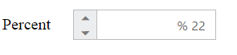

# RTL Support

The **PercentageTextBox** provides **RTL** (**Right-To-Left**) support. The alignment of **PercentageTextBox** can be changed from **Left-To-Right** into **Right-To-Left**.

## Enable RTL

The following steps explain the implementation of **enableRTL** in **PercentageTextBox** .

In the **HTML** page set the corresponding **&lt;input&gt;** elements for rendering **PercentageTextBox** control.



<table cellpadding="10">
    <tbody>
        <tr>
            <td>
                <label for="percent">Percent</label>
            </td>
            <td>
                <input id="percent" type="text" ej-percentagetextbox e-value="22" e-enablertl="true" />
            </td>
        </tr>
    </tbody>
</table>



The output for **PercentageTextBox** when **enableRTL** is **“true”** is as follows. 

 

