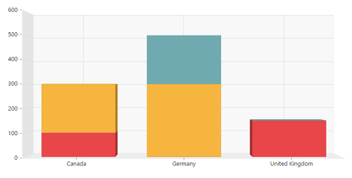

# 3D Visualization

The PivotChart control allows you to view the data in a 3D view. Following are the chart types that are supported:

* Bar
* Column
* Stacking Bar
* Stocking Column 
* Pie

## 3D Column Chart

3D Column Chart is rendered by specifying the chart type as **“Column”** in the **“type”** enumeration property of **“commonSeriesOptions”** along with `e-enable3D` property set to **“true”.**



<body>
    

        

    

    
</body>



## 3D Bar Chart

3D Bar Chart is rendered by specifying the chart type as **“Bar”** in the **“type”** enumeration property of **“commonSeriesOptions”** along with  `e-enable3D` property set to **“true”.**



<body>
    

        

    

    
</body>



## 3D Stacking Bar Chart
3D Stacking Bar Chart is rendered by specifying the chart type as **“Stacking Bar”** in the **“type”** enumeration property of **“commonSeriesOptions”** along with `e-enable3D` property set to **“true”.**



<body>
    

        

    

    
</body>



## 3D Stacking Column Chart
3D Stacking Column Chart is rendered by specifying the chart type as **“Stacking Column”** in the **“type”** enumeration property of **“commonSeriesOptions”** along with `e-enable3D` property set to **“true”.**



    $("#PivotChart1").ejPivotChart(
    {
        .....
        .....
        //Enable 3D Chart
        enable3D: true,
        commonSeriesOptions:
        {
            //Setting chart type to stacking column
            type: ej.PivotChart.ChartTypes.StackingColumn
        }
    });


## 3D Pie Chart
3D Pie Chart is rendered by specifying the chart type as **"Pie"** in the **“type”** enumeration property of **“commonSeriesOptions”** along with `e-enable3D` property set to **“true”.**



<body>
    

        

    

    
</body>

   

## Rotating 3D Chart
We can rotate the 3D Chart towards left or right by setting an appropriate angle value to the `e-rotation` property. The direction of the Chart display depends upon the positive or negative angle value.



<body>
    

        

    

    
</body>

 

