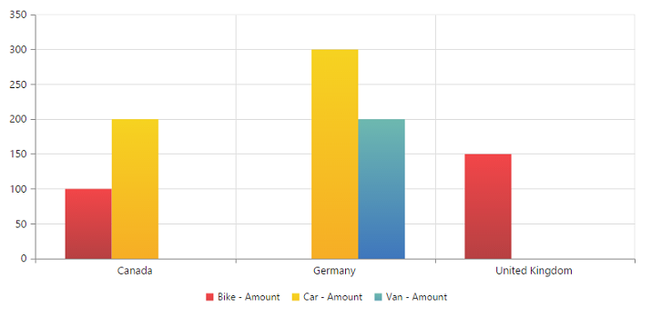
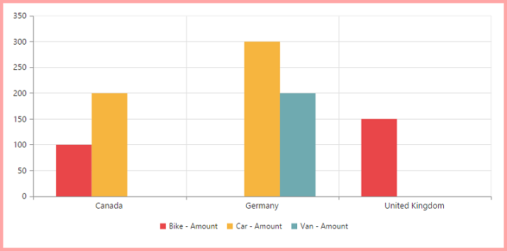
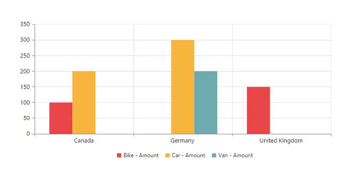
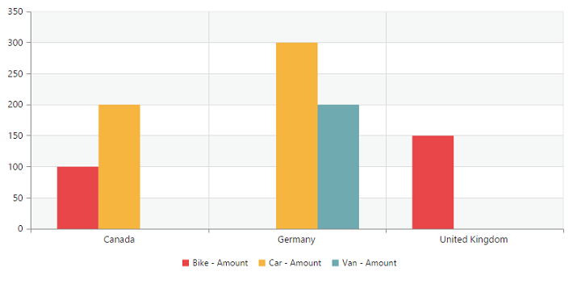

# Appearance

## Built-in Themes

Following are the built-in themes available in the PivotChart.

* flatlight
* gradientlight
* gradientdark
* azure
* azuredark
* lime
* limedark
* saffron
* saffrondark
* gradientlight
* gradientdark
* highcontrast01
* highcontrast02
* material
* office365
* bootstrap

By using the `e-theme` property, you can set the desired theme in PivotChart. By default, **“Flat Light”** theme is applied to PivotChart.



    



## PivotChart - Area Customization

### Border Customization
To customize the PivotChart border, use `e-border` property in PivotChart.



<body>
    

        

    

    
</body>



### Margin Customization
The PivotChart control `e-margin` property is used to add the margin to the Chart area at left, right, top and bottom position.



<body>
    

        

    

    
</body>



### Background Customization
The PivotChart control background can be customized by using the [`background`](/api/js/ejchart#members:chartarea-background) property in the Chart area.



<body>
    

        

    

    
</body>



### Grid Bands Customization
By using the [`alternateGridBand`](/api/js/ejchart#members:primaryxaxis-alternategridband) property of the axis, you can provide different color for grid rows and columns formed by the grid lines in the Chart area. The properties [`odd`](/api/js/ejchart#members:primaryyaxis-alternategridband-odd) and [`even`](/api/js/ejchart#members:primaryyaxis-alternategridband-even) are used to customize the grid bands at odd and even positions respectively.



<body>
    

        

    

    
</body>



### Animation
You can enable animation by using the [`enableAnimation`](/api/js/ejchart#members:commonseriesoptions-enableanimation) property under [`commonSeriesOptions`](/api/js/ejchart#members:commonseriesoptions) of the PivotChart control. This animates the Chart series on two occasions - when the Chart is loaded for the first time and when you change the series type by using the “type” property.



<body>
    

        

    

    
</body>


