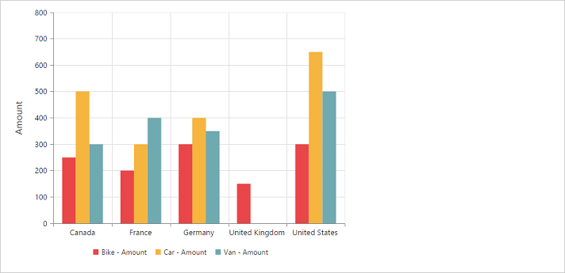

# Dimensions

## Set size in percentage

You can customize the PivotChart dimension by setting the width and height of the widget in percentage.



<body>
    

        

    

    
</body>



## Set size in pixels

You can customize the PivotChart dimension by setting the width and height of the widget in pixels.



<body>
    

        

    

    
</body>



 

## Responsive

PivotChart widget supports responsive rendering based on the target device (desktop & tablet) resolution. It supports resolution upto 1024x600. You can enable responsiveness in PivotChart by setting `e-isResponsive` property to true.



    



_Normal View_

_ResponsiveView_