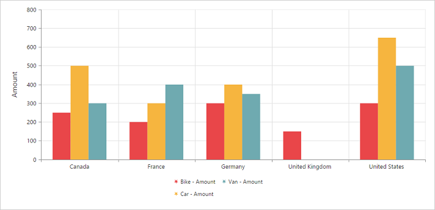
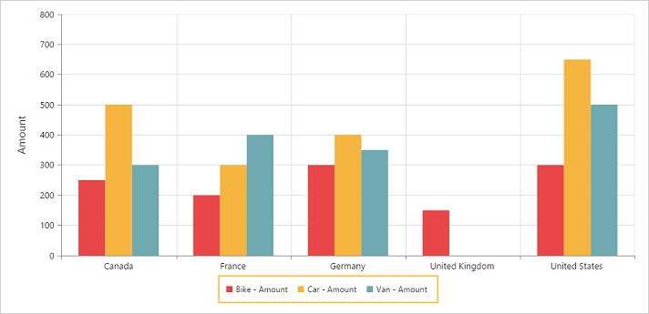
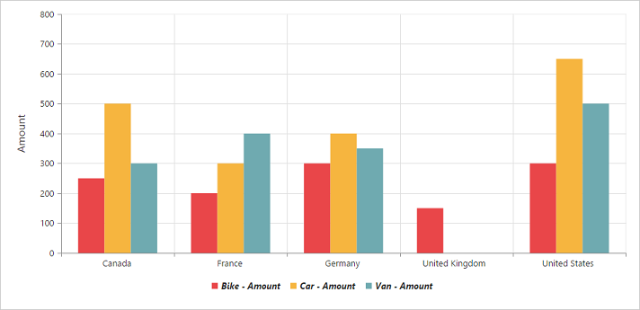

# Legend

## Legend Visibility

You can enable or disable legend using the [`visible`](/api/js/ejchart#members:legend-visible) property inside the `e-legend` object. By default, legend is enabled in PivotChart.

N> By default, the legend is visible in PivotChart.



<body>
    

        

    

    
</body>



 

## Legend Shape
You can customize the legend [`shape`](/api/js/ejchart#members:legend-shape) in PivotChart widget. Default value of legend shape is “Rectangle”. Following legend shapes that are supported:

* Rectangle
* Circle
* Cross
* Diamond
* Pentagon
* Hexagon
* Star
* Ellipse
* Triangle etc.



<body>
    

        

    

    
</body>



 

## Legend Position
By using the [`position`](/api/js/ejchart#members:legend-position) property, you can place the legend at top, bottom, left or right of the PivotChart. 

N> Default value of legend position is “bottom” in PivotChart.



<body>
    

        

    

    
</body>



 

## Legend Title
To add the legend title, you have to specify the title text in [`title.text`](/api/js/ejchart#members:legend-title-text) property.



<body>
    

        

    

    
</body>



 

## Legend Alignment
You can align the legend to center, far and near based on its position in the Chart area using the [`alignment`](/api/js/ejchart#members:legend-alignment) option.
 


<body>
    

        

    

    
</body>



## Legend Items - Size and Border
By using the legend [`itemStyle.width`](/api/js/ejchart#members:legend-itemstyle-width), [`itemStyle.height`](/api/js/ejchart#members:legend-itemstyle-height) and [`itemStyle.border`](/api/js/ejchart#members:legend-itemstyle-border) properties, you can change the legend items - size and border.



<body>
    

        

    

    
</body>



 
## Legend Border
By using the [`border`](/api/js/ejchart#members:legend-border) option in legend, you can customize border color and width.



<body>
    

        

    

    
</body>



## Legend Text
By using the [`font`](/api/js/ejchart#members:legend-font) option, you can customize the font family, font style, font weight and size of the legend text. 



<body>
    

        

    

    
</body>



