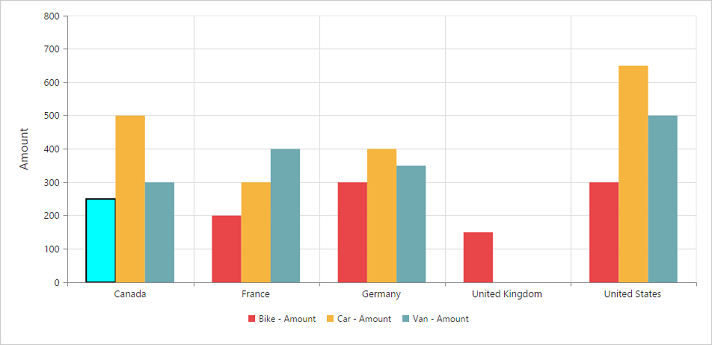

# Series

## Series Point Customization
By using the [`fill`](/api/js/ejchart#members:series-fill) and [`border`](/api/js/ejchart#members:series-border) properties of Chart series, you can customize the PivotChart series color, border color and border width.
 


<body>
    

        

    

    
</body>



