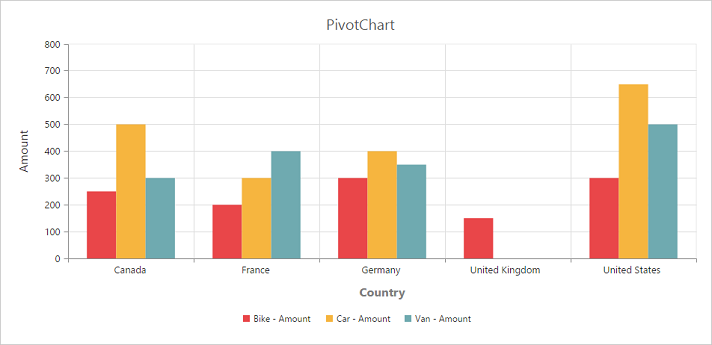

# Title

## Title Text
By using the [`title.text`](/api/js/ejchart#members:title-text) property, you can add the title text for PivotChart.
 


<body>
    

        

    

    
</body>



 

## Title Alignment

By using the [`title.textAlignment`](/api/js/ejchart#members:title-textalignment) property, you can align the PivotChart controls title text to center, far or near.



<body>
    

        

    

    
</body>



 

## Title Customization
By using the [`title`](/api/js/ejchart#members:title) property, you can add the title text for X-axis and Y-axis. Also title text can be customized by using the [`text`](/api/js/ejchart#members:title-text) and [`font`](/api/js/ejchart#members:title-font) properties. On setting [`enableTrim`](/api/js/ejchart#members:primaryyaxis-enabletrim) to true, title text could be trimmed based on its length.



<body>
    

        

    

    
</body>



 
