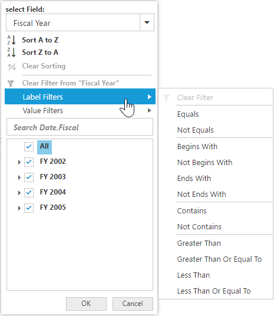

# Advanced Filtering & Sorting

It allows to filter and sort the field members in PivotClient.

### Client Mode

In client mode, you can enable Advanced Filtering and Sorting option in PivotClient by setting the `enableAdvancedFilter` property under `e-dataSource` to true.



    



### Server Mode

In server mode, you can enable the Advanced Filtering and Sorting option in PivotClient by setting the `e-enableAdvancedFilter` property to true



    



## Sorting

Sorting provides an option to sort the members of a field either in ascending or descending order. 

I> This feature is not applicable for OLAP datasource bound from server-side. 

## Label Filtering

Label filtering provides an option to filter the members of a field purely based on their caption. 

## Value Filtering

Value filtering provides an option to filter members based on the total values of the appropriate measure between the members of the level. 

