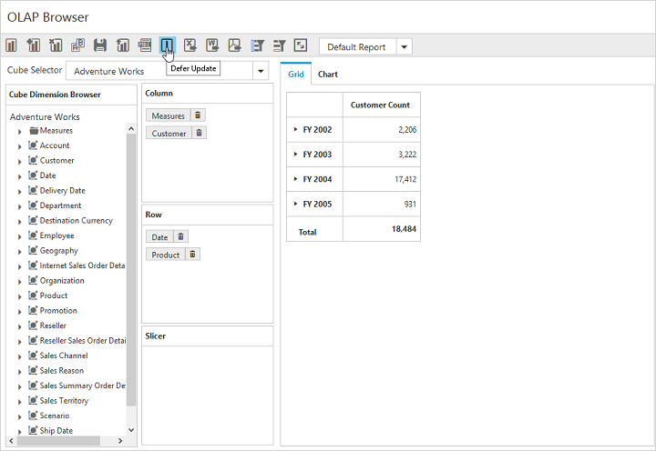
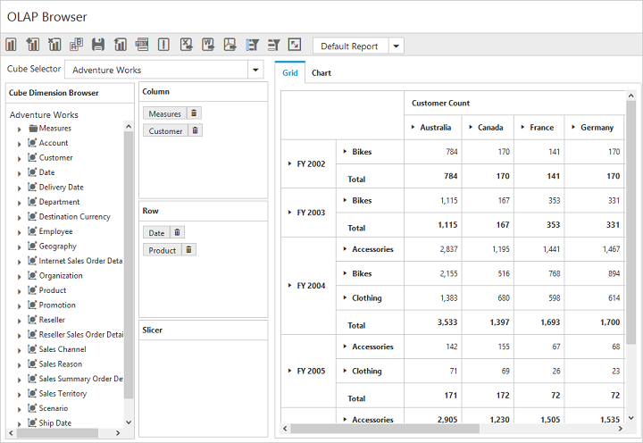

# Defer Update

I> This feature is applicable only for OLAP data source bound from server-side.

Defer Update support allows the user to refresh the control on-demand and not during every user interaction. To enable this functionality, set the `e-enableDeferUpdate` property to true. By default, the value is set to false.



    



After enabling this property, an icon for Defer Update will appear inside the toolbar.

On clicking the icon, after making the necessary UI interactions, the PivotGrid and PivotChart controls will be updated according to the OlapReport available at that instant.

