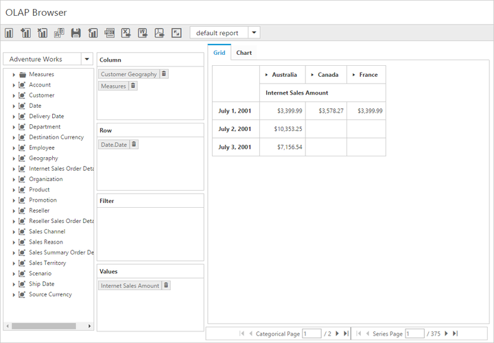

# Paging

I> This feature is applicable only for OLAP data source.

Paging helps to improve the rendering performance of the PivotClient control by dividing large amount of data into sections and displaying one section at a time.

## Using Pager 

You can enable Pager in PivotClient by setting the `e-enablePaging` property to true. You can provide the page size and current page details for each axis through [`pagerOptions`](/api/js/ejpivotclient#members:pagerOptions) property.

### Client Mode



    



### Server Mode



    



Following are the navigation option available in Pager.

* Move First - Navigates to the first page.
* Move Last - Navigates to the last page. 
* Move Previous - Navigates to the previous page from the current page.
* Move Next - Navigates to the next page from the current page.
* Numeric Box - Navigates to the desired page by entering an appropriate page number in numeric value.

## Using Virtual Scrolling

Virtual Scrolling is a technique that allows user to view the PivotClient information page by page with the use of vertical and horizontal scrollbar. You can enable Virtual Scrolling option in PivotClient by setting the `e-enableVirtualScrolling` property to true. You can provide the page size and current page details for each axis through [`pagerOptions`](/api/js/ejpivotclient#members:pagerOptions) property. 

### Client Mode



    



### Server Mode



    



## Page Settings

The properties associated to paging are:
* EnablePaging – This property is used to enable/disable paging in PivotClient control.
* PagerOptions.CategoricalPageSize - Specifies the number of categorical columns to be displayed within a page of the PivotClient control.
* PagerOptions.SeriesPageSize - Specifies the number of series rows to be displayed within a page of the PivotClient control.
* PagerOptions.CategoricalCurrentPage - Sets the current page of the categorical axis in PivotClient control.
* PagerOptions.SeriesCurrentPage - Sets the current page of the series axis in PivotClient control.

For client mode, the page setting for categorical and series axes are mandatorily needed to be set in data source property by using the following properties.



    



For server mode, the page settings for categorical and series axes are done only through OlapReport object, created inside WebAPI or WCF file.



OlapReport olapReport = new OlapReport();
olapReport.CurrentCubeName = "Adventure Works";
olapReport.EnablePaging = true;
olapReport.PagerOptions.SeriesPageSize = 4;
olapReport.PagerOptions.CategorialPageSize = 5;

