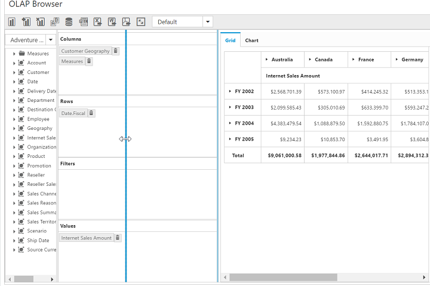

# Splitter

I> This feature is not applicable for OLAP datasource bound from server-side. 

You can resize Cube Dimension Browser and Axis Element Builder by setting enableSplitter property to true.This property is disabled by default.



    



