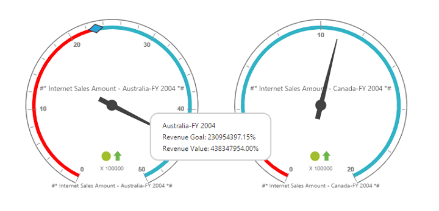

# Label Format

You can customize the format of labels displayed in the PivotGauge control using `labelFormatSettings` property.

Following are the formats that can be applied to labels in PivotGauge:

* `numberFormat` - Allows the user to change the number format of the label values in PivotGauge.
* `decimalPlaces` - Allows you to set the number of digits displayed after decimal point.
* `prefixText ` - Allows you to add a text at the beginning of the label.
* `suffixText ` - Allows you to add text at the end of the label.

Number format for the label values can be set to any of the following type:

* Default	
* Currency
* Percentage
* Fraction
* Scientific
* Text
* Notation



    



 
