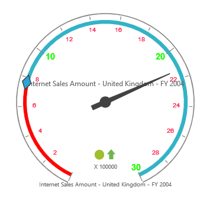
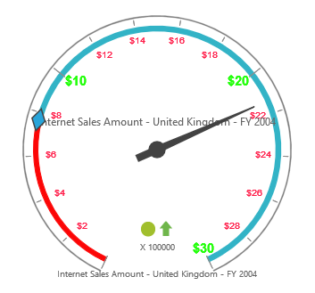

# Labels

## Adding Label Collection

Label collection can be directly added to the scales option within the PivotGauge widget as an array.



    



## Appearance Customization

The appearance of the Label can be customized through the following properties.

* **angle** – used to display labels in a rotated manner. By default, the value is 0.
* **color** – displays the label in specified color.
* **opacity** – sets the opacity of the label. By default, the value is 1.
* **type** – indicates the label for major intervals or minor intervals.  By default, it takes major intervals.
* **includeFirstValue** – includes the initial value based on user requirement.  By default, the value is “true”.
* **font** – sets the font size, font style and font family of the label.





 

## Unit Text

The `unitText` property is used to add some text along with the labels. Normally, we indicate the unit/measurement of the numeric value through unit text. Using the `unitTextPosition` property, the text can be positioned either in front or back. 

N> By default, text appears at the back.





