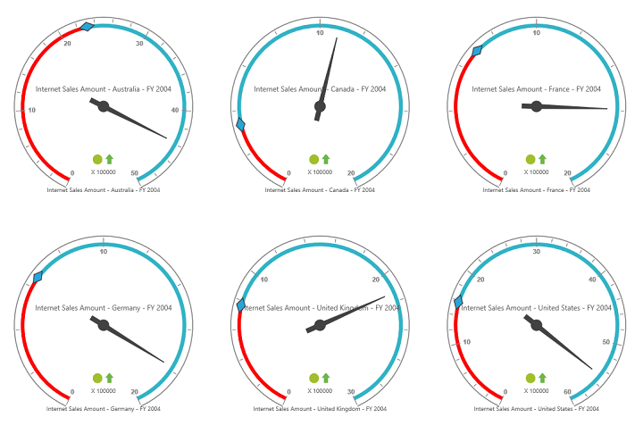

# Layout

## Row-wise Layout 

Gauges can be arranged in specified number of rows by using the `e-rowsCount` property.



    



 

## Column-wise Layout

Gauges can be arranged in specified number of columns by using the `e-columnsCount` property.



    



