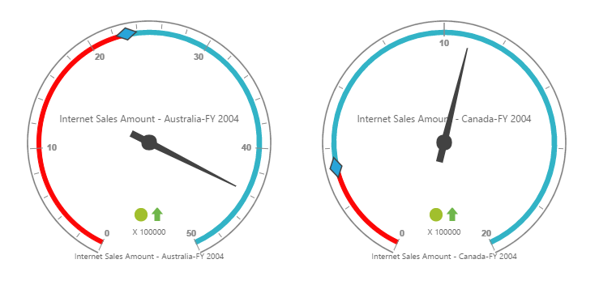

# Getting Started

The AngularJS directives are usually included within the `ej.widget.angular.min.js` file and all these directives are usually packed together in a common module known as `ejangular`. For basic details on how to configure Syncfusion widgets in AngularJS framework, refer [here](https://help.syncfusion.com/js/angularjs).

To get start with the PivotGauge control in AngularJS framework, the following list of external dependencies are mandatory, 

* [jQuery](http://jquery.com) - 1.7.1 and later versions
* [jsRender](https://github.com/borismoore/jsrender) - to render the templates
* [AngularJS](https://angularjs.org/)

The external AngularJS script file `angular.min.js` can also be accessed from the following installed location.

* **(installed location)**\Syncfusion\Essential Studio\{{ site.releaseversion }}\JavaScript\assets\external

An another mandatory script is `ej.widget.angular.min.js`, which can be accessed from the below specified location.

* **(installed location)**\Syncfusion\Essential Studio\{{ site.releaseversion }}\JavaScript\assets\scripts\common

## Script/CSS Reference

Create a new HTML file and include the below initial code.



<!DOCTYPE html>
<html lang="en" xmlns="http://www.w3.org/1999/xhtml">
    <head>
        <meta charset="utf-8" />
        <title> </title>
    </head>
    <body>
    </body>
</html>



Refer the CSS file from the specific theme folder to your HTML file within the head section as shown below. Refer the built-in available themes from [here](https://help.syncfusion.com/js/theming-in-essential-javascript-components).



<head>
    <meta charset="utf-8" />
    <title>Getting Started - PivotGauge</title>
    <link href="http://cdn.syncfusion.com/{{ site.releaseversion }}/js/web/flat-azure/ej.web.all.min.css" rel="stylesheet" />
</head>



The scripts and style sheets listed below in the <head> tag could be found in any of the following locations:

Local Disk: [Click here](http://helpjs.syncfusion.com/js/installation-and-deployment) to know more about script and style sheets installed in local machine.
 
CDN Link: [Click here](http://helpjs.syncfusion.com/js/cdn) to know more about script and style sheets available online.

NuGet Package: [Click here](http://helpjs.syncfusion.com/js/installation-and-deployment#configuring-syncfusion-nuget-packages) to know more about script and style sheets available in NuGet package.



<head>
    <meta charset="utf-8" />
    <title>Getting Started - PivotGauge</title>
    <link href="http://cdn.syncfusion.com/{{ site.releaseversion }}/js/web/flat-azure/ej.web.all.min.css" rel="stylesheet" />
    
    
    
    
    
</head>



In the above code, `ej.web.all.min.js`script reference has been added for demonstration purpose. It is not recommended to use this for deployment purpose, as its file size is larger since it contains all the widgets. Instead, you can use[CSG](http://csg.syncfusion.com/# "") utility to generate a custom script file with the required widgets for deployment purpose.

## Creating a simple application with PivotGauge and OLAP datasource (Client Mode)

This section covers the information required to populate a simple PivotGauge with OLAP data completely on the client-side.  

### Initialize PivotGauge

Create the PivotGauge control using `ej-PivotGauge` directive and define all its other properties prefixed with `e-` as shown in the below code.



<html xmlns="http://www.w3.org/1999/xhtml" ng-app="PivotGaugeApp">
<head> <!-- Dependency file references --> </head>
<body>
    

        

    

</body>
</html>



### Populate PivotGauge with DataSource

Initialize the OLAP datasource for PivotGauge widget by using **datasource** property.



<!DOCTYPE html>
<html xmlns="http://www.w3.org/1999/xhtml" ng-app="PivotGaugeApp">
<head> <!-- Dependency file references --> </head>
<body>
    

        

    

    
</body>
</html>



The above code will generate a series of Gauges for all the countries as shown below.

## Creating a simple application with PivotGauge and OLAP datasource (Server Mode)

This section covers the information required to create a simple PivotGauge bound to OLAP datasource from server-side.  

N> We will be illustrating this section by creating a simple Web Application through Visual Studio IDE since PivotGauge in ServerMode requires .NET dependency. The Web Application would contain a HTML page and a service that would transfer data to server-side, process and return back the data to client-side for control rendering. The service utilized for communication could be either WCF or WebAPI based on user requirement and we have illustrated both for user convenience.

### Project Initialization
Create a new **ASP.NET Empty Web Application** by using Visual Studio IDE and name the project as **“PivotGaugeDemo”**.

Next you need to add a HTML page. To add a HTML page in your Web Application, right-click on the project in Solution Explorer and select **Add > New Item.** In the **Add New Item** window, select **HTML Page** and name it as **“GettingStarted.html”**, click **Add.**

Now you need to set “GettingStarted.html” as start-up page. In-order to do so, right-click on “GettingStarted.html” page and select **“Set As Start Page”**.

### Control Initialization
Create the PivotGauge control using `ej-PivotGauge` directive and define all its other properties prefixed with `e-` as shown in the below code.



<!DOCTYPE html>
<html xmlns="http://www.w3.org/1999/xhtml" ng-app="PivotGaugeApp">
<head> <!-- Dependency file references --> </head>
<body>
    

        

    

    
</body>
</html>



The “url” property in PivotGauge widget points the service endpoint, where data are processed and fetched in the form of JSON. The services used for the PivotGauge widget as endpoint are WCF and WebAPI.

N> The above "GettingStarted.html" contains WebAPI URL, which is **“/Olap”**. Suppose if you are using WCF service then the URL would look like **"/OlapService.svc"**. 

### WebAPI

**Adding a WebAPI Controller**

To add a WebAPI controller in your existing Web Application, right-click on the project in Solution Explorer and select **Add > New Item.** In the **Add New Item** window, select **WebAPI Controller Class** and name it as “OlapController.cs”, click **Add.**

Now WebAPI controller is added into your application successfully which in-turn comprise of the following file. The utilization of this file will be explained in the following sections.
 
* OlapController.cs

N> While adding WebAPI Controller Class, name it with the suffix “Controller” that is mandatory. For example, in demo the controller is named as “OlapController”.

Next, remove all the existing methods such as “Get”, “Post”, “Put” and “Delete” present inside `OlapController.cs` file. 



namespace PivotGaugeDemo
{
    public class OlapController : ApiController
    {
    
    }
}



**List of Dependency Libraries**

Next you need to add the below mentioned dependency libraries into your Web Application. These libraries could be found in GAC (Global Assembly Cache) as well.

To add them to your Web Application, right-click on **References** in Solution Explorer and select **Add Reference.** Now, in the **Reference Manager** dialog, under **Assemblies > Extension**, the following Syncfusion libraries are found. 

N> When you have installed any version of SQL Server Analysis Service (SSAS) or Microsoft ADOMD.NET utility, then the location of Microsoft.AnalysisServices.AdomdClient library is [system drive:\Program Files (x86)\Microsoft.NET\ADOMD.NET]

* Microsoft.AnalysisServices.AdomdClient
* Syncfusion.Compression.Base
* Syncfusion.Linq.Base
* Syncfusion.Olap.Base
* Syncfusion.PivotAnalysis.Base
* Syncfusion.XlsIO.Base
* Syncfusion.Pdf.Base
* Syncfusion.DocIO.Base
* Syncfusion.EJ
* Syncfusion.EJ.Pivot

**List of Namespaces**

Following are the list of namespaces to be added on top of the main class inside `OlapController.cs` file.



using Syncfusion.Olap.Manager;
using Syncfusion.Olap.Reports;
using Syncfusion.JavaScript;

namespace PivotGaugeDemo
{
    public class OlapController : ApiController
    {
        
    }
}



**Datasource Initialization**

Now, the connection string to connect OLAP Cube and PivotGauge instances are created immediately inside the main class in `OlapController.cs` file.



namespace PivotGaugeDemo
{
    public class OlapController : ApiController
    {
        string connectionString = "Data Source=http://bi.syncfusion.com/olap/msmdpump.dll; Initial Catalog=Adventure Works DW 2008 SE;";
        PivotGauge pivotGauge = new PivotGauge();
        //Other codes
    }
}



**Service methods in WebAPI Controller**

Now you need to define the service methods inside OlapController class, found inside `OlapController.cs` file, created while adding WebAPI Controller Class to your Web Application.
 


namespace PivotGaugeDemo
{
    public class OlapController : ApiController
    {
        string connectionString = "Data Source=http://bi.syncfusion.com/olap/msmdpump.dll; Initial Catalog=Adventure Works DW 2008 SE;";
        PivotGauge pivotGauge = new PivotGauge();
        
        [System.Web.Http.ActionName("InitializeGauge")]
        [System.Web.Http.HttpPost]
        public Dictionary<string, object> InitializeGauge(Dictionary<string, object> jsonResult)
        {
            OlapDataManager DataManager = new OlapDataManager(connectionString);
            DataManager.SetCurrentReport(CreateOlapReport());
            return pivotGauge.GetJsonData(jsonResult["action"].ToString(), DataManager);
        }

        private OlapReport CreateOlapReport()
        {
            OlapReport olapReport = new OlapReport();
            olapReport.Name = "Default Report";
            olapReport.CurrentCubeName = "Adventure Works";

            DimensionElement dimensionElementColumn = new DimensionElement();
            //Specifying the Name for the Dimension Element
            dimensionElementColumn.Name = "Customer";
            dimensionElementColumn.AddLevel("Customer Geography", "Country");

            MeasureElements measureElementColumn = new MeasureElements();
            //Specifying the Name for the Measure Element
            measureElementColumn.Elements.Add(new MeasureElement { Name = "Customer Count" });

            DimensionElement dimensionElementRow = new DimensionElement();
            //Specifying the Dimension Name
            dimensionElementRow.Name = "Date";
            dimensionElementRow.AddLevel("Fiscal", "Fiscal Year");

            ///Adding Row Members
            olapReport.SeriesElements.Add(dimensionElementRow);
            ///Adding Column Members
            olapReport.CategoricalElements.Add(dimensionElementColumn);
            ///Adding Measure Element
            olapReport.CategoricalElements.Add(measureElementColumn);
            return olapReport;
        }
    }
}



**Configure routing in Global Application Class**

To add a Global.asax in your existing Web Application, right-click on the project in Solution Explorer and select **Add > New Item.** In the **Add New Item** window, select **Global Application Class** and name it as “Global.asax”, click **Add.**

Once you finish adding the **Global.asax** file, immediately add the namespace **“using System.Web.Http;”** and then you can configure routing like in the following code example.



public class Global : System.Web.HttpApplication
{
    protected void Application_Start(object sender, EventArgs e)
    {
        GlobalConfiguration.Configuration.Routes.MapHttpRoute(
            name: "DefaultApi",
            routeTemplate: "{controller}/{action}/{id}",
            defaults: new { id = RouteParameter.Optional });
        AppDomain.CurrentDomain.SetData("SQLServerCompactEditionUnderWebHosting", true);
    }
}



Now, PivotGauge will be rendered with the provided data as shown below.

### WCF
This section demonstrates the utilization of WCF service as endpoint binding OLAP datasource to a simple PivotGauge. For more details on this topic, [click here](http://help.syncfusion.com/angularjs/pivotgauge/olap-connectivity#wcf).

