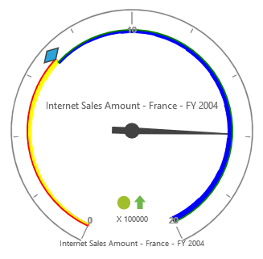

# Ranges

## Adding Range Collection

Range collection can be directly added to the scales option within the PivotGauge widget as an array.



    



## Appearance Customization

The appearance of the range can be customized through the following properties.

* **startValue** – defines the start position of the range.
* **endValue** – defines the end position of the range.
* **startWidth** – sets the width at starting position of the range.
* **endWidth** – sets the width at ending position of the range.
* **backgroundColor** – sets the background color of the range.
* **border** – sets the height and width of the border of the range.
* **placement** – sets the position of the range.
* **distanceFromScale** – sets the distance between the range and scale.

Positioning the range could be set either through `placement` or `distanceFromScale` property. 

N> By default, placement takes the value "near", whereas other enumeration values available are "far" and "center".





 

N> On setting both the position properties - "distanceFromScale" and "placement" for a range, the value set in "distanceFromScale" is given preference.

## Multiple Ranges 
Multiple ranges can be added by placing an array of objects in `ranges` option.





 
