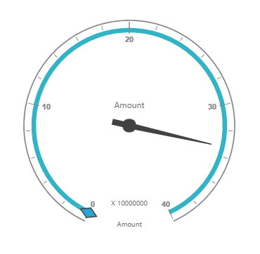

# Getting Started

The AngularJS directives are usually included within the `ej.widget.angular.min.js` file and all these directives are usually packed together in a common module known as `ejangular`. For basic details on how to configure Syncfusion widgets in AngularJS framework, refer [here](https://help.syncfusion.com/js/angularjs).

To get start with the PivotGauge control in AngularJS framework, the following list of external dependencies are mandatory, 

* [jQuery](http://jquery.com) - 1.7.1 and later versions
* [jsRender](https://github.com/borismoore/jsrender) - to render the templates
* [AngularJS](https://angularjs.org/)

The external AngularJS script file `angular.min.js` can also be accessed from the following installed location.

* **(installed location)**\Syncfusion\Essential Studio\{{ site.releaseversion }}\JavaScript\assets\external

An another mandatory script is `ej.widget.angular.min.js`, which can be accessed from the below specified location.

* **(installed location)**\Syncfusion\Essential Studio\{{ site.releaseversion }}\JavaScript\assets\scripts\common

## Script/CSS Reference

Create a new HTML file and include the below initial code.



<!DOCTYPE html>
<html lang="en" xmlns="http://www.w3.org/1999/xhtml">
    <head>
        <meta charset="utf-8" />
        <title> </title>
    </head>
    <body>
    </body>
</html>



Refer the CSS file from the specific theme folder to your HTML file within the head section as shown below. Refer the built-in available themes from [here](https://help.syncfusion.com/js/theming-in-essential-javascript-components).



<head>
    <meta charset="utf-8" />
    <title>Getting Started - PivotGauge</title>
    <link href="http://cdn.syncfusion.com/{{ site.releaseversion }}/js/web/flat-azure/ej.web.all.min.css" rel="stylesheet" />
</head>



The scripts and style sheets listed below in the <head> tag could be found in any of the following locations:

Local Disk: [Click here](http://helpjs.syncfusion.com/js/installation-and-deployment) to know more about script and style sheets installed in local machine.
 
CDN Link: [Click here](http://helpjs.syncfusion.com/js/cdn) to know more about script and style sheets available online.

NuGet Package: [Click here](http://helpjs.syncfusion.com/js/installation-and-deployment#configuring-syncfusion-nuget-packages) to know more about script and style sheets available in NuGet package.



<head>
    <meta charset="utf-8" />
    <title>Getting Started - PivotGauge</title>
    <link href="http://cdn.syncfusion.com/{{ site.releaseversion }}/js/web/flat-azure/ej.web.all.min.css" rel="stylesheet" />
    
    
    
    
    
</head>



In the above code, `ej.web.all.min.js`script reference has been added for demonstration purpose. It is not recommended to use this for deployment purpose, as its file size is larger since it contains all the widgets. Instead, you can use[CSG](http://csg.syncfusion.com/# "") utility to generate a custom script file with the required widgets for deployment purpose.

## Creating a simple application with PivotGauge and Relational datasource (Client Mode)

This section covers the basic information required to populate a simple PivotGauge with Relational data completely on the client-side.  

### Initialize PivotGauge

Create the PivotGauge control using `ej-PivotGauge` directive and define all its other properties prefixed with `e-` as shown in the below code.



<html xmlns="http://www.w3.org/1999/xhtml" ng-app="PivotGaugeApp">
<head> <!-- Dependency file references --> </head>
<body>
    

        

    

</body>
</html>



### Populate PivotGauge With Data

Let us now see how to populate the PivotGauge control using a sample JSON data as shown below. 



var pivot_dataset = [
            { Amount: 100, Country: "Canada", Date: "FY 2005", Product: "Bike", Quantity: 2, State: "Alberta" },
            { Amount: 200, Country: "Canada", Date: "FY 2006", Product: "Van", Quantity: 3, State: "British Columbia" },
            { Amount: 300, Country: "Canada", Date: "FY 2007", Product: "Car", Quantity: 4, State: "Brunswick" },
            { Amount: 150, Country: "Canada", Date: "FY 2008", Product: "Bike", Quantity: 3, State: "Manitoba" },
            { Amount: 200, Country: "Canada", Date: "FY 2006", Product: "Car", Quantity: 4, State: "Ontario" },
            { Amount: 100, Country: "Canada", Date: "FY 2007", Product: "Van", Quantity: 1, State: "Quebec" },
            { Amount: 200, Country: "France", Date: "FY 2005", Product: "Bike", Quantity: 2, State: "Charente-Maritime" },
            { Amount: 250, Country: "France", Date: "FY 2006", Product: "Van", Quantity: 4, State: "Essonne" },
            { Amount: 300, Country: "France", Date: "FY 2007", Product: "Car", Quantity: 3, State: "Garonne (Haute)" },
            { Amount: 150, Country: "France", Date: "FY 2008", Product: "Van", Quantity: 2, State: "Gers" },
            { Amount: 200, Country: "Germany", Date: "FY 2006", Product: "Van", Quantity: 3, State: "Bayern" },
            { Amount: 250, Country: "Germany", Date: "FY 2007", Product: "Car", Quantity: 3, State: "Brandenburg" },
            { Amount: 150, Country: "Germany", Date: "FY 2008", Product: "Car", Quantity: 4, State: "Hamburg" },
            { Amount: 200, Country: "Germany", Date: "FY 2008", Product: "Bike", Quantity: 4, State: "Hessen" },
            { Amount: 150, Country: "Germany", Date: "FY 2007", Product: "Van", Quantity: 3, State: "Nordrhein-Westfalen" },
            { Amount: 100, Country: "Germany", Date: "FY 2005", Product: "Bike", Quantity: 2, State: "Saarland" },
            { Amount: 150, Country: "United Kingdom", Date: "FY 2008", Product: "Bike", Quantity: 5, State: "England" },
            { Amount: 250, Country: "United States", Date: "FY 2007", Product: "Car", Quantity: 4, State: "Alabama" },
            { Amount: 200, Country: "United States", Date: "FY 2005", Product: "Van", Quantity: 4, State: "California" },
            { Amount: 100, Country: "United States", Date: "FY 2006", Product: "Bike", Quantity: 2, State: "Colorado" },
            { Amount: 150, Country: "United States", Date: "FY 2008", Product: "Car", Quantity: 3, State: "New Mexico" },
            { Amount: 200, Country: "United States", Date: "FY 2005", Product: "Bike", Quantity: 4, State: "New York" },
            { Amount: 250, Country: "United States", Date: "FY 2008", Product: "Car", Quantity: 3, State: "North Carolina" },
            { Amount: 300, Country: "United States", Date: "FY 2007", Product: "Van", Quantity: 4, State: "South Carolina" }
];



Now set the JSON data to the **"data"** property available inside the **"dataSource"** object.  The **"dataSource"** object allows us to set the raw data input and the fields in the rows, columns, values and filters. 



<!DOCTYPE html>
<html xmlns="http://www.w3.org/1999/xhtml" ng-app="PivotGaugeApp">
<head> <!-- Dependency file references --> </head>
<body>
    

        

    

    
</body>
</html>



The above code will generate a simple PivotGauge as shown in the below image. 

## Creating a simple application with PivotGauge and Relational datasource (Server Mode)

This section covers the information required to create a simple PivotGauge bound to Relational datasource from server-side. 

N>The Illustration is done by creating a simple Web Application through Visual Studio IDE since PivotGauge in ServerMode requires .NET dependency. The Web Application would contain a HTML page and a service which transfers data to server-side, processes and returns back the data to client-side for control rendering. The service utilized for communication could be either a WebAPI Controller Class or a WCF Service based on user requirement.  We have illustrated both for user convenience.

### Project Initialization

Create a new **ASP.NET Empty Web Application** by using Visual Studio IDE and name the project as **“PivotGaugeDemo”.**

Next you need to add a HTML page. To add a HTML page in your Web Application, right-click on the project in Solution Explorer and select **Add > New Item**. In the **Add New Item** window, select **HTML Page** and name it as “GettingStarted.html”, click **Add.**
 
Now you need to set “GettingStarted.html” as start-up page. In-order to do so, right-click on “GettingStarted.html” page and select **“Set As Start Page”**.

### Control Initialization

Create the PivotGauge control using `ej-PivotGauge` directive and define all its other properties prefixed with `e-` as shown in the below code.



<!DOCTYPE html>
<html xmlns="http://www.w3.org/1999/xhtml" ng-app="PivotGaugeApp">
<head> <!-- Dependency file references --> </head>
<body>
    

        

    

    
</body>
</html>



The “url” property in PivotGauge widget points the service endpoint, where the data gets processed and fetched in the form of JSON. The services used for the PivotGauge widget as endpoint are WebAPI and WCF.

N> The above "GettingStarted.html" contains WebAPI URL, which is **“/Relational”**. Suppose if you are using WCF service then the URL would look like **"/RelationalService.svc"**. 

### WebAPI

**Adding a WebAPI Controller**

To add a WebAPI controller in your existing Web Application, right-click on the project in Solution Explorer and select **Add > New Item**. In the **Add New Item** window, select **WebAPI Controller Class** and name it as “RelationalController.cs”, click **Add**.
 
Now WebAPI controller is added to your application successfully which in-turn comprise of the following file. The utilization of this file will be explained in the immediate sections. 

* RelationalController.cs

N> While adding WebAPI Controller Class, name it with the suffix “Controller” that is mandatory. For example, in demo the controller is named as “RelationalController”.

Next, remove all the existing methods such as “Get”, “Post”, “Put” and “Delete” present inside `RelationalController.cs` file.



namespace PivotGaugeDemo
{
    public class RelationalController: ApiController
    {
    
    }
}



**List of Dependency Libraries**

Next you need to add the below mentioned dependency libraries into your Web Application. These libraries could be found in GAC (Global Assembly Cache) as well.

To add them to your Web Application, right-click on **References** in Solution Explorer and select **Add Reference.** Now in the **Reference Manager** dialog, under **Assemblies > Extension**, the following Syncfusion libraries are found. 

* Syncfusion.Compression.Base
* Syncfusion.Linq.Base
* Syncfusion.Olap.Base
* Syncfusion.PivotAnalysis.Base
* Syncfusion.XlsIO.Base
* Syncfusion.Pdf.Base
* Syncfusion.DocIO.Base
* Syncfusion.EJ
* Syncfusion.EJ.Pivot

**List of Namespaces**

Following are the list of namespaces to be added on top of the main class inside `RelationalController.cs` file.
 


using Syncfusion.JavaScript;
using Syncfusion.PivotAnalysis.Base; 

namespace PivotGaugeDemo
{
    public class RelationalController : ApiController
    {

    }
}


**Datasource Initialization**

A simple collection is provided as a datasource for the PivotGauge in this demo section. This datasource is placed inside a separate class “ProductSales” in `RelationalController.cs` file. Refer to the following code example.



namespace PivotGaugeDemo
{
    //....
    //....
    
    internal class ProductSales
    {
        public string Product { get; set; }

        public string Date { get; set; }

        public string Country { get; set; }

        public string State { get; set; }

        public int Quantity { get; set; }

        public double Amount { get; set; }

        public static ProductSalesCollection GetSalesData()
        {
            /// Geography
            string[] countries = new string[] { "Australia", "Canada", "France", "Germany", "United Kingdom", "United States" };
            string[] ausStates = new string[] { "New South Wales", "Queensland", "South Australia", "Tasmania", "Victoria" };
            string[] canadaStates = new string[] { "Alberta", "British Columbia", "Brunswick", "Manitoba", "Ontario", "Quebec" };
            string[] franceStates = new string[] { "Charente-Maritime", "Essonne", "Garonne (Haute)", "Gers", };
            string[] germanyStates = new string[] { "Bayern", "Brandenburg", "Hamburg", "Hessen", "Nordrhein-Westfalen", "Saarland" };
            string[] ukStates = new string[] { "England" };
            string[] ussStates = new string[] { "New York", "North Carolina", "Alabama", "California", "Colorado", "New Mexico", "South Carolina" };

            /// Time
            string[] dates = new string[] { "FY 2005", "FY 2006", "FY 2007", "FY 2008", "FY 2009" };

            /// Products
            string[] products = new string[] { "Bike", "Van", "Car" };
            Random r = new Random(123345345);

            int numberOfRecords = 2000;
            ProductSalesCollection listOfProductSales = new ProductSalesCollection();
            for (int i = 0; i < numberOfRecords; i++)
            {
                ProductSales sales = new ProductSales();
                sales.Country = countries[r.Next(1, countries.GetLength(0))];
                sales.Quantity = r.Next(1, 12);
                /// 1 percent discount for 1 quantity
                double discount = (30000 * sales.Quantity) * (double.Parse(sales.Quantity.ToString()) / 100);
                sales.Amount = (30000 * sales.Quantity) - discount;
                sales.Date = dates[r.Next(r.Next(dates.GetLength(0) + 1))];
                sales.Product = products[r.Next(r.Next(products.GetLength(0) + 1))];
                switch (sales.Product)
                {
                    case "Car":
                    {
                        sales.Date = "FY 2005";
                        break;
                    }
                }
                switch (sales.Country)
                {
                    case "Australia":
                    {
                        sales.State = ausStates[r.Next(ausStates.GetLength(0))];
                        break;
                    }
                    case "Canada":
                    {
                        sales.State = canadaStates[r.Next(canadaStates.GetLength(0))];
                        break;
                    }
                    case "France":
                    {
                        sales.State = franceStates[r.Next(franceStates.GetLength(0))];
                        break;
                    }
                    case "Germany":
                    {
                        sales.State = germanyStates[r.Next(germanyStates.GetLength(0))];
                        break;
                    }
                    case "United Kingdom":
                    {
                        sales.State = ukStates[r.Next(ukStates.GetLength(0))];
                        break;
                    }
                    case "United States":
                    {
                        sales.State = ussStates[r.Next(ussStates.GetLength(0))];
                        break;
                    }
                }
                listOfProductSales.Add(sales);
            }
            return listOfProductSales;
        }

        public override string ToString()
        {
            return string.Format("{0}-{1}-{2}", this.Country, this.State, this.Product);
        }

        public class ProductSalesCollection : List<ProductSales>
        {
        }
    }
}


**Service methods in WebAPI Controller**

Now you need to define the service methods inside RelationalController class, found inside `RelationalController.cs` file, created while adding WebAPI Controller Class to your Web Application.
 


namespace PivotGaugeDemo
{
    public class RelationalController : ApiController
    {
        PivotGauge pivotGauge = new PivotGauge();

        [HttpPost]
        [ActionName("InitializeGauge")]
        public Dictionary<string, object> InitializeGauge(Dictionary<string, object> jsonResult)
        {
            pivotGauge.PivotReport = BindDefaultData();
            return pivotGauge.GetJsonData(jsonResult["action"].ToString(), ProductSales.GetSalesData());
        }

        private PivotReport BindDefaultData()
        {
            PivotReport pivotSetting = new PivotReport();
            pivotSetting.PivotRows.Add(new PivotItem { FieldMappingName = "Date", FieldHeader = "Date", TotalHeader = "Total" });
            pivotSetting.PivotColumns.Add(new PivotItem { FieldMappingName = "Product", FieldHeader = "Product", TotalHeader = "Total" });
            pivotSetting.PivotCalculations.Add(new PivotComputationInfo { CalculationName = "Amount", Description = "Amount", FieldHeader = "Amount", FieldName = "Amount", Format = "C", SummaryType = Syncfusion.PivotAnalysis.Base.SummaryType.DoubleTotalSum });
            return pivotSetting;
        }
    }
    .....
    ..... // Datasource initialization
    .....
}


**Configure routing in Global Application Class**

To add a Global.asax in your existing Web Application, right-click on the project in Solution Explorer and select **Add > New** Item. In the **Add New Item** window, select **Global Application** Class and name it as **“Global.asax”**, click **Add.**
 
Once you finish adding the **Global.asax** file, delete all the methods inside the **Global** class and add the namespace **“using System.Web.Http;”** and then you can configure routing like in the following code example.



public class Global : System.Web.HttpApplication
{
    protected void Application_Start(object sender, EventArgs e)
    {
        GlobalConfiguration.Configuration.Routes.MapHttpRoute(
            name: "DefaultApi",
            routeTemplate: "{controller}/{action}/{id}",
            defaults: new { id = RouteParameter.Optional });
        AppDomain.CurrentDomain.SetData("SQLServerCompactEditionUnderWebHosting", true);
    }
}


Now, PivotGauge is rendered with sales amount as shown in below image. 
 

### WCF

This section demonstrates the utilization of WCF service as endpoint binding Relational datasource to a simple PivotGauge. For more details on this topic, [click here](http://help.syncfusion.com/angularjs/pivotgauge/relational-connectivity#wcf-1).
  

