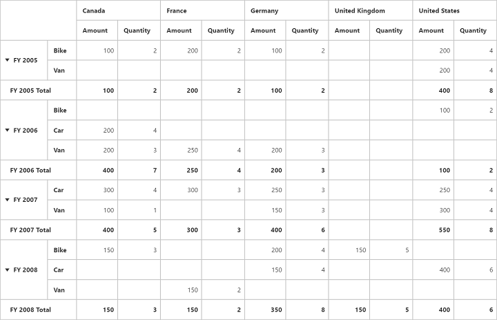

# Grand Total Hiding

Grand Total Hiding can be classified into three categories.

* Row Grand Total Hiding
* Column Grand Total Hiding
* Both

## Row Grand Total Hiding

You can hide the **Grand Total** in row alone by setting the property `e-enableRowGrandTotal` to `false`



    



## Column Grand Total Hiding

You can hide the **Grand Total** in column alone by setting the property `e-enableColumnGrandTotal` to `false`



    



## Both

You can hide the **Grand Total** in both row and column by setting the property `e-enableGrandTotal` to `false`



    



