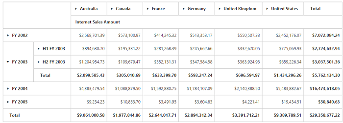
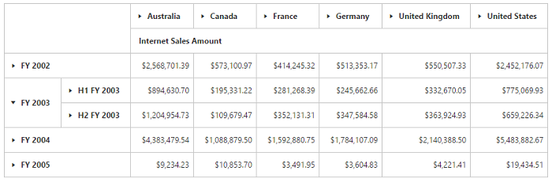
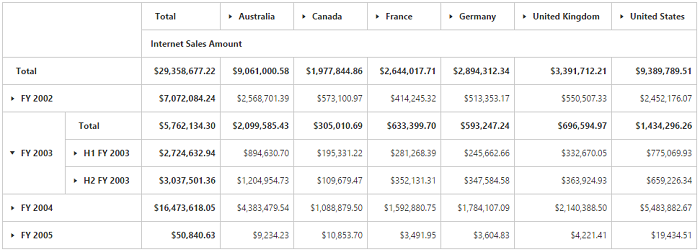

# Grid Layout

## Normal Layout

A layout in which summary cells are positioned at the bottom of each parent member and their child members appear next to them. Normal layout is the default layout in PivotGrid control. The enumeration property `e-layout` needs to be set to **"ej.PivotGrid.Layout.Normal"** in-order to view PivotGrid in normal layout. 



    



## No Summaries Layout

I> This feature is applicable only for OLAP datasource.

A layout in which summary cells are completely hidden and the child members appear next to their parent member.  The enumeration property `e-layout` needs to be set to **"ej.PivotGrid.Layout.NoSummaries"** in-order to view PivotGrid without summaries.



    


 

## Excel-like Layout
A layout in which summary cells are positioned besides each parent member and their child members appear next to them. The enumeration property `e-layout` needs to be set to **"ej.PivotGrid.Layout.ExcelLikeLayout"** in-order to view PivotGrid in excel-like layout.



    



## Top Summary Layout

I> This feature is applicable only for OLAP datasource only at Server Mode.

A layout in which summary cells are positioned at the top of each parent member and their child members appear next to them. The enumeration property `e-layout` needs to be set to **"ej.PivotGrid.Layout.NormalTopSummary"** in-order to view PivotGrid in top summaries layout.



    



