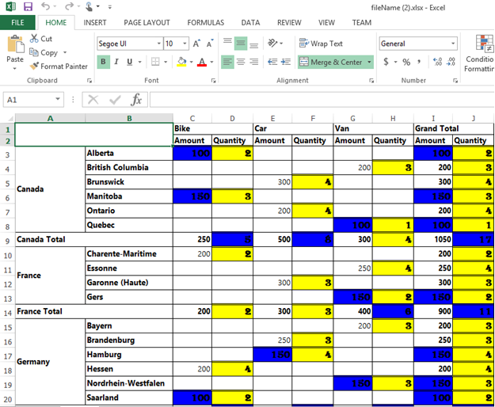

# PivotGrid: Elements

## Hyperlink
The PivotGrid control supports hyperlink option to link data for each individual cell. Hyperlink can be enabled separately for row header, column header, value and summary cells. Following are the respective properties:

* **enableColumnHeaderHyperlink** - Enables hyperlink for column headers.
* **enableRowHeaderHyperlink** - Enables hyperlink for row headers.
* **enableSummaryCellHyperlink** - Enables hyperlink for summary cell.
* **enableValueCellHyperlink** - Enables hyperlink for value cell.

Also hyperlink option provides separate events for row header, column header, value and summary cells as mentioned below.
 
* **e-columnHeaderHyperlinkClick** - Returns column header information through event on hyperlink click.
* **e-rowHeaderHyperlinkClick** - Returns row header information through event on hyperlink click.
* **e-summaryCellHyperlinkClick** - Returns summary cell information through event on hyperlink click.
* **e-valueCellHyperlinkClick** - Returns value cell information through event on hyperlink click.



    



## Selection
You can select a particular range of value cells from PivotGrid and manipulate/display them. Cell selection is applicable only for value cells and you can enable this functionality by setting `e-enableCellSelection` property to true.

The `e-cellSelection` event would be triggered as soon as the selection process is over, that is, when the mouse left click is released. The event argument contains a collection of JSON records and header values, which contains information about the selected cells.



    



## Cell Context
Cell context allows user to perform any custom operation on cell right-click. For example, you can create and display context menu on cell right-click.

Cell context is enabled by setting the `e-enableCellContext` property to true. The `e-cellContext` event would be raised as soon as right-click is done providing cell information through event argument.



    



## Conditional Formatting
Conditional formatting in PivotGrid allows user to highlight particular cells with certain color, font-style, font-family etc. based on the condition they have met.  Also the condition can be applied for certain Measure alone.
  
Conditional formatting is enabled by setting `e-enableConditionalFormatting` property to true and the formatting dialog is launched when **"createConditionalDialog"** method is invoked.



    

<button id="ApplyBtn" class="ang-pivotgrid" ej-button e-showroundedcorner="true" e-size="small" e-click="ApplyChanges">Apply</button>



### Export

We can export the PivotGrid with highlighted particular cells along with its formatting styles. 

LIMITATIONS FOR WORD:

The following border styles are not supported

* Solid
* Groove
* Ridge

LIMITATIONS FOR PDF:

Border styles are not applicable.

LIMITATIONS FOR EXCEL:

The following border styles are alone supported

* Dashed
* Dotted
* Double

Also border size is not supported.

